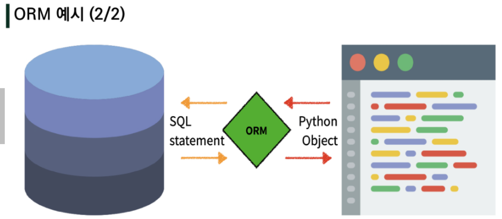
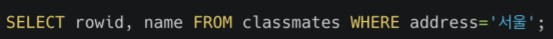
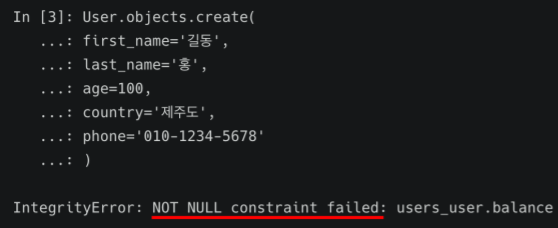
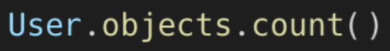
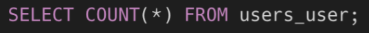

# Model

- 단일한 데이터에 대한 정보를 가짐
- 저장된 데이터베이스의 구조
- django는 model을 통해 데이터에 접속하고 관리

=> 웹 어플리케이션의 데이터를 구조화하고 조작하기 위한 도구

# DB

- 데이터베이스 => 체계화된 데이터 모임

  

  ## 쿼리 (Query)

- 데이터를 조회하기 위한 명령어

- 조건에 맞는 데이터를 추출하거나 조작하는 명령어

- 쿼리를 날린다 -> DB를 조작한다.

## 스키마(Schema)

- 데이터베이스에서 자료의 구조, 표현방법, 관계 등을 정의한 구조 (structure)

## 테이블(Table)

- 열과 행의 모델을 사용해 조작된 데이터 요소들의 집합
- SQL 데이터베이스에서는 테이블을 관계라고도 부름

- 열(column) = 필드(field) = 속성 (각 열에는 고유한 데이터 형식이 지정)
- 행(row) = 레코드(record) = 튜플 (테이블의 데이터가 저장)

- PK(기본키) => 각 행의 고유값으로 Primary Key로 불림

- 반드시 설정해야 하며, DB 관리 및 관계 설정 시 주요하게 활용

  

# ORM

- Object-Relational-Mapping

- 객체 지향 프로그래밍 언어를 사용하여 호환되지 않는 유형의 시스템 간에 (Django - SQL) 데이터를 변환하는 프로그래밍 기술

  => 간단히 말하면 장고에서 쓴 언어를 SQL이 알아들을 수 있게 변환시켜주는 중간 다리 역할

  DB를 객체(object)로 조작하기 위해 ORM을 사용 => Class 를 통한 instance 생성을 통해 조작

  

-  장점

- SQL을 잘 알지 못해도 DB 조작이 가능

- SQL의 절차적 접근이 아닌 객체 지향적 접근으로 인한 높은 생산성

- 단점
- ORM만으로 완전한 서비스를 구현하기 어려운 경우가 있음

=> 현대 웹 프레임워크의 요점은 웹 개발의 속도를 높이는 것 (생산성)

# models.py

- DB 칼럼과 어떠한 타입으로 정의할 것인지 표현
- title과 content는 모델의 필드를 나타냄

- Article은 테이블 이름이 됨
- 실제 db 반영은 앱이름_클래스명 => **articles_article**

# Migrations

- django가 model에 생긴 변화를 반영하는 방법

- Migration실행 및 DB 스키마를 다루기 위한 명령어

  1. makemigrations

     - model을 변경한 것에 가반한 새로운 마이그레이션을 만들 때 사용 (migration파일 생성)

       => 추가 모델 필드 작성 후 필수 진행

  2. migrate

     - migration을 DB에 반영하기 위해 사용
     - 설계도를 **실제 DB에 반영**하는 과정
     - 모델에서의 변경 사항들과 DB의 스키마가 동기화를 이룸
     - 1, 2번 물어보는 장면이 나올 때는 어떤 필드가 추가될 때 그 필드에 데이터가 없는데 null로 둘건지, 어떠한 값으로 넣을건지

  3. sqlmigrate

     - migration에 대한 SQL 구문을 보기 위해 사용

     - migration이 SQL 문으로 어떻게 해석되어서 동작할지 미리 확인 가능

       

  4. showmigrations

     - 프로젝트 전체의 migration 상태를 확인하기 위한 용도
     - migration 파일들이 migrate 됐는지 여부 확인 가능

     

# DB API

- DB를 조작하기 위한 도구
- django가 기본적으로 ORM 을 제공함에 따른 것으로 DB를 편하게 조작할 수 있도록 도움

## DB API 구문

- Manager

  - django 모델에 데이터베이스 query 작업이 제공되는 인터페이스
  - 기본적으로 모든 django 모델 클래스에 objects라는 Manager를 추가

- QuerySet

  - 데이터베이스로부터 전달받은 객체 목록
  - queryset 안의 객체는 0개, 1개 혹은 여러 개일 수 있음
  - 데이터베이스로부터 조회, 필터, 정렬 등을 수행할 수 있음
  - all() 위치에는 get이나 order_by 등도 올 수 있음

  

  

## Django shell

- 일반 python shell을 통해서는 장고 프로젝트 환경에 접근 불가
- 그래서 장고 프로젝트 설정이 load된 Python shell을 활용해 DB API 구문 테스트 실행
- 기본 Django shell 보다 더 많은 기능을 제공하는 shell_plus 를 사용해서 진행

## 간단 정리

- Model
  - 웹 애플리케이션의 데이터를 구조화하고 조작하기 위한 도구
- Database
  - 체계화된 데이터의 모임(집합)
- Migrations
  - django가 model에 생긴 변화
  - (필드를 추가했다던가 모델을 삭제했다던가 등)을 반영하는 방법
- ORM
  - OOP 언어를 사용하여 데이터베이스와 OOP 언어 간의 호환되지 않는 데이터를 변환하는 프로그래밍 기법 OOP(Object-Oriented Programming, 객체 지향 프로그래밍)
- Database API
  - DB를 조작하기 위한 도구 (QuerySet API, CRUD)

# 관계형 데이터베이스 (RDB)

• Relational Database
• 키(key)와 값(value)들의 간단한 관계(relation)를 표(table) 형태로 정리한 데이터베이스
• 관계형 모델에 기반

## RDB 용어 정리

• 스키마 (schema) : 데이터베이스에서 자료의 구조, 표현방법, 관계등 전반적인 명세를 기술한 것

• 테이블 (table) : 열(컬럼/필드)과 행(레코드/값)의 모델을 사용해 조직된 데이터 요소들의 집합

• 열 (Column) : 각 열에는 고유한 데이터 형식이 지정됨.

• 행 (row) : 실제 데이터가 저장되는 형태

• 기본키 (Primary Key) : 각 행(레코드)의 고유 값

## RDBMS

• Relational Database Management System

• 관계형 모델을 기반으로 하는 데이터베이스 관리시스템을 의미

예시) • MySQL • SQLite • PostgreSQL • ORACLE • MS SQL

### SQLite

- 서버 형태가 아닌 파일 형식으로 응용 프로그램에 넣어서 사용하는 비교적 가벼운 데이터베이스

## SQL (Structured Query Language)

• 관계형 데이터베이스 관리시스템의 데이터 관리를 위해 설계된 특수 목적으로 프로그래밍 언어

• 데이터베이스 스키마 생성 및 수정

• 자료의 검색 및 관리

• 데이터베이스 객체 접근 조정 관리

## SQL Keywords - Data Manipulation Language

• INSERT : 새로운 데이터 삽입(추가)

• SELECT : 저장되어있는 데이터 조회

• UPDATE : 저장되어있는 데이터 갱신

• DELETE : 저장되어있는 데이터 삭제

## DB 생성

## CSV 파일을 table로 만들기

## SELECT

- SELECT 문은 특정 테이블의 레코드(행) 정보를 반환!

- ; 까지 하나의 명령 (SQL Query) 로 간주 됨!

## 테이블 생성 및 삭제 statement

• CREATE TABLE

​	• 데이터베이스에서 테이블 생성

 • DROP TABLE

​	• 데이터베이스에서 테이블 제거

## CREATE - 테이블 생성 및 확인하기

## 특정 테이블의 Schema 조회

## DROP

## INSERT

- 모든 열에 데이터가 있는 경우 column을 명시하지 않아도 됨!

## ID

## NULL

- 꼭 필요한 정보라면 공백으로 비워두면 안된다. (NOT NULL 설정 필요)

## 해결 방법

1. id를 포함한 모든 value 작성

2. 각 value에 맞는 column들을 명시적으로 작성

# READ

## SELECT

• 테이블에서 데이터를 조회

• SELECT 문은 SQLite에서 가장 복잡한 문이며 다양한 절(clause)와 함께 사용

​	• ORDER BY, DISTINCT, WHERE, LIMIT, GROUP BY …

=> 특정 열만 조회

## LIMIT

• 쿼리에서 반환되는 행 수를 제한

• 특정 행부터 시작해서 조회하기 위해 OFFSET 키워드와 함께 사용하기도 함

=> 한 개의 행만 조회

## OFFSET

• 특정부분에서 원하는 수만큼 데이터 조회

=> 세번째에 있는 한 행만 조회

## WHERE

• 쿼리에서 반환된 행에 대한 특정 검색 조건을 지정

=> 주소가 서울인 데이터 조회

## SELECT DISTINCT

• 조회 결과에서 중복 행을 제거

• DISTINCT 절은 SELECT 키워드 바로 뒤에 작성해야 함

=> age값 전체를 중복 없이 조회

# DELETE

## DELETE

• 테이블에서 행을 제거

=> 중복 불가능한(UNIQUE) 값인 rowid를 기준으로 삭제하는 게 BEST!

=> 삭제하고 난 뒤 다시 추가를 해보면 확인할 수 있는 사실

=> SQLite는 기본적으로 id를 재사용 (5번 삭제 후 5번이 재사용됨)

## AUTOINCREMENT

• SQLite가 사용되지 않은 값이나 이전에 삭제된 행의 값을 재사용하는 것을 방지

• (django에서 기본 값으로 사용되는 개념!)

# UPDATE

## UPDATE

• 기존 행의 데이터를 수정

• SET clause(절)에서 테이블의 각 열에 대해 새로운 값을 설정

=> 중복 불가능한(UNIQUE) 값인 rowid를 기준으로 수정하자!

## CRUD 정리

# Sqlite Functions

다음 함수들은 기본적으로 해당 컬럼이 숫자(INTEGER)일 때만 사용 가능

• COUNT

​	• 그룹의 항목 수를 가져옴

=> users 테이블의 레코드 총 개수를 조회

• AVG

​	• 값 집합의 평균 값을 계산

=> 30살 이상인 사람들의 평균 나이

• MAX

​	• 그룹에 있는 모든 값의 최대값을 가져옴

=>  계좌 잔액(balance)이 가장 높은 사람과 그 액수를 조회

• MIN

​	• 그룹에 있는 모든 값의 최소값을 가져옴

• SUM

​	• 모든 값의 합을 계산

# LIKE

## LIKE operator

• 패턴 일치를 기반으로 데이터를 조회하는 방법

• sqlite는 패턴 구성을 위한 2개의 wildcards를 제공

​	• % (percent sign)

​		• 0개 이상의 문자

​	• _ (underscore)

​		• 임의의 단일 문자

## wildcards

=> users 테이블에서 나이가 20대인 사람만 조회

=> users 테이블에서 중간 번호가 5114인 사람만 조회

## ORDER BY

• 조회 결과 집합을 정렬

• SELECT 문에 추가하여 사용

• 정렬 순서를 위한 2개의 keyword 제공

​	• ASC – 오름차순 (default)

​	• DESC - 내림차순

=> 특정 컬럼을 기준으로 데이터를 정렬해서 조회

=> 나이 순, 성 순으로 오름차순 정렬하여 상위 10개만 조회

## GROUP BY

• 행 집합에서 요약 행 집합을 만듦

• SELECT 문의 optional 절

• 선택된 행 그룹을 하나 이상의 열 값으로 요약 행으로 만듦

• 문장에 WHERE 절이 포함된 경우 반드시 WHERE 절 뒤에 작성해야 함

• 지정된 기준에 따라 행 세트를 그룹으로 결합 데이터를 요약하는 상황에 주로 사용

=> users에서 각 성(last_name)씨가 몇 명씩 있는지 조회

• AS 를 활용해서 COUNT에 해당하는 컬럼 명을 바꿔서 조회할 수 있음

## ALTER TABLE

=> 새로운 컬럼 이름은 created_at 이며, TEXT 타입에 NULL 설정!

테이블에있던 기존 레코드들에는 새로 추가할 필드에 대한 정보가 없다.

그렇기 때문에 NOT NULL 형태의 컬럼은 추가가 불가능!

## 해결방법

ref) https://wikidocs.net/71306

1. NOT NULL 설정 없이 추가하기

2. 기본 값(DEFAULT) 설정하기

# SQL - ORM

## 모든 user 레코드 조회 - ORM

## 모든 user 레코드 조회 - SQL

## user 레코드 생성 - ORM

## 방금 생성한 레코드 확인하기 - SQL

## user 레코드 생성 실패 예시 - SQL

## NOT NULL constraint failed를 ORM에서 확인

# READ

=> id가 102인 유저의 정보를 조회

## 특정 user 레코드 조회 - ORM

## 특정 user 레코드 조회 - SQL

# UPDATE

=> id가 102인 유저의 정보를 수정

## 특정 user 레코드 수정 - ORM

## 특정 user 레코드 수정 및 확인 - SQL

# DELETE

=>  id가 102인 유저의 정보를 삭제

## 특정 user 레코드 삭제 - ORM

## 특정 user 레코드 삭제 - SQL

# SQL & ORM 활용

=> 전체 유저의 수를 조회

## 전체 유저의 수를 조회 - ORM

## 전체 유저의 수를 조회 - SQL

=> 나이가 30살인 사람들의 이름을 조회

## 나이가 30살인 사람들의 이름 - ORM

## 나이가 30살인 사람들의 이름 - SQL

## 나이가 30살인 사람들의 이름 - 쿼리문 확인하기

## 조건에 따른 쿼리문

=> 대/소 관계 비교 조건

## 나이가 30살 이상인 사람의 인원 수 - ORM

## 나이가 30살 이상인 사람의 인원 수 - SQL

## 나이가 30살이면서 성이 김씨인 사람의 인원 수 - ORM

## 나이가 30살이면서 성이 김씨인 사람의 인원 수 - SQL

## 나이가 30살이거나 성이 김씨인 사람의 인원 수 - ORM

=> OR 을 활용하고 싶다면, Q object 를 활용해야 함

## 나이가 30살이거나 성이 김씨인 사람의 인원 수 - SQL

## 지역번호가 02인 사람의 인원 수 - ORM

## 지역번호가 02인 사람의 인원 수 - SQL

## 주소가 강원도이면서 성이 황씨인 사람의 이름 - ORM

## 주소가 강원도이면서 성이 황씨인 사람의 이름 - SQL

## 잔액이 적고 나이가 많은 순으로 10명 - ORM

## 잔액이 적고 나이가 많은 순으로 10명 - SQL

### 10번째 유저

- ORM
  - 맨 뒤에 [10] 으로 변경
- SQL
  - 맨 뒤에 OFFSET 9 추가

# Aggregate

• ‘무언가를 종합, 집합, 합계' 등의 사전적 의미

• 특정 필드 전체의 합, 평균, 개수 등을 계산할 때 사용

(GROUP BY 에서 주로 사용)

## 성이 김씨인 유저들의 평균 나이 - ORM

## 성이 김씨인 유저들의 평균 나이 - SQL

# Annotate

• ‘주석을 달다’라는 사전적 의미

• 필드를 하나 만들고 거기에 ‘어떤 내용’을 채워 넣는 개념

 • 마치 컬럼 하나를 추가하는 것과 같음

