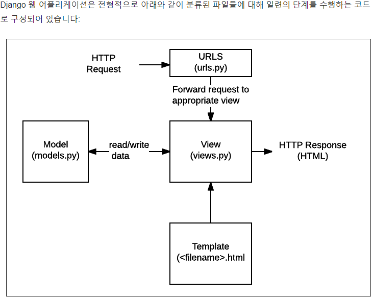

## 웹 서비스가 뭐에요??

해답: 클라이언트(우리) 가 서버에 요청을 보내고, 서버가 클라이언트에서 html 로 응답을 해준다.

## Django == 서버 만드는 웹 프레임워크

1. 장고는 하나의 project안에 여러개의 app 을 설치 가능!

2. 대부분이 MVC 디자인 구조(아키텍쳐)를 따른다.

   ​	model, view, controller

3. 하지만, django 는 MTV 패턴이라 불린다.

   ​	model = date 구조 정의, DB의 기록을 관리 (추가, 수정, 삭제)

   ​	template = 파일 구조 or 레이아웃 정의, 실제 내용 보여줌 (presentation, 표현하는 로직) 

   ​	view = http 요청 수신하고 http 응답 반환, model 통해 요청 충족시기기 위해 데이터에 접근(중간관리자)

   

   ​						(MTV 구조도)

   

## 프로젝트 시작전 스텝

1. 폴더 생성

2. 가상환경 생성

3. 가상환경 스위치 켜고

4. 원하는 library or framework(패키지) 다운로드

5. pip freeze > requirements.txt 생성

6. touch .gitignore 생성

7. 프로젝트 만들기: django-admin startproject firstpjt .    

   해석:	(장고야, 프로젝트 하나 시작할게. 이름은 firstpjt로 하고, 현재위치에서 시작할게)

8. 서버를 켜서 서버가 제대로 생성됫는지 확인: python manage.py runserver

   이후 나온 출력값에 주소가 있는데, ctrl+클릭 으로 접속해서 확인

9. 서버 끄려면 ctrl + c

10. 어플리케이션 생성: python manage.py startapp articles

11. 생성된 어플들은 firstpjt 파일에 settings.py 안에 등록, 라이끄 출생신고

    !꼭 어플 선 생성, 후 출생신고!     아니면 생성 안됨 ㅋ

12. url 쓰고 (밑에 url 만들기 참고)

13. view 함수 생성: view.py 에서 `def index(): return render(request, ???)` 생성

14. 템플릿 생성 : 해당 어플 폴더 안에 templates 폴더 생성 후, index.html 파일 생성

15. 

tip: 현재 위치 확인 명령어: ls  혹은 pwd

### URL 만들기

1. `url.py` 안에서 `urlpatterns` 변수 안에 `path('index/', ???)` index는 요청, ??? 는 views 

#### 필터링

1. ex. {{ key값 | *length* }}

   ​	{{ key값 | *join*:", " }}

2. google에 Django build-in filter reference 검색 ;)

3. 필터는 반복문도 돌릴 수 있다 ㅇㅅㅇ;

   ex.     

     		 <li>{{ m }}</li>

     	  

4. 수업 진행된 필터들:

   ​	empty, lorem, length, if, for, add, truncatechars(문자열 관련), title, 등

## 템플릿 상속

여러 가지 view 위치에서 동일한 템플릿 파일을 읽어 오고 싶을때 사용.

Procedure

1. 위치를 어플 밑에 위치시키는게 아니라, 어플과 동일한 위치에 템플릿 파일을 만든

2. setting.py 에 TEMPLATES = {'DIRS': [BASE_DIR / 'templates'] } 이런식으로 수정

3. 부모 html 안에 원하는 위치에      이용

4. 자식 html 안에는 처음 라인에   

   마지막 라인에 

## 요약

URL 로 요청이 들어오면,

URL.py 에서 view.py 에 response요청

views.py 에서 요청 대상에게 반환해 줘야할 html 전달

그리고 views.py 에서 클라이언트에게 반환된 html 을 전달!

variable routing 이 뭐죠? 라 질문이 들어오면, 계시판에서 계시글을 가져올 떄 자주 쓰임

----------------------------------------------------------------------------------------------------------------------

대장 url 을 설정할때 include() 를 사용해서 부하 url로 요청 을 라우팅 해준다

URL pattern 뜻은, 경로에 별명을 지어서, 얘 하나만 수정하면 다 일괄 수정되게 하는 꿀팁

#### 서버 키기

python manage.py runserver

#### 팁

shift + alt + 방향키

django 에서 주석 표시 {# 주석! #}

page 에러 메세지 번호가 4로 시작 = 클라이언트쪽 문제,

page 에러 메세지 번호가 5로 시작 = 서버쪽 문제

일일히 수정하는거 귀찮으니까 name=" 이름 " 으로 별명을 생성 = 수정할 때 매-우 편리