# Model

## Model

1. 단일 데이터 정보 가짐
2. 저장된 DB 구조
3. Model 통해 데이터 접속하고 관리
4. 각각의 Model은 하나의 DB 테이블에 매핑 된다

#### DB != Model

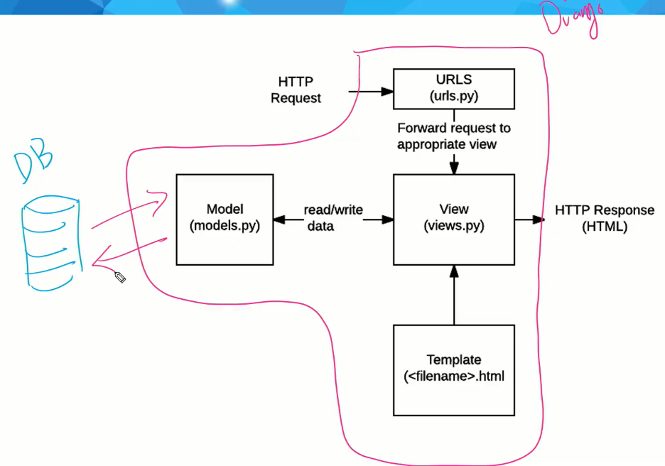

## Database

체계화된 데이터의 모임

하나의 DB에는 여러개의 Table이 만들어 질 수 있다

#### Query : 데이터를 조회, 조작, 추출 하기 위한 명령어

​	ex. query를 날린다 == DB를 조작한다

#### 자료구조

1. Schema

   ​	DB의 structure (표현방법, 관계, 등을 정의한 구조)

   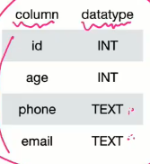

2. Table (라이끄 excel 표)

   ​	row : record or 튜플

   ​			record 의 고유 값 : PK (primary key)

   ​					ex. id, name, age, phone, email, etc / 중복이 없어야 한다

   ​	column : field or 속성

   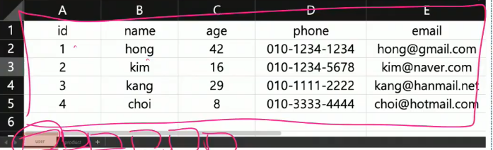

## ORM (object-relational-mapping)

1. 객체 지향 프로그래밍 언어 사용하여 (ex. django - SQL) 호환 안되는 유형의 시스템 간에 데이터를 변환하는 프로그래밍 기술!
2. OOP 에서 RDBMS (관계형 데이터베이스) 연동 할 때, DB와 OOP 언어간의 호환되지 않는 데이터를 변환하는 프로그래밍 기법
3. Django 는 내장 Django ORM을 사용
4. 파이썬으로 ORM 활용하여 SQL과 대화 가능
5. DB를 객체(object) 로 조작하기 위해 ORM 사용!

#### 장점

1. 당장 SQL 몰라도 DB 조작 가능
2. SQL 절차적 접근x, 객체 지향적 접근으로 인한 높은 생산성

#### 단점

1. SQL 완전 모르면, 완전한 서비스 구현 어려울 수 있다

### 하지만, 현대 웹 Framework의 요점은 웹 개발의 속도, 생산성을 높이는것!

## Model.py 작성

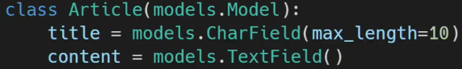

위 사진: 열이 3개인 Schema 정의 (title + content + PK, 고로 3개의 열)

CharField, TextField == datatype 정의 (charfield 만 최대 문자 길이 정의는 필수사항!)

title, content = 모델의 field (열) 을 나타낸다

하지만 아직 DB에는 안보낸 상태..

이걸 설계도로 만드는 작업 필요 == makemigration!!

import models 모듈 에서 Model 이라는 클래스를 상속받는중이다!

## Migration

1. Django가 Model에 생긴 변화를 DB에 반영하는것

   ​	DB에 반영이 되야 데이터를 쓸 수 있지!

2. Migration 실행, DB 스키마 다루는 4가지 명령어들

   ​	makemigrations*필수	($ python manage.py makemigrations)

   ​	migrate*필수

   ​	sqlmigrate*optional	(설계도를 DB로 보내기 전, ORM 이용해서 SQL문법으로 해석된것을 미리 확인만 해봄)

   ​				($ python manage.py sqlmigrate app이름 migrations파이썬파일앞에숫자만)

   ​				(ex. $ python manage.py sqlmigrate articles 0001)

   ​	showmigrations*optional	(DB에 반영된 설계도 확인   X == 반영됨)

   ​				($ python manage.py showmigrations)

   

#### models.py에 설계도를 만들기 위한 사전작업을 한다. 만들어진 설계도는  `makemigrations` 로migrations/0001_initial.py 로 이동시키고, 여기에서 설계도가 ORM의 도움으로 SQL 문으로 해석되고, `migrate` 를 통해서 DB로 전달된다. 

## DB 수정하기!

1. 설계도 수정할떄는, original copy 는 걸들지 말고, original을 기반으로 updated된 설계도를 새로 작성!
2. models.py 안에 새로운 field 들 작성(설계도 사전준비) >> `python manage.py makemigrations` >> 설계도 생성되면 `python manage.py migrate` >> apply OK 뜨면 성-공

#### 중요한 추가 필드

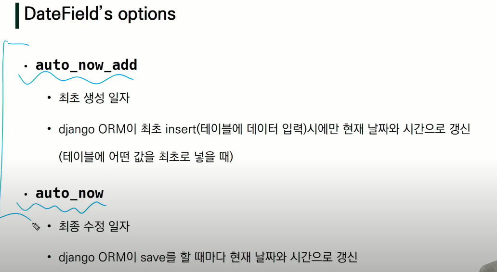

`auto_now_add`

1. 최초 생성일자가 기록(최초 생성 이후 변경 안됨)
2. django ORM이 최초 테이블 데이터 입력시에만 현재 날짜와 시간으로 갱신
3. 수업 예시에서 created_at field 에 이 datefield 를 반영함

`auto_now`

1. 최종 수정 일자가 기록 (새로 저장 할떄마다, 해당 현재 시간이 기록)
2. django ORM이 save를 할 때마다 현재 날짜와 시간으로 갱신
3. 수업 예시에서 updated_at field 에 이 datefield 를 반영함

#### 반드시 기억해야할 migration 3 단계

1. models.py  :  model 변경사항 (설계도 사전준비)
2. $ python manage.py makemigrations  :  migration 파일 생성 (설계도 생성)
3. $ python manage.py migrate  :  DB에 설계도 반영

## DB API

1. OOP 파이썬 활용
2. DB 조작하기 위한 도구

#### Making Queries

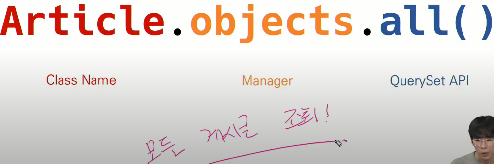

위 사진 == DB와 소통하는 Python 구조

뜻: Article 클래스에 있는 모든 객체를 DB에게 줘라

1. Model 을 만들면 자동으로 objects 가 생성된다. objects는 QuerySet API를 사용하기 위한 매니저일뿐이다.

2. QuerySet == 데이터베이스가 우리한테 주는 객체응답 목록. 여러개의 항목이 있을 수 있고, 0개, 1개일수도있다.

   ​	쿼리셋은 [ ] 로 감싸져 있으니, List 처럼 쓸 수 있다. (slicing, indexing, 등 활용)

   ​	쿼리셋은 DB로부터 조회, 필터, 정렬 등 수행 가능, 이거 하려면 Shell 사용해야한다

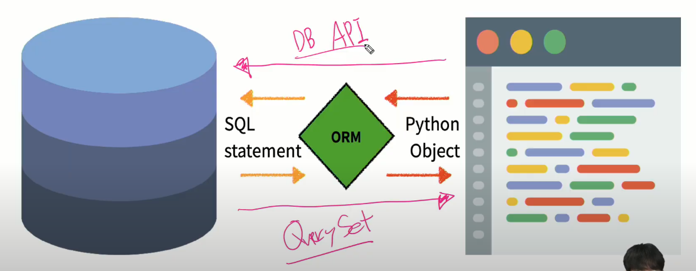

#### Shell 사용법

우리는 장고의 DB와 소통해야한다, 고로 일반 python 의 shell 을 켜봤자 장고안의 DB들과는 소통 불가능.

고로, 장고안에서 장고Shell 을 사용. 그래야 Model 클래스들을 사용 가능하기 떄문에 DB와 소통 가능

하지만, 기본 장고 shell 보다 shell plus 가 더 기능이 좋아서 이거 사용할거임 ㅋ

다운 방법:

 	1. pip install django-extensions
 	2. 프로젝트 setting.py에 django_extensions 어플이름을(3rd 파티 라이브러리) 추가해야 완료
 	3. pip install ipython (shell 을 깔끔하고 자동완성 하기 쉽게 해주는 것)

## CRUD ( Create Read Update Delete)

https://docs.djangoproject.com/en/3.2/ref/models/querysets/ 이거 무조건 참고 많이 하게 될듯

1. 대부분의 SW가 가지는 기본 데이터 처리 기능 

   ​	ex. 계시글 작성, 계시글 열람, 계시글 수정, 계시글 삭제

2. DB 조작은 항상 객체로 한다

#### Create 실습

방법은 3가지 있다

1. Model 클래스로 인스턴스 만들고, 필드 이름 을 지정

   save 메서드를 이용해서 DB에 저장시킨다 (ex. 인스턴스.save() )

   단순히 모델을 인스턴스화 하는건 DB에 영향을 안 미친다. 고로 반드시 save() 매서드 필요!

   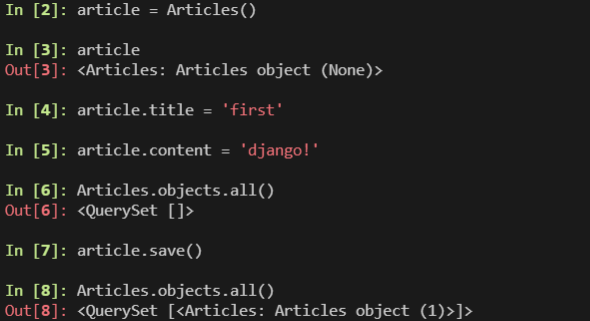

2. 처음부터 키워드 인자로 초기값을 다 준다 `article = Article(title='second', content='django!!')`

   save 매서드 이용해서 DB에 저장 ( ex. 인스턴스.save() )

   단순히 모델을 인스턴스화 하는건 DB에 영향을 안 미친다. 고로 반드시 save() 매서드 필요!

   

3. 쿼리셋의 create() 매서드를 사용하는 방법 ==  인스턴스 생성 안하고, 바로 객체 생성하고 필드에 값들도 주고 저장까지 한방에!

   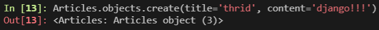

*팁*

1. ex. article.title,	article.content, etc

   *실제 table의 컬럼에 명시된 primary key 이름은 id 이지만, id 조회를 할때는 `article.pk` 를 권장

2. DB에 저장된 객체표현을 보기 편하게 출력하기:

   models.py 안에 `def __str__(self): return self.title` 함수 입력 >> 꼭 shell 다시 시작 >>

   `Articles.objects.all()` 로 출력값 다시 확인

   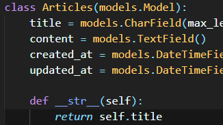

#### Read 실습

가장 어렵다..

QuerySet API method 는 크게 2가지로 분류

1. 새로운 쿼리셋을 주는 매서드	ex. all() < 읽기 담당 ,  get() < 읽기만 담당(검색) ,  filter() ,  delete() < 삭제 담당 ,  

   ​														post() < 조작하는 행위 고로 CUD 담당

   ​	GET 매서드 = 계시글 목록좀 줭

   ​	POST 매서드 = 계시글 좀 작성해줘 

   ​	get(*조회 매개변수) : 객체 하나만 조회한다 Articles.objects.get(pk=100).객체 못찾으면 DoesNotExist, 둘 이상 										객체 찾으면 MultipleObjectReturned 예외를 발생시킨다. 고로, 유니크성을 보장하는 										parameter 로서 사용한다. 고로 거의 무조건 pk 값 조회 할 때만 사용된다.

   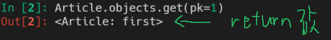

   ​	filter(*찾는매개변수와 일치하는 객체를 포함하는 새 쿼리셋을 반환), 객체 못찾으면 새로운 빈 쿼리셋 반환한다. 										고로, get() 과는 대조되게 pk 말고 다른 값들을 조회할때 더 적절!

   ​							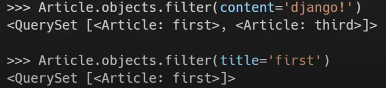

2. 쿼리셋을 return 하지 않는 매서드    ex. create()  < 작성을담당

#### Update 실습

1. 뭘 업데이트할지 정하고

   ​	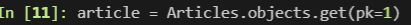

2. 수정!

   ​	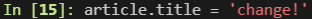

3. save() !

#### 삭제 실습 (다음 수업에서 더 깊게 들어간다네)

1. 뭘 삭제할지 정하고

   ​	

2. 삭제!

   ​	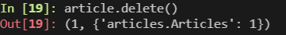

3. save() 가 필요없는 이유 : 쿼리셋에 모든 행에 대해 sql 명령어로 삭제 쿼리를 다이렉트로 명령하고,

   삭제된 개체 수와 겍체 유형당 삭제 수가 포함된 딕셔너리를 반환

#### 계시판 실습

1. 계시글 페이지 작성시, 두개의 view 함수 필요: 작성 페이지를 render할때, 사용자로부터 입력받은 데이터 저장할때
2. view 함수를 두개 생성 `def new(request), def create(request)`
3. 

## 세큐리티!

1. CSRF 검증에 실패하였습니다

   내가 만든 탬플릿이 맞는지 의심하는 에러메세지

   (views.py 에서 GET 을 이용해서 인풋값 가져오려하는데 인풋값이 POST인경우에도 발생 할 수 있음 ㅇㅅㅇ;)

   Cross-site request forgery = 	사용자가 자신의 의지와 무관하게 공격자가 의도한 행동을 하여 특정 웹페이지를 보안에 취약하게 한다거나 수정, 삭제 등의 작업을 하게 만드는 공격 방법

   CSRF 공격 방어 방법:

   1. `` 사용

      토큰 `value` 값이 `title, content`와 함께 넘어간다.

      등록된 매우 목잡한 난수 값과 내가만든 template의 html에 있는 난수 값이 불일치 하면 바로 걸러낸다.

      랜더링 (새로고침) 할 때마다 새로운 난수값을 부여한다.

      사이트간 요청 위조를 막는다.

      특히나, DB에 조작을 가하는 요청인 경우 더 막는닷.

      똑같은 모습으로 복제해도, 결국 난수값을 알지 못하면, 데이터는 저장 안된다.

      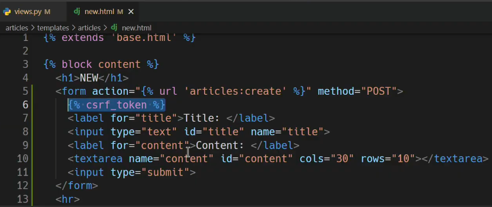

--------------------------------------------------------------------------------------------------------------

## 수업 실습 내용

1. `class Article(models.Model):` 이 클래스 변수는 원하는 정보 주면 테이블 만들어줌

   실제 table 의 이름은 == 앱이름_클래스명소문자 (ex. articles_article)

   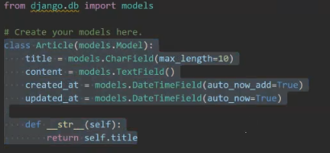

   위에 상태는 그냥 테이블 만들 사전준비만 되어있는거임

2. `$ python manage.py makemigrations` 명령어로 migrate 진행. 테이블 만들어졌지만 DB에 저장은 안됨

3. `$ python manage.py migrate` 로 DB에 저장

4. 저장 확인하려면 `$ python manage.py showmigrations`

5.  `$ pip install ipython django-extensions` 설치하면 그냥 더 편하게 shell 기능 이용 가능

6. 

## 팁

requrements.txt 내용 다운로드 명령어: pip install -r requirements.txt

SQLite 익스텐션 설치 : DB 파일에 우측클릭하면 open database 클릭 하면, VSC explorer창에 DB를 볼 수 있게된다

shell 에서 나갈때 명령어 == exit()

Django 에서 우선되야하는건, 행위의 의미 보다는, 행위의 흐름를 이해하는데 집중하라

DTL(django template language) 문법 == template 안에서 쓰는 문법

Template 에서 View로 넘겨줄때는 디셔너리 형태로 넘겨준다!

a 태그는 GET 요청 !만! 가능하다

3rd party 라이브러리를 다운받으면 (ex django-extensions) 단순히 설치하고 끝인지, 따로 앱 등록필요한지 확인하고, 등록할건 등록. 이름에서 `-` 가 있으면, 등록할때는 `_` 로 변환!

#### webex 정리.

url.py 이름정하는거 편하다. 하드코딩으로 일일히 파일 위치 안적어도됨. 하지만 문제가 생길 수 있다. App이 하나가 아니라, 두개 이상 있고, 동일한 html 이름이 있으면 장고가 구분 불가능. 고로 `app_name = ` 이용해서 구분 가능하다.

`app_name` 이 app 폴더 이름과 동일한것과 templates 밑에 새로운 폴더 가 app 이름과 동일한건, 그냥 그게 따라가기 편하니까. 궅이 다른 이름으로 지을 필요 x

template폴더 나누는 이유: 기본적으로 django는 app의 template를 `templates` 파일 밑에서 찾는다. 다만 app 폴더가 여러개고, 같은 templates 파일 이름이 존재하면, view 에서 settings.py 의 installed apps 에 적혀있는 app 이름들 순서대로 찾아가기 떄문에, 잘못된 위치에 라우팅 되버린다.

고로 `articles/index.html`, `pages/index.html` 이런식으로 구분 시켜주려고, 공간을 인위적으로 만들어 준다.

구분 방법은 templates 폴더 안에 또 app 폴더와 동일한 이름의 폴더를 만들고, 그 안에 모든 templates 파일들(html)을 넣는다

## 의미심장한 말들

1. `'APP_DIRS': True` 이게 무슨뜻일까? False 가 되면 어떻게되지?

2. `BASE_DIR = Path(__file__).resolve().parent.parent` 이게 뭘 의미하는거지?

3. 교육생: `date` 표현법 다 외워야 하나요?

   교수님: 그건.. 말씀을 못드리겠습니다 ^^

   

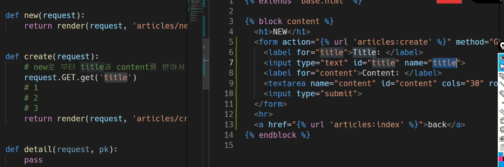

좌측 title 은 우측 title 값을 가져온거임 

