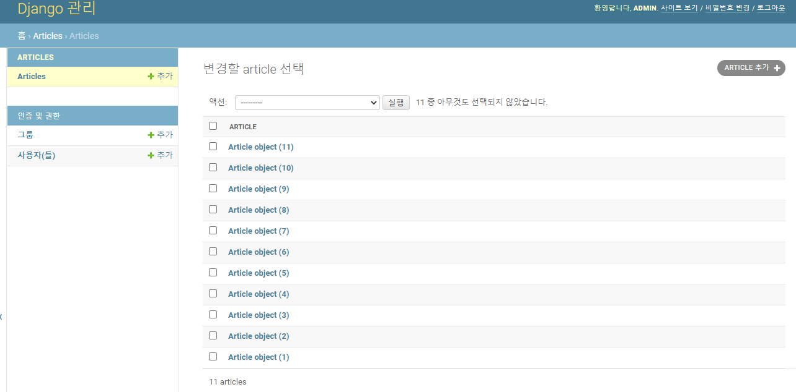
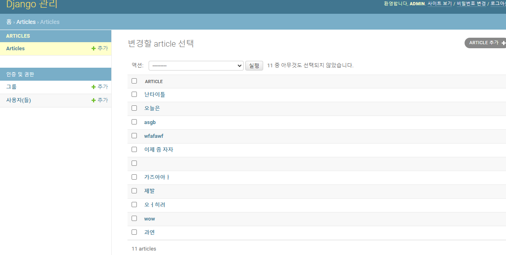
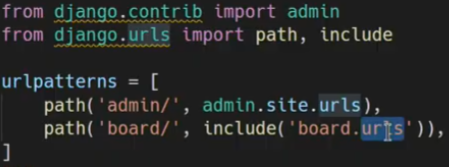
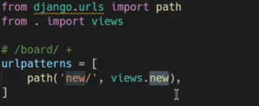
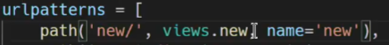
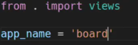
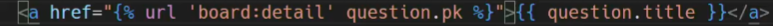
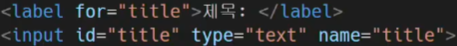
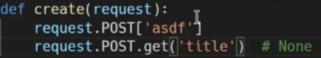

## 서버 프로그래밍 == 데이터를 만지는 일

## migration

model.py 에서 DB와 소통 가능한 클래스 만들면, 꼭 migration 해서, 해당 설계도 사전준비 도구들 DB에 커밋 및 푸쉬 해줘라

1. `$ python manage.py makemigrations`
2. `$ python manage.py migrate`

## 장고의 관리자 페이지 == ㄹㅇ 핵꿀 압도적 기능

#### 관리자 페이지 접속 가능하게 하기

1. `admin.py` 에서 `from .models import Question` 이렇게 모델 클래스 가져오고,
2. `admin.site.register(models.py안의클래스이름)` 이렇게 작성하고
3. 서버 들어가서 주소에 `/admin` 하면 바-로 admin 페이지 로그인 화면 뜸

기본으로 생성된 앱의 urls.py 안에 들어가보면, 이미 admin 이라는 주소에 대한 처리를 미리 해놓았다. 

그래서 /admin 하면 바로 로그인 페이지 뜨는거임

4. 터미널 창에서 `$ python manage.py createsuperuser` 쳐서 알려주는데로 따라가면 id 와 비번 등록 가능

   

하지만 이대로 admin 접속하면 매우 보기 불-편

고로, `models.py` 에서 스트링 매직매서드 오버라이드를 통해서 위에 사진의 목록 이름의 출력 방식을 바꾸자

5. `models.py` 에서 선언된 클래스 아래에 `def __str__(self): return self.title` 

6. 위에 작업으로 인해 `model.py` 에 변경이 생겼으니 바로!!

   1. `$ python manage.py makemigrations`
   2. `$ python manage.py migrate`

   진행하자

편-안

#### URL 을 어플별로 나눠서 관리하기

1. 

2. 앱 폴더 안에 `urls.py` 생성

3. `new/` 라는 url 이 들어오면, 특정 view 로 포워딩해라! 라는 뜻의 코드 작성

   

4. 근데 하드코딩하면 일일히 url 바꿀때 작업 다 못함. 고로, 닉네임 만들어주자

   

5. 어떤 위치에 있는 닉네임인지도 정의 해놓자

   

6. url에 닉네임을 정해하면 `html` 템플릿들에서 url로 포워딩 할때 아래와같이 한다.  

   

#### 팁: 

- 항상 고정 url 들을 우선적으로 적고, 특수 url들을 후자로 적자

- 

  위에 사진 처럼, form 태그 안에 label의 `for=''` 와 input의 `id=''` 가 한 세트고, `name=''` 은 url로 포워딩 됫을 때 사용 될 닉네임이다

- 

  첫번째는 해당 값이 없으면 에러가 떠버림..

  두번쨰는 해당 값이 없어도 에러는 안뜨고 `None` 을 반환함

  서버 유지가 최 우선이니까 대괄호가 아닌, `get()` 을 사용한다!

- 

#### CRUD 생성 순서

1. 어떤 로직으로 패턴들이 오가는지 모델링 하고

2. url 들 정의 하고

3. views 안에 필요한 함수들 정의

4. 각 함수의 존재 이유를 주석 작성

5. 각 함수의 기능들 채워넣기

6. 필요한 templates html 파일들 작성

7. POST 매서드 사용하는 html 파일에 form 태그 안에는 `csrf_tocken` 넣기.

   DB에 영향을 주는 POST 매서드 사용 시, 한단계 시큐리티가 필수

   

#### !꿀팁!

form 태그 밖에 위치한 button 태그는, 그냥 무쓸모 버튼이지만,

form 태그 !안에! 위치한 button 태그는 와 자동으로 input 태그 타입 submit과 같은기능수행!!!!