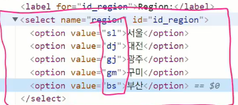

## 데이터를 받되, 유요한 데이터인지를 검증하기


## Form

<hr>

#### Django제공 form 기능

- 우리가 직접 작성한 form 보다, 더 안전하게 수행 가능
- 사용자 데이터를 받고 처리하는 과정 모든걸 django가 해준다..!
- Form Class로 활용 가능.
  - 데이터 유효성 검증, 데이터 검증 결과 재출력, 우효한 데이터에 대해 요구되는 동작수행들, 반복코드 줄여줌

#### Form 선언하기

- 모델 선언하는것과 매우 유사 (필트타입 사용, 일부 매개변수도 비슷)

- forms 라이브러리에서 파생된 Form 클래스를 상속받음

  ```python
  # 1. app 폴더 안에 `forms.py` 생성후 해당 위치에서 작업 시작
  # 2. forms 라이브러리 import
  from django import forms
  # 3. 클래스 생성
  class ArticleForm(forms.Form):
      # 필드값들 선언, 다만 forms에는 TextField 존재 안함
      title = forms.CharField(max_length=10)
      content = forms.CharField()
  
  # 먼저 이 ArticleForm을 create 용도로 사용해본다.
  # views.py
  def new(request):
      form = ArticleForm()
      context = {
          'form': form,
      }
      return render(request, 'articles/new.html', context)
  ```

  

  ```html
  # new.html
  
  {{ form }}
  
  ```

  form 의 rendering 옵션들:

  1. as_p() : 각각의 필드가 p 태그로 감싼다

  2. as_ul() : 각 필드가 li 태그로 감싸진다

     하지만ul 태그는 직접 작성해야한다

  3. as_table(): 각 필드가 테이블( `<tr>` ) 행으로 감싸져서 헨더링됨

     `<table>` 은 직접 작성해야한다

#### Widgets

- form fields에 할당되어 사용된다. (form fields 에서 Textarea는 없다)

  ex.

  `content = forms.CharField(widget=forms.Textarea)`

- django의 html input element를 표현

- 주의!

  - form fields 와 혼동되면 no!
  - form fields 는 input 유효성 검사를 처리, 하지만 widgets 는 단순한 렌더링 처리만 수행!

  ```python
  # forms.py
  from django import forms
  
  class ArticleForm(forms.Form):
      REGION_A = 'sl'
      REGION_B = 'dj'
      REGION_C = 'gj'
      REGION_D = 'gm'
      REGION_E = 'bs'
      REGION_CHOICES = [
          (REGION_A, '서울'), # 튜플로 작성하고, 우측이 사용자에게 보여짐
          (REGION_B, '대전'),
          (REGION_C, '광주'),
          (REGION_D, '구미'),
          (REGION_E, '부산'),
      ]
      
      title = forms.CharField(max_length=10)
      content = forms.CharField()
      # 응용 예시
      region = forms.ChiceField(choices=REGION_CHOICES, widget=forms.Select())
  ```

  결과 : 


## ModelForm

<hr>

- Model에 이미 받고자 하는 필드가 Article이 이미 정의 되어있는데, form 에서 또 필드를  정의해버리면 중복. 

- 고로 먼저 작성하게된 Model을 기반으로 Form 클래스를 만들게 해주는게 ModelForm

  ```python
  # 어플명/forms.py
  from django import forms
  from .models import Article
  
  class ArticleForm(forms.ModelForm):
      # 필드를 재 정의 하지 않고!
      # 어떤 모델을 기반으로 form 을 작성할 것인지에대한 정보를 지정
      class Meta:
          # 사용할 필드들 작성
          model = Article
          
          # 사용자로부터 특정 값들을 받을시:
          # 공식문서상 이 방법을 제일 추천
          fields = ('title', 'content',)
          
          # 사용자로부터 모든 값을 받으려면:
          # auto_now 이런거는 DB에서 자동 입력해주느거여서 출력에서 자동 배제!
          fields = '__all__'
          
          # 특정 필드를 제외시키고 싶을떄
          exclude = ('title',)
  ```

  


## ?

<hr>

```python
# views.py
def create(request):
    title = request.POST.get('title')
    content = request.POST.get('content')
    
    # 데이터가 채워진 form 을 생성. request.POST는 모든 입력값들을 가져옴!
    form = ArticleForm(request.POST)
    # 유효성 검사 통과를 했다면,
    if form.is_valid():		# is_valid() 매서드 하나로 모든 필드 검증 진행..!
        # form 을 저장 후 detail.html 화면으로 사용자 이동
        form.save()
        return redirect('articles:detail', article.pk)
    # 통과 못하면 다시 new.html 화면으로 사용자 이동
    return redirect('articles:new')

```


## views.py 의 최종형태

<hr>

create 와 new 합체

```python
# views.py
def create(request):
    # create
    if requeset.method == 'POST':
        form = ArticleForm(request.POST)
        if form.is_valid():
            article = form.save()
            return redirect('articles:detail', articlel.pk)
    # new
    else:
        form = ArticleForm()
    context = {
        'form': form,
    }
    return render(request, 'articles/create.html', context)
```


# Form 과 ModelForm의 차이

- 재 정의 해야하고, 재 정의 필요없다
- 모델 정보를 미리 알고 있냐 아니냐의 차이


## HTTP Method 처리

- 데코레이터를 활용해서 GET 과 POST를 구분해서 활용


## webex 노트

- url 을 타서 들어오는 요청은 모두 GET 요청이다! 조회하는 행위이니까.

- import get_object_or_404 는 더 단단한(?) 사이트를 만들기 위함

  ​	안 쓰면 500 에러 (서버 탓), 하지만 이걸 쓰면 클라이언트 탓을 해서 책임회피

- form 클래스는 두가지 있다. 폼과 모델폼

- 포스트와 겟을 더 견고하게 해주는건 