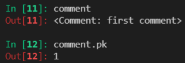
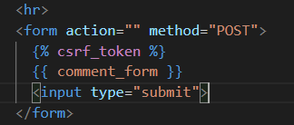
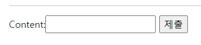
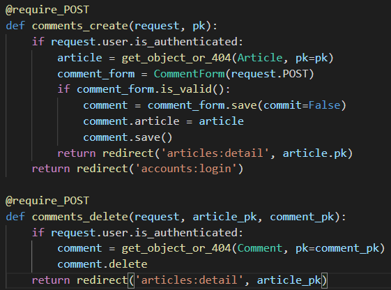
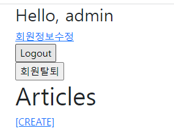
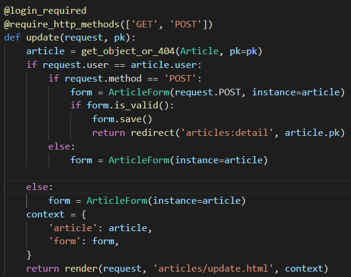

# 1018_django_model_relationship_1

[TOC]

## 시작하기

### 댓글 class 생성


- articles > models.py에 작성해주기

```python
class Comment(models.Model):
    article = models.ForeignKey(Article, on_delete=models.CASCADE)
    content = models.CharField(max_length=200)
    created_at = models.DateTimeField(auto_now_add=True)
    updated_at = models.DateTimeField(auto_now=True)

    def __str__(self):
        return self.content
```

- on_delete는 만약 외래 키가 참조하는 객체가 사라졌을 때 외래 키를 가진 객체를 어떻게 처리할 지를 정의
  - CASCADE : 참조된 객체가 삭제 됐을 때 이를 참조하는 객체도 삭제된다.
- on_delete 필수 !
- article을 적어도 나중에는 `article_id`로 보여짐


- makemigrations를 이용해 설계도 그리기


- migrate로 설계도를 DB에 반영하기


### 댓글 달기


- shell plus키고 시작!


- comment(인스턴스) = Comment()(모델)


```
comment.content = 'first comment'
comment.save()
```

- 오류가 난다... IntegrityError


- article_id가 없다고 알려주는 오류창
- 어느 article에 작성할 것인지 안적어줘서 오류 난거임!


- 새로운 article을 하나 만들어주고


- 참조 : comment.article
  - 댓글은 반드시 자신이 참고하는 게시글이 있음



- 실제로 저장되었는지 확인


- 작성이 된 것을 확인할 수 있다.


- article_id, article.id, article.pk 전부 다 가능 !


### 1번 게시글에 2번째 댓글 달기


- commnet는 오타.. comment로 작성하자.


- 어쨌든 댓글 하나 더 달렸음!


### 역참조를 이용해 댓글 확인


```
article.comment_set.all()
```

- 댓글이 있는지 확인할 수 있음

- `comment_set` 꼭 기억하기!

- comment_set을 사용하기 싫고 comments로 바꾸고 싶으면 articles > models.py에서 수정할 수 있음

  ```
  articles = models.ForeignKey(Article, on_delete=models.CASCADE, related_name='comments')
  ```

  라고 고치면 되는데, 한 번 설정하면 되돌아올 수 없기 때문에 주의해서 사용해야 함

- 아무 것도 없으면 빈 쿼리셋이 반환 됨(`에러 아님!`)


## Comment의 CRUD

### CREATE (댓글 생성)


- models.py에서 작성한 Comment를 import

  ```
  class CommentForm(forms.ModelForm):
      
      class Meta:
          model = Comment
          fields = '__all__'
  ```


- detail만 수정 해줄 것임

  ```
  @require_safe
  def detail(request, pk):
      article = get_object_or_404(Article, pk=pk)
      comment_form = CommentForm()
      context = {
          'article': article,
          'comment_form': comment_form
      }
      return render(request, 'articles/detail.html', context)
  ```

  

- 수정한 detail의 templates도 수정

  ```
  <form action="" method="POST">
    
    {{ comment_form }}
    <input type="submit">
  </form>
  ```

- runserver을 해보니까 뭔가 이상하다...?


- 이미 어떤 글의 댓글을 달기로 했는데 또 article을 설정해야한다고?


- forms.py를 고쳐줘야 함

  ```
  class CommentForm(forms.ModelForm):
      
      class Meta:
          model = Comment
          fields = '__all__'
          exclude = ('article',)
  ```



- 없어졌다! 그냥 끝일까?

- 그럴리가.


```
path('<int:pk>/comments/', views.comments_create, name='comments_create')
```


```
  <form action="" method="POST">
    
    {{ comment_form }}
    <input type="submit">
  </form>
```


```
def comments_create(request, pk):
    article = get_object_or_404(Article, pk=pk)
    comment_form = CommentForm(request.POST)
    if comment_form.is_valid():
        comment = comment_form.save(commit=False)
        comment.article = article
        comment.save()
    return redirect('articles:detail', article.pk)
```

- save(commit=False) : 데이터베이스에 저장되지 않은 인스턴스를 반환


### READ (댓글 조회)


```
@require_safe
def detail(request, pk):
    article = get_object_or_404(Article, pk=pk)
    comment_form = CommentForm()
    comments = article.comment_set.all()
    context = {
        'article': article,
        'comment_form': comment_form,
        'comments' : comments
    }
    return render(request, 'articles/detail.html', context)
```


```
  <h4>댓글 목록</h4>
  <ul>
    
      <li>{{ comment.content }}</li>
    
  </ul>
```


### DELETE (댓글 삭제)


```
path('<int:article_pk>/comments/<int:comment_pk>/delete', views.comments_delete, name='comments_delete'),
```


```
@require_POST
def comments_delete(request, article_pk, comment_pk):
    comment = get_object_or_404(Comment, pk=comment_pk)
    comment.delete
    return redirect('articles:detail', article_pk)
```


- detail.html 수정해주기

  ```
    <hr>
    <h4>댓글 목록</h4>
    <ul>
      
        <li>{{ comment.content }}
          <form action="" method="POST" class="d-inline">
            
            <input type="submit" value="DELETE">
          </form>
        </li>
      
    </ul>
    <hr>
  ```



- 인증된 사용자만 사용할 수 있도록!

  ```
  @require_POST
  def comments_create(request, pk):
      if request.user.is_authenticated:
          article = get_object_or_404(Article, pk=pk)
          comment_form = CommentForm(request.POST)
          if comment_form.is_valid():
              comment = comment_form.save(commit=False)
              comment.article = article
              comment.save()
          return redirect('articles:detail', article.pk)
      return redirect('accounts:login')
  
  @require_POST
  def comments_delete(request, article_pk, comment_pk):
      if request.user.is_authenticated:
          comment = get_object_or_404(Comment, pk=comment_pk)
          comment.delete
      return redirect('articles:detail', article_pk)
  ```


### 추가) 댓글이 없을 때


```
    
      <p>댓글이 없어요..</p>
    
```


### 추가) 댓글 개수 세기


```
	<h6> {{ comments|length }}개</h6>
```


## 사용자 정의 인증 in Django


### 유저 모델 대체하기

- 내장 User 모델이 제공하는 인증 요구사항이 적절하지 않을 수 있음
- 예) username 대신 email을 아이디로 사용하는 사이트 있을 수 있음
- AUTH_USER_MODEL값을 제공하여 default user model을 재정의할 수 있도록 함
- 커스텀 유저 모델을 설정하는 것을 강력하게 권장
- 프로젝트의 모든 migrations 혹은 migrate를 실행하기 전에 이 작업을 마쳐야 함(진행하는 동안 변경할 수 없음) -> 사실 변경은 가능하지만 너무 어려운 작업임. 그래서 초기에 설정하기를 권장함
- 기본 값 : `auth.User` 

#### AUTH_USER_MODEL

- Custom User 모델 정의하기


- accounts > models.py

- `AbstractUser`라는 기본 User model을 사용하기는 함!

- https://docs.djangoproject.com/en/3.2/topics/auth/customizing/#substituting-a-custom-user-model

  ```
  from django.contrib.auth.models import AbstractUser
  
  class User(AbstractUser):
      pass
  ```


- 저장하면 바아로 에러남


- settings.py

- 기존에 django가 사용하는 User 모델이었던 auth 앱의 User 모델을 accounts의 User 모델을 사용하도록 변경해주는 작업

  ```
  AUTH_USER_MODEL = 'accounts.User'
  ```


- accounts > admin.py

- admin sit에 Custom User 모델 등록

  ```
  from django.contrib import admin
  from django.contrib.auth.admin import UserAdmin
  from .models import User
  
  admin.site.register(User, UserAdmin)
  ```


- 가지고 있던 DB와 migrations를 다 삭제하고 다시 makemigrations, migrate를 해준다.
- 굉장히 까다로운 작업이고, 파일을 날리기 부담스러우니 꼭 프로젝트 시작 전에 수정하고 시작하자!!!


- accounts > forms.py

- 유저 모델을 부르는 2가지 방법

  1. Models.py에서 Use 모델을 부른다. (settings.AUTH_USER_MODEL)
  2. 그 외 나머지 모든 곳에서는 get_user_model()

      class CustomUserCreationForm(UserCreationForm):
      
          class Meta(UserCreationForm.Meta):
              model = get_user_model()
              fields = UserCreationForm.Meta.fields + ('email',)


- accounts > views.py

- 방금 만들어준 CustomUserCreationForm를 import 해준다.

  ```
  from .forms import CustomUserChangeForm, CustomUserCreationForm
  ```


- 원래 있던 UserCreationForm에서 CustomUserCreationForm으로 바꿔준다.

  ```
  @require_http_methods(['GET', 'POST'])
  def signup(request):
      if request.user.is_authenticated:
          return redirect('articles:index')
  
      if request.method == 'POST':
          form = CustomUserCreationForm(request.POST)
          if form.is_valid():
              user = form.save()
              auth_login(request, user)
              return redirect('articles:index')
      else:
          form = CustomUserCreationForm()
      context = {
          'form': form,
      }
      return render(request, 'accounts/signup.html', context)
  ```

  


- singup 페이지가 뜬다. (이메일 주소를 작성하는 칸이 생김!)



- 끝내고 나면 회원가입이 된다!

- 굿!

######## 지금까지 한 것이 User 모델을 작성한 것이다! ########

#### User모델 대체 후 다양한 설정들

1. article의 작성자 찾기


- articles > models.py

  ```
  from django.db import models
  from django.conf import settings
  
  # Create your models here.
  class Article(models.Model):
      user = models.ForeignKey(settings.AUTH_USER_MODEL, on_delete=models.CASCADE)
      title = models.CharField(max_length=10)
      content = models.TextField()
      created_at = models.DateTimeField(auto_now_add=True)
      updated_at = models.DateTimeField(auto_now=True)
  
      def __str__(self):
          return self.title
  ```


- makemigrations하려고 하니까 전에 내용들은 어떻게 할 것인지 질문이 나온다.


- 이럴 때 1번을 선택하고, 한번 더 1을 누르면 완료


- migrate도 진행해준다.


- 짜잔! 나오긴 나오는데 갑자기 User를 선택하라고 한다.

- 우리는 결국 1개의 아이디만 로그인하기 때문에 이런 창은 귀찮고 번거로움


- 고치러 가자.

- articles > forms.py

  ```
  class ArticleForm(forms.ModelForm):
  
      class Meta:
          model = Article
          fields = ('title', 'content',)
  ```

  - 참고로 exclude 사용해도 상관 없음


- 오예 이제 User가 없으니까 바로 보내지겠지?
- 보내도 여전히 오류가 난다 왜!?


- save(commit=False) : 데이터베이스에 저장되지 않은 인스턴스를 반환

- articles > views.py

  ```
  @login_required
  @require_http_methods(['GET', 'POST'])
  def create(request):
      if request.method == 'POST':
          form = ArticleForm(request.POST)
          if form.is_valid():
              article = form.save(commit=False)
              article.user = request.user
              article.save()
              return redirect('articles:detail', article.pk)
      else:
          form = ArticleForm()
      context = {
          'form': form,
      }
      return render(request, 'articles/create.html', context)
  ```

- 엣헴 문제 없쮜!

2. 글 작성자 보여주기


- articles > templates > articles > detail.html

  ```
    <p>글 작성자 : {{ article.user }}</p>
  ```

3. 글 작성자만 삭제, 수정할 수 있도록 만들어주기


- 아무나 내 글을 삭제하면 안되니까 고쳐준다.

  ```
  @require_POST
  def delete(request, pk):
      article = get_object_or_404(Article, pk=pk)
      if request.user.is_authenticated:
          if request.user == article.user:
              article.delete()
              return redirect('articles:index')
      return redirect('articles:detail', article.pk)
  ```



- 마찬가지로 아무나 내 글을 수정하면 안되니까 고쳐주자!

  ```
  @login_required
  @require_http_methods(['GET', 'POST'])
  def update(request, pk):
      article = get_object_or_404(Article, pk=pk)
      if request.user == article.user:
          if request.method == 'POST':
              form = ArticleForm(request.POST, instance=article)
              if form.is_valid():
                  form.save()
                  return redirect('articles:detail', article.pk)
          else:
              form = ArticleForm(instance=article)
      
      else:
          form = ArticleForm(instance=article)
      context = {
          'article': article,
          'form': form,
      }
      return render(request, 'articles/update.html', context)
  ```

4. 이왕 이럴거 작성자만 버튼이 보이도록 수정하기


- articles > templates > articles > detail.html

  ```
    
      <a href="">[UPDATE]</a>
      <form action="" method="POST">
        
        <input type="submit" value="DELETE">
      </form>
    
  ```

- 짜잔! 그럼 완성 (뿌듯)

5. Comment에도 같은 작업 하기!


- articles > models.py

- user 인스턴스를 생성해준다.

  ```
  class Comment(models.Model):
      user = models.ForeignKey(settings.AUTH_USER_MODEL, on_delete=models.CASCADE)
      article = models.ForeignKey(Article, on_delete=models.CASCADE)
      content = models.CharField(max_length=200)
      created_at = models.DateTimeField(auto_now_add=True)
      updated_at = models.DateTimeField(auto_now=True)    
      
      def __str__(self):
          return self.content
  ```

  


- articles > views.py

- 인증된 사용자만 댓글을 작성할 수 있도록 만들어 준다.

  ```
  @require_POST
  def comments_create(request, pk):
      if request.user.is_authenticated:
          article = get_object_or_404(Article, pk=pk)
          comment_form = CommentForm(request.POST)
          if comment_form.is_valid():
              comment = comment_form.save(commit=False)
              comment.article = article
              comment.user = request.user
              comment.save()
          return redirect('articles:detail', pk)
      return redirect('accounts:login')
  ```


- articles > templates > articles > detail.html
- if문을 이용해서 요청한 사용자(request.user)와 댓글 다는 사용자(comment.user)가 같은지 판단


- articles > templates > articles > detail.html
- 인증된 사용자가 아닐 때는 로그인 하라는 hyperlink를 준다.


- 댓글 작성 유저 작성하기

  ```
  <li>댓글 작성 유저 : {{ comment.user }}</li>
  ```


- articles > views.py

- 댓글을 삭제하는 경우도 만찬가지로 인증된 사용자만 삭제할 수 있도록 만든다.

  ```
  @require_POST
  def comments_delete(request, article_pk, comment_pk):
      if request.user.is_authenticated:
          comment = get_object_or_404(Comment, pk=comment_pk)
          if request.user == comment.user:
              comment.delete()
          return redirect('articles:detail', article_pk)
      return redirect('accounts:login')
  ```


- articles > models.py
- related_name을 설정하면 comment_set -> comments가 된다.
- 사용 이유 : 1이 N을 불러올 때 _set이던 것을 이름을 바꿔준다!
- makemigrations와 migrate해주기


- 오류가 발생했다. 이런
- related_name을 바꿨는데 views.py에 그대로 둬서 문제가 발생한 것이다.


- articles > views.py

- 방금 related_name을 수정해줬으니 comment_set에서 comments로 바꿔준다.

  ```
  @require_safe
  def detail(request, pk):
      article = get_object_or_404(Article, pk=pk)
      comment_form = CommentForm()
      # comments = article.comment_set.all()
      comments = article.comments.order_by('-pk')
      context = {
          'article': article,
          'comment_form': comment_form,
          'comments': comments
      }
      return render(request, 'articles/detail.html', context)
  ```

  - 끗~!


