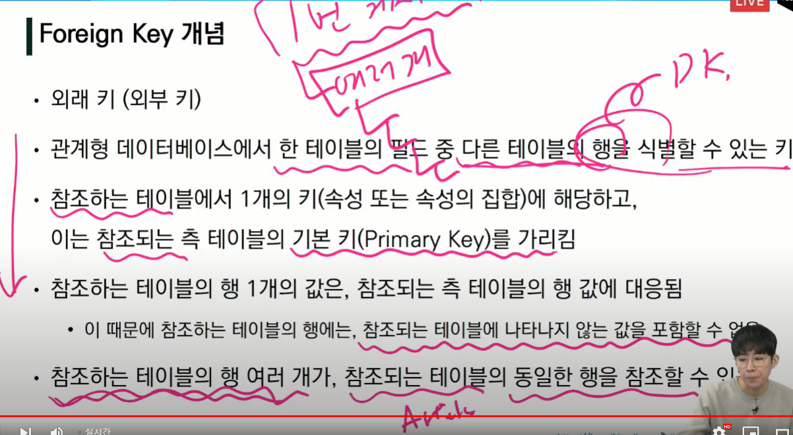
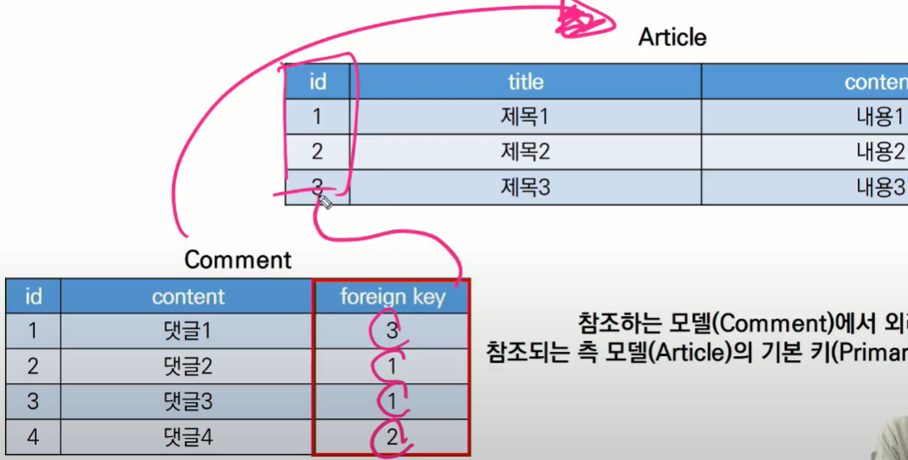
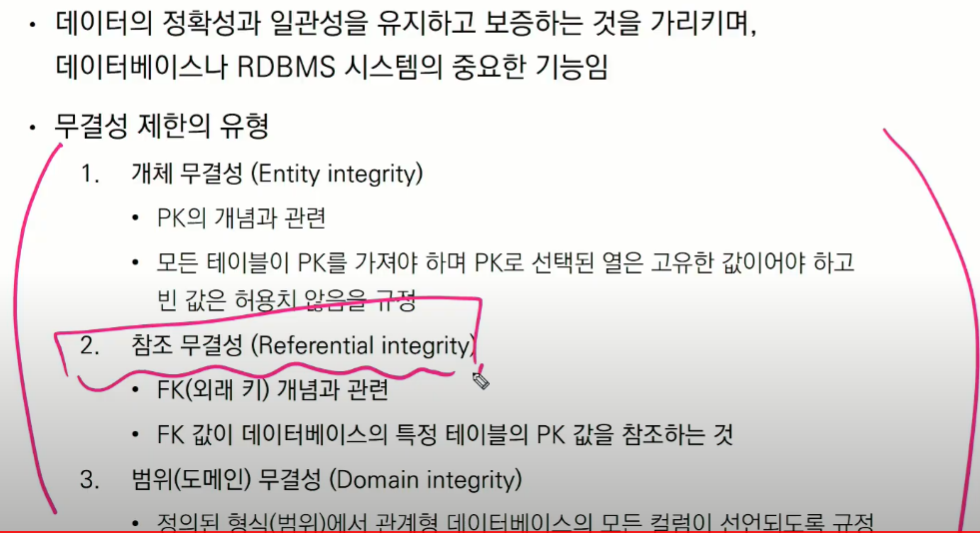
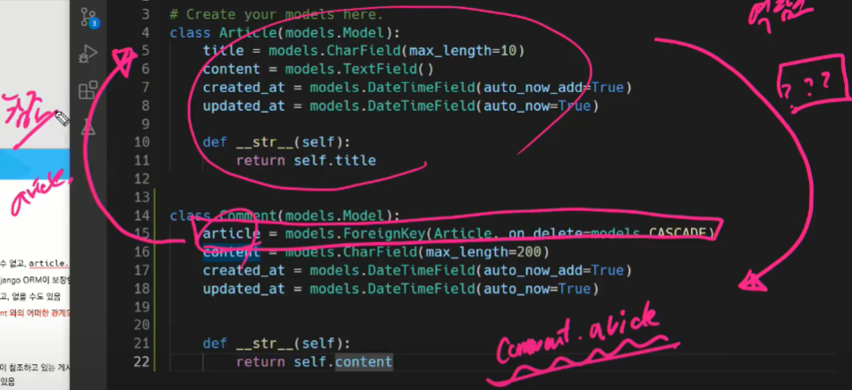
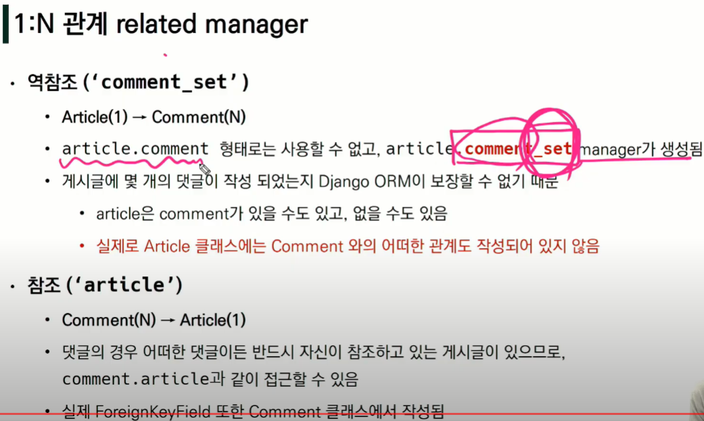
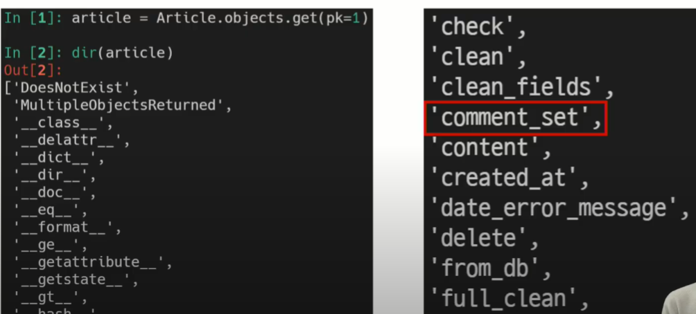
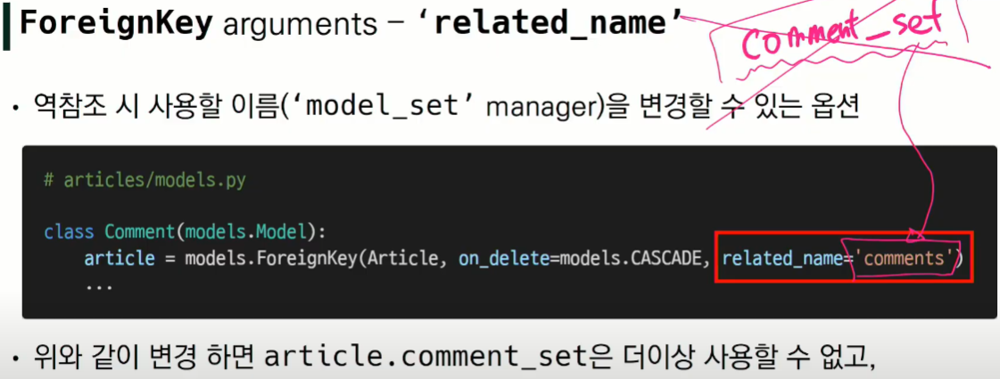

## Foreign Key 개념

관계형 DB에서 하나의 테이블의 필드 중,

다른 테이블의 행을 식별 할 수 있는 Key



<br>

### 가장 기본적인 형태



<br>

### Foreign key 특징

키를 사용하여 부모 테이블의 유일한 값을 참조 (참조 무결성)

강제로 Aritcle 의 title 혹은 content를 foreign key 로 설정 가능하지만, id 값의 유일성이 매우 적합.

참조 무결성 원칙: 

- DB 관계 모델에서 관련된 2개의 테이블 간의 일관성을 말함
- 외래 키가 선언된 테이블의 오리ㅐ 키 속성(열)의 값은 그 테이블의 부모가 되는 테이블의 기본 키 값으로 존재해야 함

<hr>

<br>

<br>

## django model 에서의 활용

### ForeignKey field

- 1 대 N 관계

- 2개의 위치 인자가 필요

  - 참조하는 model class
  - on_delete 옵션

- migrate 작업 하게 될텐데, 그떄 이름에 `_id` 추가해서 DB 열 이름 만듦

  - 명시적인 모델 관계 파악을 위해 참조하는 클래스 이름의 소문자 단수형으로 작성하는것 강력 추천.

  - 1 대 N 관계속에, N 쪽에 새로운 컬럼이 생긴다

    (참조하는 쪽에서 새로운 컬럼 생성됨)

<br>

### on_delete  : 이건 필수!

- 외래 키가 참조하는 객체가 사라졌을 때 외래 키를 가진 객체를 어떻게 처리할 지를 정의

- `on_delete=CASCADE`옵션인 경우는, 

  게시글을 지웠을때, 해당 게시글을 참조하는 모든 객체들도 삭제된다.

- 이것은 Database integrity (data 무결성) 유지위해 필수 작업.

  - 데이터의 정확성과 일관성을 보증

<br>

### 데이터 무결성



<br>

### 참조와 역참조





<br>

### article 인스턴스가 사용 가능한 모든 속성, 메서드



<br>

### 역참조 시 사용할 이름 설정

- 
- 부득이하게 comment_name 이름이 겹쳐질때 사용한다.
- 원래는 `article.comment_set` 이지만, 위와같은 경우는 `article.comment` 로 역참조 가능하다.
- 

<hr>
<br>

<br>

## comment CREATE

1. CommentForm 작성

   - ```python
     from django import forms
     from .models import Article
     
     class ArticleForm(forms.ModelForm):
     	class Meta:
     		model = Article
     		fields = '__all__'
     class CommentForm(forms.ModelForm):
     	class Meta:
     		model = Comment
     		# fields = '__all__'
              exclude = ('article',)
     ```

2. views.py 에서 CommentForm 설정

   - ```python
     from .models import CommentForm
     def detail(request, pk):
     	article = get_object_or_404(Article, pk=pk)
     	comment_form = CommentForm()
     	context = {
     		'comment_form': comment_form,
     	}
     	...
     ```

3. detail 페이지에서 CommentForm 출력

   - ```django
     <form action="" method="POST">
     	
         {{comment_form}}
         <input type='submit'>
         </form>
     ```

   - 

<br>

### `save(commit=False)`

DB에 저장은 안하되, 인스턴스로 넘겨줄 수 있다.

사용이유는, 게시글이랑 연결이 안되면, article 없이 저장돼서 오류, 고로 not null constraint failed 에러 발생.

활용방법은:

댓글 저장을 하는 시점에서 어떤 게시글에 저장 할 지를 추가해준다.

db저장 안하고 comment 객체만 반환한 후에 어떤 게시글에 저장될지 설정하고 다시 save.

<hr>

<br>

<br>

## Substituting a custom User model

- 장고 왈: custom User model 활용 강력추천!

- `UserCreationForm` 은  auth.model 의 기본값을 가르키니까,

  custom User model 활용 시, forms.py 에 CustomUserCreationForm 작성해서 이걸 UsercreationForm 대신에 활용


<br>

<br>

## 웹ex 팁들

웹의 전부 = 클라이언트와 서버간의 요청과 응답

DTL = django template language (장고가 만든 html 에서만 사용 가능)

form = 사용자가 보는 화면에서 사용자가 입력하는것, customize 가능

modelForm = class Meta 통해서 모델을 상속받음. 하지만 customize못함

csrf_token = DB를 조작하는 행위를 할때..