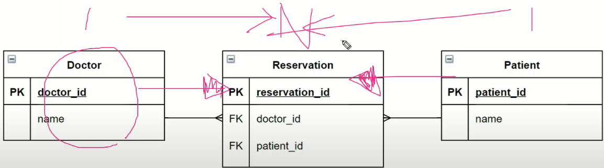

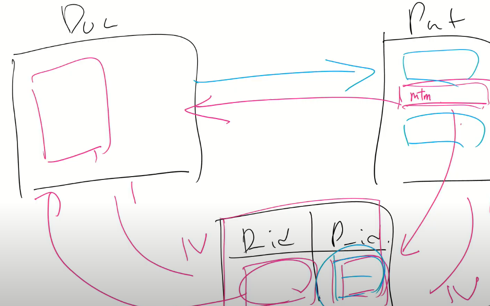

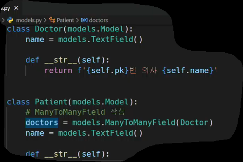

1,2번 사진이 3번 사진의 visualization 이다.

`ManyToManyField(참조모델)` 의 위치는 Doctor or Patient 상관없다.

어차피 중계 모델이 만들어지고, doctor patient 둘 다 각 각 해당 모델과 

1:N 관계를 갖기 때문.

또한, `ManyToManyFIeld`는 따로 필드를 생성하지않는다.

 

### 중계 테이블을 직접 만드는 경우는 없나?

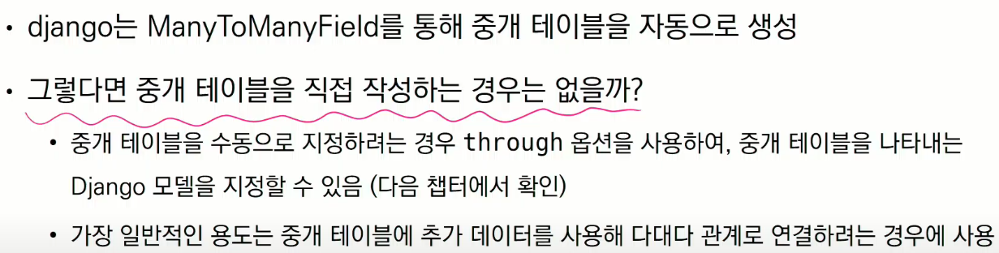

예시:

- 예약정보에 증상, 병명, 예약시간, 등 추가적인 데이터를 중계 필드에 더해야하면, 직접 중계 테이블을 작성 해야한다.
- 해당 커스텀 중계 테이블은 `through` 옵션을 활용하여 생성한다.

 

## `related_name`

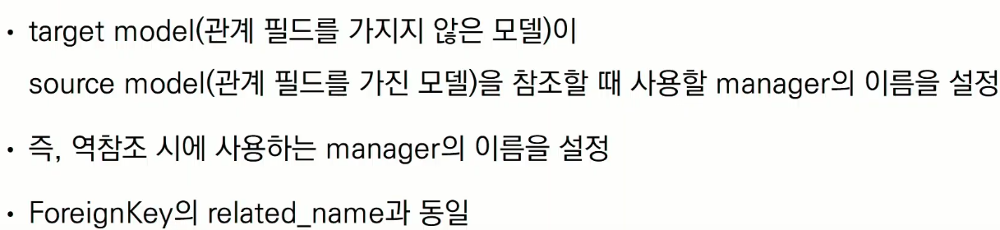

 

## `ManyToManyField` 기초 요약

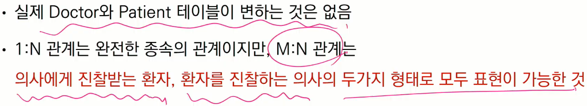

 

 

### related Manager

- 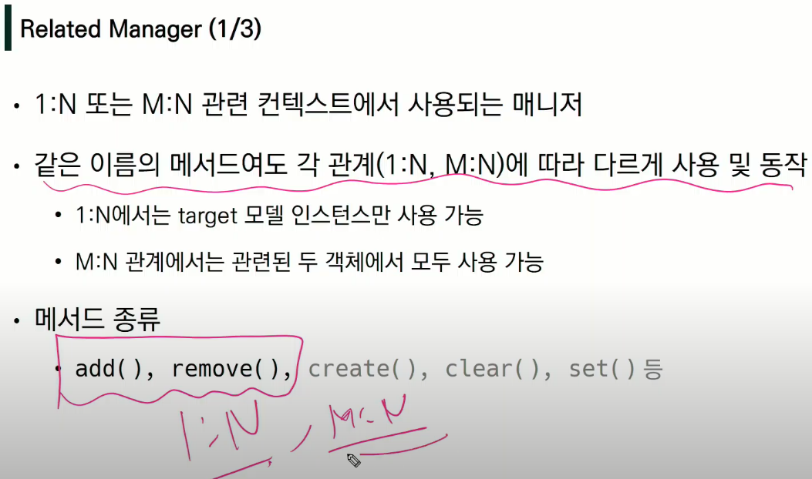
- 매서드는 1:n m:n 일때 각각 다르게 작동한다
- 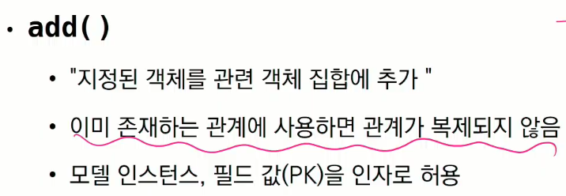
- 

 

## through 옵션 활용

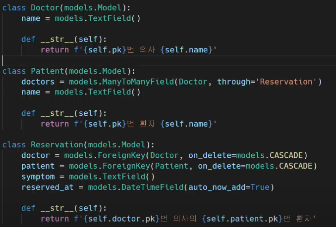

환자입장에서 through 활용

- 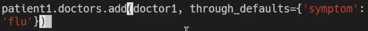

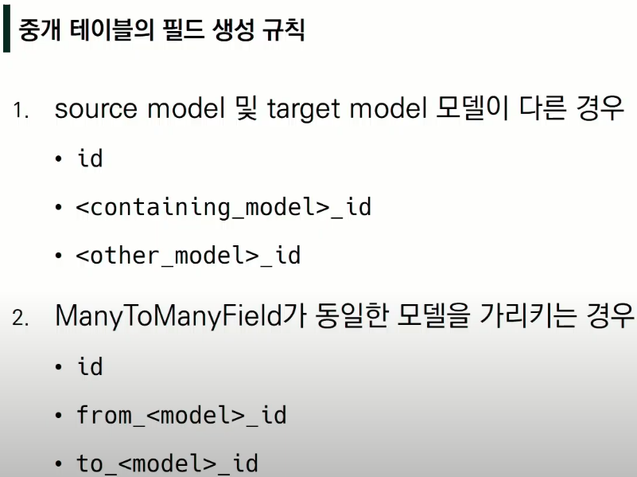

 

 

## 좋아요 기능 만들기 (대표적인 M:N 관계)

