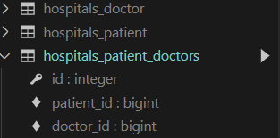

ManyToManyField 통해 중계 태이블 생성하면,

​	`앱이름 _ 클래스이름 _ 필드이름`

순으로 이름이 자동 정의 된다.

필드의 이름들은 mtm field가 참조하는 

1. `클래스이름 _ id`

   mtm 필드가 선언된

2.  `클래스이름 _ id`


## M : N 관계

- 서로가 서로간의 1 : N 관계를 가지고있다


<hr>


### with

```django

	...

```

with 태그 안에서 특정한 변수 로직을 지정해서 사용 가능하다.

깔끔하게 정돈하면서 코딩 가능. 가독성 up

<hr>


매니저떄문에 

`add`,  `no` 를 활용한다.