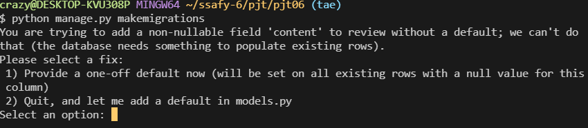

# Simple forum 3 ( + login functionality)

by Tae Hun KIM, 

partnered with Jang Hoon O

        


1. [Build-process](#build-process)
2. [Acquired knowledge](#acquired knowledge)
3. [Challenges & Solutions](#challenges & solutions)
4. [Takeaway](#takeaway)

<hr>
<br>
<br>


<br>

<br>


## :handshake:  Build-process (페어 프로그래밍)

<hr>


1. 이번 설명도, 새로운 구현 요소들 위주로 이루어졌습니다.

   이전 프로젝트와 유사하게, 장고 프레임워크를 이용하여 명세서에 적힌 대로 기본적인 CRUD 를 구현하기 위한 틀을 잡는것부터 시작했습니다.

   model, view, templates 를 지정 해 주었습니다

   하지만, 시간 관계상 static file 과 media file은 이번 프로젝트에서는 다루지 않았습니다.

   

   <br>

   <br>

2. `Review`의 필드값들을 정의

   ```python
   class Review(models.Model):
       movie_title = models.CharField(max_length=100),
       title = models.CharField(max_length=100),
       content = models.TextField(),
       rank = models.IntegerField(),
   ```

   <br>

   <br>

3. 게시글 생성( `create` ) 및 수정과 같은 DB에 영향을 미치는 기능들은 모두 `@login_required` 데코레이터로 로그인을 해야만 사용 가능하게 끔 제한을 걸었습니다. 

   ```python
   # views.py
   @login_required
   @require_http_methods(['GET', 'POST'])
   def create(request):
       if request.method == 'POST':
           form = ReviewForm(request.POST)
           if form.is_valid():
               review = form.save()
               return redirect('community:detail', review.pk)
       else:
           form = ReviewForm()
       context ={
           'form': form,
       }
       return render(request, 'community/create.html', context)
           ...
   ```

   <br>

   <br>

4. 로그인 기능은 장고에서 기본적으로 제공하는 `AuthenticationForm`을 활용하여 아래와 같이 구현되었고, 

   ```python
   # views.py
   @require_http_methods(['GET', 'POST'])
   def login(request):
       if request.user.is_authenticated:
           return redirect('community:index')
   
       if request.method == 'POST':
           form = AuthenticationForm(request, request.POST)
           if form.is_valid():
               auth_login(request, form.get_user())
               return redirect(request.GET.get('next') or 'community:index')
       else:
           form = AuthenticationForm
       context = {
           'form': form,
       }
       return render(request, 'accounts/login.html', context)
   ```

   <br>

   <br>

5. 로그인을 하기 위한 회원가입 기능은 `UserCreationForm`을 활용하여 아래와 같이 구현하였습니다.

   ```python
   # views.py
   @require_http_methods(['GET','POST'])
   def signup(request):
       if request.user.is_authenticated:
           return redirect('community:index')
       if request.method == 'POST':
           form = UserCreationForm(request.POST)
           if form.is_valid():
               user = form.save()
               auth_login(request, user)
               return redirect('community:index')
       else:
           form = UserCreationForm()
       context = {
           'form': form,
       }
       return render(request, 'accounts/signup.html', context)
   ```

   <br>

   <br>

6. 아래와 같이, 템플릿 상에서 로그인이 되어 있다면 로그인과 회원가입 버튼은 확인을 못하게 막아놨지만, 혹시 모를 상황에 대비하여 회원가입과 로그인 기능 둘 다, 함수의 가장 먼저 `if`문으로 로그인이 되어있음을 확인하고,

   로그인이 되어있다면 회원가입이나 로그인 기능이 소용이 없으므로, `index` 페이지로 리다이렉팅 되도록 설정하였습니다.

   ```django
    _navbar.html 
   
             <li class="nav-item">
               <a class="nav-link active" href="">게글 작성</a>
             </li>
             <li class="nav-item">
               <a class="nav-link active" href="">회원정보 수정</a>
             </li>
             <li class="nav-item">
               <a class="nav-link active" href="">로그아웃</a>
             </li>
           
             <li class="nav-item">
               <a class="nav-link active" href="">회원가입</a>
             </li>
             <li class="nav-item">
               <a class="nav-link active" href="">로그인</a>
             </li>
           
   ```

   <br>

   <br>

7. 로그아웃 같은 경우는, 아래와 같이 구현 되었고,

   ```python
   @require_safe
   def logout(request):
       auth_logout(request)
       return redirect('community:index')
   ```

   <br>

   <br>

8. 명세서에서 추가적으로 `CustomUserChangeForm`을 활용한 회원정보 수정과, `PasswordChangeForm` 을 활용한 비밀번호 수정 기능도 추가하였습니다.

   ```python
   @login_required
   @require_http_methods(['GET', 'POST'])
   def update(request):
       
       if request.method == 'POST':
           form = CustomUserChangForm(data=request.POST, instance=request.user)
           if form.is_valid():
               form.save()
               return redirect('community:index')
       else:
           form = CustomUserChangForm(instance=request.user)
       context = {
           'form': form,
       }
       return render(request, 'accounts/update.html', context)
   
   @login_required
   @require_http_methods(['GET', 'POST'])
   def change_pw(request):
       if request.method == 'POST':
           form = PasswordChangeForm(request.user, request.POST)
           if form.is_valid():
               user = form.save()
               update_session_auth_hash(request, user)
               return redirect('community:index')
       else:
           form = PasswordChangeForm(request.user)
       context = {
           'form': form,
       }
       return render(request, 'accounts/change_pw.html', context)
   ```

   <br>

   <br>

<hr>
<br>
<br>
<br>

<br>


## :memo:  Acquired knowledge 

<hr>


- 다양한 django의 built-in 폼들과 모델폼들.
- django를 활용한 Authentication 기능 구현법

<hr>
<br>
<br>
<br>


<br>

## :fire:  Challenges & Solutions 

#### 1. Problem: 마이그레이션 문제



모델의 필드값들을 제대로 정의하기도 전에 마이그레이션을 해버려서 위와같은 에러가 났습니다.

해결방법으로는, 가장 직관적이게 DB자체를 삭제하고, 다시 마이그레이션 을 하여 문제를 해결하였습니다.

<hr>
<br>
<br>
<br>

<br>


## :shopping_cart:  Takeaway

<hr>

2주 전 프로젝트 (pjt04) 와 같이, 네이게이터 와 드라이버 역할을 번갈아 가며 프로젝트를 수행했습니다.

다시 장훈님과 함께 프로젝트를 진행하게 되었고, 너무 잘 해주셔서 제한 시간 내에 많은 기능들을 구현 할 수 있었던 프로젝트이지 않았나 생각합니다. 그리고 프로젝트의 방향성을 파트너와 사전에 공유함으로써, 이전 프로젝트(pjt05)에서 피드백 한 '후반 생산성'을 개선할 수 있었던게 좋았습니다. 또한, 조금이나마 서로 익숙해져서 그런지, 스무스한 커뮤니케이션으로 가장 즐거웠던 프로젝트가 아니었나 생각합니다.

하지만 아쉬운 부분이 있었다면, 전반적인 DB와 django의 소통 터미놀로지에 대한 이해 부족으로, 이와 관련된 자잘한 에러들로 인해 시간을 많이 낭비 했다는 점 입니다.

다음 페어 프로그래밍을 수행하게 된다면, 파트너와 사전에 명확한 목적 공유를 하는것은 물론, django와 DB의 소통 터미놀로지에 대한 이해력을 높인다면 더 나은 결과물을 만들 수 있을거라 생각합니다.
