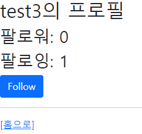
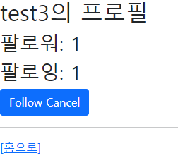
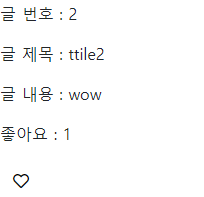
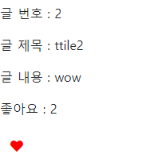

# Simple Review Forum

by Tae Hun KIM, 

partnered with Seong Ryeol LEE

        


1. [Build-process](#build-process)
2. [Acquired knowledge](#acquired knowledge)
3. [Challenges & Solutions](#challenges & solutions)
4. [Takeaway](#takeaway)

<hr>
<br>
<br>

## :triangular_flag_on_post: Goal Implementations

<hr>

`1 : N` 관계와 `M : N` 관계 DB 관계 설정을 활용한 

1. 리뷰 글  '좋아요' 기능
2. 유저 '팔로우' 기능

<hr>

<br>

<br>

<br>


## :handshake:  Build-process (페어 프로그래밍)

<hr>

1. '좋아요' 와 '팔로우' 기능 구현을 위해, 가장 먼저 최소한의 기능들을 구현했습니다.

   - CRUD 중, Create 와 Read
   - 로그인, 로그아웃, 회원가입

   ```python
   # community/views.py
   ...
   @require_http_methods(['GET', 'POST'])
   @login_required
   def create(request):
   	...
       
   @require_safe
   def index(request):
   	...
   
   @require_safe
   def detail(request, review_pk):
   	...
   ....
   ```

   ```python
   # accounts/views.py
   ...
   @require_http_methods(['GET', 'POST'])
   def signup(request):
       ...
   
   @require_http_methods(['GET', 'POST'])
   def login(request):
       ...
   
   def logout(request):
       ...
   ...
   ```

   <br>

2. 팔로우 기능 구현에 앞서, 1개 이상의 유저 객체를 생성할 필요가 있으므로 (팔로워 유저, 팔로잉 유저), 아래와 같이 커스텀 유저 모델을 활용했습니다.

   물론, 다른 모델을 만들고 (예: `FollowerUser`) 장고의 기본 유저 모델과 `1 : 1` 관계로 엮는 방법으로 1개 이상의 유저 객체를 구현할 수 있었습니다.

   하지만 이와같은 방법은, 만약 유저 모델을 수정하게 되면, 해당 유저 모델과 연관되어있는 모든 DB (예: ForeignKey, ManyToMany 관계로 연결된 모든 table) 를 하드코딩으로 수정해야하는 상황이 발생합니다.

   참고로, 장고 공식문서에서도 강력히 커스텀 유저 모델을 활용하는걸 추천하고있습니다.

   고로, 아래와같은 커스텀 유저 모델을 만드는 방법을 기용하였습니다.

   ```python
   # accounts/models.py
   class User(AbstractUser):
       followings = models.ManyToManyField('self', symmetrical=False, related_name='followers')
   
   # accounts/forms.py
   User = get_user_model()
   class CustomUserCreationForm(UserCreationForm):
       class Meta(UserCreationForm.Meta):
           model = User
           fields = ('first_name', 'username',)
   ```

   ```python
   # settings.py
   AUTH_USER_MODEL = 'accounts.User'
   ```

   <br>

3. 다음으로 팔로우기능을 담을 유저의 프로필 페이지를 구현과 팔로우 기능 로직 구현을 하였습니다. 

   ```python
   # accounts/views.py
   def profile(request, username):
       target = get_object_or_404(get_user_model(), username=username)
       context = {
           'target': target,
       }
       return render(request, 'accounts/profile.html', context)
   
   @require_POST
   def follow(request, username):
       if request.user.is_authenticated:
           target = get_object_or_404(get_user_model(), username=username)
           if request.user != target:
               if target.followings.filter(username=request.user).exists():
                   target.followings.remove(request.user)
               else:
                   target.followings.add(request.user)
           return redirect('accounts:profile', username)
       return redirect('accounts:login')
   ```

   <br>

4. 토글 버튼으로 팔로우와 언팔로우를 표시하였습니다.  추가로, 해당 유저의 팔로우와 팔로잉 숫자도 표시하며 팔로우 기능 구현을 마쳤습니다.

   ```django
    accounts/profile.html 
   ...
    팔로우 버튼 
     
       <form action="" method="POST">
         
         
           <button class="btn btn-primary" data-toggle="toggle">Follow Cancel</button>
         
           <button class="btn btn-primary" data-toggle="toggle">Follow</button>
         
       </form>
     
   ...
   ```

   

   <br>

5. 다음으로 리뷰 글 의 좋아요 기능 구현을 위해 테이블간에 `M:N` 관계와 `1:N` 관계를 `ForeignKey` 와 `ManyToMany` 필드를 통해 설계했습니다. 

   ```python
   # community/models.py
   class Review(models.Model):
       ...
       user = models.ForeignKey(settings.AUTH_USER_MODEL, on_delete=models.CASCADE)
       like_users = models.ManyToManyField(settings.AUTH_USER_MODEL, related_name='like_review')
   ...
   ```

6. 다음으로 좋아요 기능의 로직을 구성하였습니다.

   ```python
   # community/views.py
   @require_POST
   def like(request, review_pk):
       if request.user.is_authenticated:
           review = get_object_or_404(Review, pk=review_pk)
           if review.like_users.filter(pk=request.user.pk).exists():
               review.like_users.remove(request.user)
           else:
               review.like_users.add(request.user)
           return redirect('community:detail', review_pk)
       return redirect('accounts:login')
   ```

7. 마지막으로 [Font Awesome](https://fontawesome.com/) 을 활용한 좋아요 표시 로직을 구성하였습니다.

   ```django
    community/detail.html 
    받은 좋아요 개수 
   <p>좋아요 : {{ review.like_users.all|length }}</p>
   
      좋아요 기능 
     <div>
       <form action="" method="POST">
         
         
            좋아요 표시 취소 
           <button class="btn btn-link" style="color:red"><i class="fas fa-heart"></i></button>
         
            좋아요 표시 
           <button class="btn btn-link" style="color:black"><i class="far fa-heart"></i></button>
         
       </form>
   ...
   ```

    

   

   

<hr>
<br>
<br>
<br>


## :memo:  Acquired knowledge 

<hr>

#### `Foreign Key` 와 `ManyToMany` 를 활용한 데이터간의 참조 & 역참조

- 데이터간에 연결고리를 만들어 웹 어플리케이션을 더욱 역동적으로 구현할 수 있게되었습니다.

  또한, 커스텀 유저 모델을 활용하여 추후에 모델에 수정사항이 생기더라도 효율적으로 대처할 수 있다는 것도 알게 되었습니다.

### 효율적이지 않은 데이터 호출

- 구현을 끝내고 코드를 돌아보니, DB를 활용한 코드와 파이썬을 활용한 코드가 난무했습니다.

  특히, DB에서 쿼리셋을 불러올때는 ORM을 활용하는게 시간복잡도를 줄일 수 있다는 점에서, 적절한 타이밍에 적절한 ORM을 활용할 수 있도록, 공부와 고민이 필요하다 느꼈습니다.

<hr>
<br>
<br>

<br>


## :shopping_cart:  Takeaway

<hr>

이전 프로젝트 (pjt06) 와 같이 드라이버와 네비게이터를 번갈아가며 수행한 프로젝트입니다.

제 파트너이자 드라이버 역할을 맡아주셨던 성렬님과 열띈 커뮤니케이션을 이어가며 프로젝트를 수행했고, 결과물로써는 볼품 없어 보일 수 있으나, 가장 즐기면서 코드를 쨧던 프로젝트였습니다.

이전 프로젝트로부터 개선된 점이 있다면, DB와 django의 소통 터미놀로지에 대한 이해가 높아져, 이와 관련된 자잘한 에러들과는 마주하지 않았던 점입니다.

하지만, 앞서 언급했듯이, 이젠 더 범용성 있게 DB를 조작 할 수 있도록, 더욱 공부를 해야할 필요성을 느꼈습니다.

다음 페어 프로그래밍을 수행하게 된다면, DB조작에 시간을 너무 많이 빼앗기지 않고, 남은 시간을 비쥬얼적인 면을 보완하는데 할애 하는것이 목표입니다.