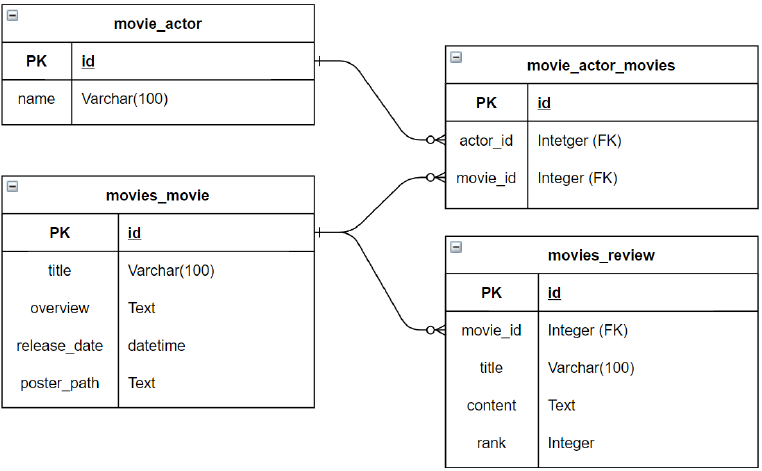
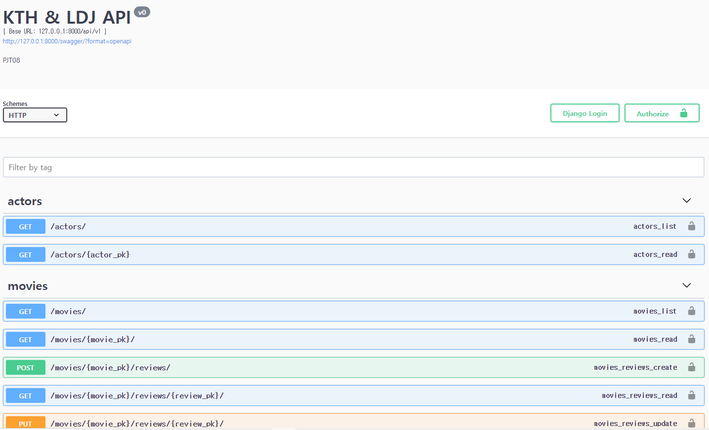
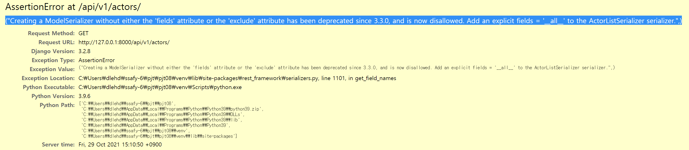
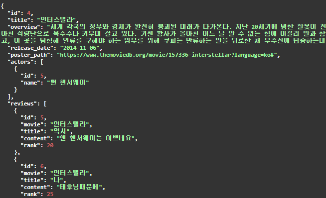

# Simple Review Forum API

by Tae Hun KIM, 

partnered with Dong Jun LEE

      


1. [Build-process (페어 프로그래밍)](#build-process (페어 프로그래밍))
2. [Acquired knowledge](#acquired-knowledge)
3. [Challenges](#challenges)
4. [Takeaway](#takeaway)

<hr>
<br>
<br>
<br>

## :triangular_flag_on_post: Goal Implementations

<hr>

1. Django Rest Framework를 활용한 API Server 제작.
   - 영화와 배우 정보를 DB로부터 불러오기 기능
   - 리뷰 글 불러오기, 생성, 수정, 그리고 삭제 기능 (CRUD)
   - swagger 활용하여 API server 문서화

*참고: 영화, 배우, 리뷰 글 Data는 관리자페이지를 통하여 DB에 생성하였습니다.

<hr>

<br>

<br>

<br>


## :handshake:  Build-process (페어 프로그래밍)

<hr>

1. 가장 먼저 아래와 같은 Entity Relationship Diagram 을 기반으로 모델 객체들을 디자인 하였습니다.

   

   ```python
   # models.py
   ...
   
   class Actor(models.Model):
       name = models.CharField(max_length=100)
   	...
   
   class Movie(models.Model):
       actors = models.ManyToManyField(Actor, related_name='movies')
       title = models.CharField(max_length=100)
       ...
   
   class Review(models.Model):
       movie = models.ForeignKey(Movie, on_delete=models.CASCADE, related_name='reviews')
       title = models.CharField(max_length=100)
       ...
   ```

   <br>

2. 리소스와 행위를 구별한 RESTful 한 URL을 구성하였습니다

   ```python
   # urls.py
   ...
   
   urlpatterns = [
       path('actors/', views.actor_list),                  # 전체 배우 목록
       path('actors/<int:actor_pk>', views.actor_detail),  # 단일 배우 정보(출연 영화 포함)
   
       path('movies/', views.movie_list),                  # 전체 영화 목록
       path('movies/<int:movie_pk>/', views.movie_detail), # 단일 영화 정보(출연 배우, 리뷰 데이터 목록 포함)
   
       path('reviews/', views.review_list),                # 전체 리뷰 목록 조회
       path('movies/<int:movie_pk>/reviews/', views.review_create),    # 리뷰 생성
       path('movies/<int:movie_pk>/reviews/<int:review_pk>/', views.review_detail_or_update_or_delete),    # 단일 리뷰 정보(영화 정보 포함)/수정/삭제
   ]
   ```

   <br>

3. 작성한 모델 객체들을 기반으로 한 Data를 응답 해 줄때, JSON 포맷으로 변환 해주기 위해 `rest_framework` library를 활용하여 적절한 `Serializer` 들을 생성했습니다.

   ```python
   # serializers.py
   
   class ActorListSerializer(serializers.ModelSerializer):
       class Meta:
           model = Actor
           fields = ('id', 'name',)
   
   
   class MovieListSerializer(serializers.ModelSerializer):
       class Meta:
           model = Movie
           fields = ('id', 'title',)
   
   
   class ActorSerializer(serializers.ModelSerializer):
       movies = MovieListSerializer(many=True, read_only=True)
   
       class Meta:
           model = Actor
           fields = ('id', 'name', 'movies',)
   
   
   class ReviewListSerializer(serializers.ModelSerializer):
       movie = serializers.CharField(
           source='movie.title',
           read_only=True,
       )
   
       class Meta:
           model = Review
           fields = '__all__'
           exlcude = ('content', 'rank',)
   
   
   class MovieSerializer(serializers.ModelSerializer):		# 문제 미 해결
       actors = ActorListSerializer(many=True, read_only=True,)
       reviews = ReviewListSerializer(many=True, read_only=True,)
   
       class Meta:
           model = Movie
           fields = ('id', 'title', 'overview', 'release_date', 'poster_path', 'actors', 'reviews',)
   
   
   class ReviewSerializer(serializers.ModelSerializer):
       movie = serializers.CharField(
           source='movie.title',
           read_only=True,
       )
   
       class Meta:
           model = Review
           fields = '__all__'
   ```

   <br>

4. 영화와 배우 정보를 DB로부터 불러오기 기능, 리뷰 글 불러오기, 생성, 수정, 그리고 삭제 기능 (CRUD) 들을 수행하는 함수들을 작성하였습니다.

   ```python
   # 전체 배우 목록 조회
   @api_view(['GET'])
   def actor_list(request):
       actors = Actor.objects.all()
       serializer = ActorListSerializer(actors, many=True)
       return Response(serializer.data)
   
   
   # 단일 배우 정보 조회
   @api_view(['GET'])
   def actor_detail(request, actor_pk):
       actor = get_object_or_404(Actor, pk=actor_pk)
       serializer = ActorSerializer(actor)
       return Response(serializer.data)
   
   
   # 전체 영화 목록 조회
   @api_view(['GET'])
   def movie_list(request):
       movies = get_list_or_404(Movie)
       serializer = MovieListSerializer(movies, many=True)
       return Response(serializer.data)
   
   
   # 단일 영화 정보 조회
   @api_view(['GET'])
   def movie_detail(request, movie_pk):
       movie = get_object_or_404(Movie, pk=movie_pk)
       serializer = MovieSerializer(movie)
       return Response(serializer.data)
   
   
   # 전체 리뷰 목록
   @api_view(['GET'])
   def review_list(request):
       reviews = get_list_or_404(Review)
       serializer = ReviewListSerializer(reviews, many=True)
       return Response(serializer.data)
   
   
   # 리뷰 생성
   @api_view(['POST'])
   def review_create(request, movie_pk):
       movie = get_object_or_404(Movie, pk=movie_pk)
       serializer = ReviewSerializer(data=request.data)
       if serializer.is_valid(raise_exception=True):
           serializer.save(movie=movie)
           return Response(serializer.data, status=status.HTTP_201_CREATED)
   
   
   # 단일 리뷰 정보 조회/수정/삭제
   @api_view(['GET', 'PUT', 'DELETE'])
   def review_detail_or_update_or_delete(request, movie_pk, review_pk):
       review = get_object_or_404(Review, pk=review_pk)
       review_title = review.title     # 리뷰 제목
   
       # 단일 리뷰 조회
       if request.method == "GET":
           serializer = ReviewSerializer(review)
           return Response(serializer.data)
   
       # 단일 리뷰 수정
       elif request.method == "PUT":
           serializer = ReviewSerializer(instance=review, data=request.data)
           if serializer.is_valid(raise_exception=True):
               serializer.save()
               return Response(serializer.data)
   
       # 단일 리뷰 삭제
       else:
           review.delete()
           return Response({ review_title }, status=status.HTTP_204_NO_CONTENT)
   ```

   <br>

5. 마지막으로, swagger 를 활용하여 API 서버 문서화를 진행하였습니다.

   

<hr>
<br>
<br>

<br>


## :memo:  Acquired knowledge 

<hr>

#### Django REST Framework (DRF) 활용한 serializing

- 장고에 내장된 http 매서드를 활용하여 data를 직렬화하여 JSON 으로 변환하는 방법은 비교적 번거로움이 컸습니다. 특히나 다루어야할 객체들이 많아질수록 그 번거로움은 커져갔습니다.

  이때 DRF 를 활용하여, `serializers.py` 안에 모든 직렬화 로직들을 모아두고 view 함수에 활용하는 구조적으로 더욱 정돈되어있는 방법을 학습할 수 있었던 프로젝트었습니다.

<br>

#### serializer 객체 내부에서 필드값 커스터마이징

- 영화의 다양한 정보를 가지고있는 `movie` 객체의 제목만을  serialization 을 통해 JSON 으로 전달해 주고 싶었습니다.

  이때 아래와 같이 `source` 를 통해 `Review` 객체가 가진 영화 정보 `movie` 필드의 제목만을 `movie` 라는 변수명에 할당하여 영화의 제목만을 serialization 하도록 하였습니다.

  ```python
  class ReviewSerializer(serializers.ModelSerializer):
      movie = serializers.CharField(
          source='movie.title',
          read_only=True,
      )
  ```

<br>

### swagger 활용한 API 서버 문서화

- 짧은 시간 내에 API 서버 구축과 더불어 문서화 까지 진행을 하기에 앞서, 시간을 단축 시켜줄 수 있는 swagger를 활용하게 되었습니다. 하지만 아직까진 매우 디폴트한 구성들만 활용하는 단계입니다. 

  앞으로는 각 링크마다의 설명 추가, API 서버 문서의 레이아웃, 등 커스터마이징 가능한 부분들을 더 배워나가면, 많든 도움이 될거라 생각합니다.

<hr>
<br>
<br>
<br>

## :fire:  Challenges

#### 1. Problem: 1시간을 헤맷던 Integrity Error




   - 위와같은 에러메세지를 발견 후, 지금까지 그래 왔듯이 에러메세지를 자세히 읽어본 후, 유추한 문제발생 지점인 `serializers.py` 의 `ActorListSerializer` 클래스의 필드값을 확인하였습니다.

     하지만 처음 봤을때 틀린 내용을 마땅히 찾지 못하였고, 이후 에러 메세지에 대한 확신을 잃고 다른 애꿏은 파일들을 건들기 시작했습니다. 결국 1시간정도 시간을 허비하고 원인을 찾았습니다.
     
     애초에 문제는 `fields` 를 `fiedls` 라 적었던것이었습니다.
     
     현업에서는 바닥부터 구현을 해나가는 경우보다는, 현존하는 코드를 수정해 나가는 작업이 더욱 많다는 말을 들었습니다. 고로, 이러한 에러메세지를 더욱 많이 경험하고 해결해 나가는 경험을 키워야 한다는 뜻입니다.
     
     이번 에러로 인해 배운점은, 장고는 에러의 원인을 친절하게 잘 짚어주다는것을 인지하고, 인내심을 갖고, 해당 에러메세지가 건네주는 힌트를 우선으로 문제점을 찾아나가야한다는 점입니다.

<br>

#### 2. Problem: 표시되지 않는 리뷰글의 제목

- 단일 영화 정보를 직렬화 해주는 로직에서, 해당 영화에 대한 리뷰 글들의 제목들만을 해당 직렬화에 포함시키고자 했습니다만, 아래와같이 제목을 포함한 리뷰의 모든 정보들이 직렬화되는 상황이 발생하였습니다.

  

   이를 해결하고자 하였지만 결국 해결하지 못하였습니다.

  하지만 api 서버의 본질을 생각해 본다면 (개발자들에게 정보 응답) 오히려 정보량이 더 많은 위의 사진과 같은 결과도 썩 나쁘지만은 않아보여, 수정하기를 그만두고 다른 다음 작업을 진행하였습니다.

  

<hr>
<br>
<br>

<br>


## :shopping_cart:  Takeaway

<hr>

이번에는 온전히 네비게이터역할을 수행하며 프로젝트를 진행하였습니다.

제 파트너이자 드라이버 역할을 맡아주셨던 동준님과 정말 열심히 서로를 도와가며 만들었고, 결과물로써는 많이 부족할지 언정, 많은 것을 배울 수 있었던 프로젝트이지 않았나 생각합니다.

결과물이 많이 부족한 이유로는, 단순히 모르는게 너무 많았다는 점입니다.

시리얼라이징을 유연하게 조작하는 방법을 몰랐고, 1:N 과 M:N 관계 데이터들을 `models.py` 와 `serializers.py` 에서 어떻게 다루어야하는지도 제대로 파악하지 못하는 상태에서 시작했던 프로젝트었습니다.

이로인해 정말 많은 시행착오와, 고민끝에는 다른 사람들에게 도움을 요청하기도 하며 어떻게든 완성을 할 수 있었습니다만, 결과물이 만족스럽지는 못했던것 같습니다.

하지만 신입 개발자가 된다면, 현업에서 오히려 이러한 상황들에 많이 노출될 것이라는 생각을 되새기며, 이러한 상황은 오히려 훗날 많은 도움이 될 거라 생각하며 열심히 할 수 있었고, 오히려 이 힘든 상황에서 감정을 공유하며 같이 작업을 했던 동준님과 정말 즐겁게 프로젝트를 수행할 수 있었던것 같습니다. 결과적으로 많을것도 배울 수 있었지요.

앞으로도 쉽게 해결될 일은 없을테니, 함께하는 파트너와 힘들고 즐거운 모든 순간들의 감정들을 공유하며 일을 해 나갈 수 있다면, 꾸준히 성장할 수 있게될거라는 생각이 들었습니다. 동준님 정말 고생 많으셨습니다!