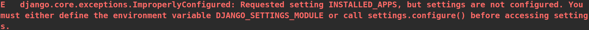

# Simple Movie Recommendation

by Tae Hun KIM, 

partnered with Sang Jun SON

      


1. [Build-process (페어 프로그래밍)](#build-process (페어 프로그래밍))
2. [Acquired knowledge](#acquired-knowledge)
3. [Challenges](#challenges)
4. [Takeaway](#takeaway)

<hr>
<br>
<br>
<br>

## :triangular_flag_on_post: Goal Implementations

<hr>

1. JavaScript를 활용한 비동기적 DOM 조작
   - 영화 리뷰 게시글 좋아요 기능 구현
   - 사용자 프로필 팔로우 기능 구현
2. 사용자만의 영화 추천 기능
   - TMDB API 기반의 사용자만의 추천 영화 제공

*참고: 사용자 정보와 영화 게시글의 CRUD 로직은 스켈리톤 코드를 활용하였습니다.

<hr>

<br>

<br>

<br>


## :handshake:  Build-process (페어 프로그래밍)

<hr>

1. 가장 먼저 좋아요 기능을 구현했습니다.

   좋아요 버튼이 눌리면,

   ```javascript
   // community/index.html
   ...
   const forms = document.querySelectorAll('.like-form')
       forms.forEach(function (form) {
         form.addEventListener('submit', setLikeState)
       })
   ...
   ```

   비동기적으로 `views.py`에서 좋아요 추가, 삭제, 총 좋아요 개수를 DB에 반영하는 로직을 실행 후, 

   장고의 built-in 클래스인 `JsonResponse`와 `HttpResponse`를 활용하여 JSON 응답으로 수정된 좋아요 정보를 넘겨주도록 하였고, 

   ```python
   # community/views.py
   ...
   @require_POST
   def like(request, review_pk):
       if request.user.is_authenticated:
           review = get_object_or_404(Review, pk=review_pk)
           user = request.user
   
           if review.like_users.filter(pk=user.pk).exists():
               review.like_users.remove(user)
               liked = False
           else:
               review.like_users.add(user)
               liked = True
           liked_status = {
               'liked': liked,
               'count': review.like_users.count()
           }
           return JsonResponse(liked_status)
       return HttpResponse(status=401)
   ```

   해당 좋아요 정보를`axios` 라이브러리를 활용하여 `index.html` 에서 받아와서 사용자의 화면에 반영 해 주었습니다.

   ```javascript
   // community/index.html
   const setLikeState = (e) => {
           ...
           axios({
             method: 'post',
             url: `http://127.0.0.1:8000/community/${reviewId}/like/`,
             headers: {
               'X-CSRFToken': csrftoken
               }
           })
           .then(function (res) {
             ...
             likeStatus.value = liked ? '좋아요 취소' : '좋아요'        
             likeCountStatus.innerText = `${count}명이 이 글을 좋아합니다.`
           })
           .catch(function (err) {
             if (err.response.status === 401) {
               window.location.href = '/accounts/login/'
             }
           })
         	...
   ```

   <br>

2. 다음으로 유저 profile의 좋아요 기능을 구현하였습니다. 로직의 흐름 자체는 좋아요 기능과 매우 유사합니다.

   팔로우 (혹은 언팔로우) 버튼 클릭을 감지하면,

   ```javascript
   // accounts/profile.html
   ...
   const form = document.querySelector('#follow-form')
       const csrftoken = document.querySelector('[name=csrfmiddlewaretoken]').value  //csrf 토큰
       
       form.addEventListener('submit', function (e) {
         e.preventDefault()
         const userId = e.target.dataset.userId
   ...
   ```

   비동기적으로 `views.py`에서 팔로워 추가, 삭제, 총 팔로워 수 를 DB에 반영하는 로직을 실행 후, 

   장고의 built-in 클래스인 `JsonResponse`와 `HttpResponse`를 활용하여 JSON 응답으로 수정된 팔로우 정보를 넘겨주도록 하였고, 

   ```python
   # accounts/views.py
   ...
   @require_POST
   def follow(request, user_pk):
       if request.user.is_authenticated:
           person = get_object_or_404(get_user_model(), pk=user_pk)    # you
           user = request.user                                         # me
           if person != user:
               if person.followers.filter(pk=user.pk).exists():
                   person.followers.remove(user)
                   is_followed = False
               else:
                   person.followers.add(user)
                   is_followed = True
               follow_status = {
                   'isFollowed': is_followed,
                   'followersCount': person.followers.count(),
                   'followingsCount': person.followings.count(),
               }
               return JsonResponse(follow_status)
           return redirect('accounts:profile', person.username)
       return HttpResponse(status=401)
   ```

   해당 팔로우 정보들을`axios` 라이브러리를 활용하여 `index.html` 에서 받아와서 사용자의 화면에 반영 해 주었습니다.

   ```javascript
   // accounts.profile.html
   ...
   axios({
           method: 'post',
           url: `http://127.0.0.1:8000/accounts/${userId}/follow/`,
           headers: {'X-CSRFToken': csrftoken},
         }) .then ((res) => {
           const {isFollowed, followersCount, followingsCount} = res.data
           const followInput = document.querySelector('#followBtn')
           const followCount = document.querySelector('#follow-count')        
   
           followCount.innerText = `팔로잉 : ${followingsCount} / 팔로워 : ${followersCount}`
           followInput.value = isFollowed ? '언팔로우':'팔로우'
           
         }) .catch ((err) => {
           if (err.response.status === 401) {
             window.location.href = '/accounts/login/'   // ip 주소값 생략
           }
         })
   ...
   ```

   <br>

3. 마지막으로, 각 사용자들만을 위한 추천 영화를 보여주는 기능을 구현하였습니다. 

   계획했던 영화 추천의 로직은 이하와 같습니다.:

   1. 사용자가 클릭한 모든 영화들의 TMDB상의 `movie_id` 값들을 로컬 스토리지에 저장.
   2. 저장된 `movie_id` 값들 중 랜덤한 한개의 `movie_id` 값을 활용하여 TMBD API의 관련`movie_id` 영화의 추천작을 사용자에게 보여준다.

   하지만, 제 시간안에 구현에 실패하여, 최종적으로는 로컬 스토리지에 저장된 `movie_id` 값들중 그냥 첫번째 위치에 있는 `movie_id` 값을 활용하여 TMBD API의 관련`movie_id` 영화의 추천작을 사용자에게 보여주게 되었습니다.

   <br>

   가장 먼저, 영화 정보를 가져오기 위해서 TMDB API 를 활용하여 TMDB에서부터 추천영화 목록 20개를 가져왔습니다. 그리고 해당 영화 정보들을 바로 DB에 저장하였습니다.

   ```python
   # moviecrawler.py
   
   from dotenv import load_dotenv
   import requests
   
   import os
   os.environ.setdefault("DJANGO_SETTINGS_MODULE", "movies.settings")
   
   import django
   django.setup()
   
   from movies.models import Movie
   
   load_dotenv()
   API_KEY = os.getenv("API_KEY")
   API_URL = os.getenv("API_URL")
   
   
   class TMDBHelper:
       def __init__(self, api_key=None):
           self.api_key = api_key
   
       def get_request_url(self, method="/movie/popular", **kwargs):
           base_url = "https://api.themoviedb.org/3"
           request_url = base_url + method
           request_url += f"?api_key={self.api_key}"
   
           for k, v in kwargs.items():
               request_url += f"&{k}={v}"
   
           return request_url
   
   
   def get_popular_movie():
       method = "/movie/popular"
       query_set = {"region": "KR", "language": "ko-KR"}
       mv = TMDBHelper(API_KEY)
       request_url = mv.get_request_url(method, **query_set)
       data = requests.get(request_url).json()
   
       return data.get("results")
   
   
   # SQLite로 영화 정보들 저장
   if __name__ == '__main__':
       popular_mv_lst = get_popular_movie()
       for movie in popular_mv_lst:
           Movie(title=movie["title"],
                 release_date=movie["release_date"],
                 popularity=movie["popularity"],
                 vote_count=movie["vote_count"],
                 vote_average=movie["vote_average"],
                 overview=movie["overview"],
                 poster_path=movie["poster_path"],
                 tmdb_id=movie["id"]
                 ).save()
   ```

   영화 목록 페이지에서 보이는 `detail` 버튼을 클릭하면 해당 영화의 `movie_id`값을 로컬 스토리지에 저장합니다.

   ```javascript
   // moveis/index.html
   ...
   const STORAGE_KEY = 'my-movie-list'
   
       const setMovieStorage = (e) => {
           
           const movieId = e.target.id
           console.log(movieId)
           let movieStorage = JSON.parse(localStorage.getItem(STORAGE_KEY)) || []
           movieStorage.push(movieId)
           movieStorage = new Set(movieStorage)
           movieStorage = [...movieStorage]
           localStorage.setItem(STORAGE_KEY, JSON.stringify(movieStorage))
           console.log(localStorage)
       }
   
       const movies = document.querySelectorAll('.movie')
       movies.forEach(function (movie) {
         movie.addEventListener('click', setMovieStorage)
       })
   ...
   ```

   로컬 스토리지에 `movie_id`가 하나 이상 저장되어 있을경우에, 영화 목록 페이지에서 `Recommend`버튼을 누르게 되면 

   Recommend 페이지로 이동이 되어 사용자가 상세 정보를 열람했던 영화의 `movie_id`값과 연관이 있는 영화 포스터 이미지들을 20개 보여주게 하였습니다.

   만약 사용자가 아직 영화 상세정보를 열람하지 않았다면, 상세정보를 먼저 열람하도록 안내메세지를 보여줍니다.

   ```javascript
   // movies/recommended.html
   ...
   const STORAGE_KEY = 'my-movie-list'
       const movies = JSON.parse(localStorage.getItem(STORAGE_KEY)) || []
       const recommendedMovieList = document.querySelector("#recommended-movie")
   
       if (movies.length !== 0) {
           const selectedMovie = movies[0]
           const API_URL = `https://api.themoviedb.org/3/movie/${selectedMovie}/recommendations?api_key=151722ecc2fd016e5276ec5178b529bc`
           axios.get(API_URL).then((res) => {
   
               res.data.results.forEach((movie) => {
                   const DOM_img = document.createElement("img");
                   DOM_img.src = `https://image.tmdb.org/t/p/original/${movie.poster_path}`
                   DOM_img.alt = movie.title
                   DOM_img.width = "100"
                   recommendedMovieList.appendChild(DOM_img);
               })
               
           })
       }else(
           recommendedMovieList.innerHTML= `<p>Movie 목록에서 관심있는 영화를 목록에서 선택해주세요</p>`
       )
   ...
   ```

<hr>
<br>
<br>
<br>


## :memo:  Acquired knowledge 

<hr>


#### JavaScript를 활용한 비동기적 프로그래밍

- 이전까지는 전체 페이지 내에서 사소한 정보 하나라도 바뀌게되면, 해당 정보를 수정하기 위해 모든 패이지가 새로고침 되었습니다.

  이는 사용자 입장에선 기다림이 잦아지기에 UX적인 면에서 좋지 않았고, 트래픽량 (서버와 클라이언트 간에 정보 교환) 도 당연히 많았습니다.

  하지만 이번 프로젝트를 통해, 이제는 수정될 대상의 페이지의 컴포넌트만 수정 할 수 있게 비동기적인 프로그래밍을 활용하였고, 이는 UX적인 면에서도 트래픽 값 면에서도 이득이 되었다 생각합니다.

<br>

#### Axios 라이브러리를 활용한 Data기반의 DOM 조작

- `ManyToMany` 혹은 `ForeignField` 와 같은 모델관계 필드를 활용하게되면 정보간의 복합적인 관계가 형성되어, 하나의 데이터를 수정하고, 그로인해 수정되어야 하는 모든 데이터들을 업데이트하기 까다로웠습니다.

  그래서 이번 프로젝트에선, 데이터를 기반으로 DOM 조작이 가능하도록 `axios`라이브러리를 활용하였고, 결과론적으로 하드코딩량을 줄여주었고, 정보 수정 로직을 더욱 직관적으로 짤 수 있게 되었습니다.

<hr>
<br>
<br>
<br>

## :fire:  Challenges

#### 1. `You must either define the environment variable DJANGO_SETTINGS_MODULE or call settings.configure() before accessing settings.`




   - TMDB API 에서 영화 정보들을 가져오는 기능 구현 과정에서 만났던 에러메세지입니다.

     `evvironment varialbe DJANGO_SETTINGS_MODULE`을 정의하거나 `settings`에 접근하기 전에  `setting.configure()`을 불러오라는데, 전혀 뭐라는지 알아듣지 못했습니다.

     시간은 매우 촉박하고, 문제는 원인조차 모를때, 일단은 구글링을 불나게 하였습니다.

     그 과정에서 다행이 한 블로그의 글 대로 해본 결과 문제가 해결되었습니다.

     신기하게도 에러메세지에서 친절하게 알려준대로 수정을 한 듯 보였습니다.

     해결 코드:

     1. 터미널에 명령어 입력 =>
        `export DJANGO_SETTINGS_MODULE='config.settings' `
     2. `moviecrawler.py` 수정

     ```python
     # 전
     import os
     os.environ.setdefault("DJANGO_SETTINGS_MODULE", "config.settings")
     # 후
     import os
     os.environ.setdefault("DJANGO_SETTINGS_MODULE", "movies.settings"
     ```

     

<hr>
<br>
<br>

<br>


## :shopping_cart:  Takeaway

<hr>

이번에는 네비게이터와 드라이버를 번갈아 수행하였습니다.

제 파트너이자 드라이버 역할을 맡아주셨던 상준님께서 너무 잘 해주셔서 자칫 망할뻔한 프로젝트를 살릴 수 있었습니다.

지금까지의 프로젝트 중 가장 시간이 촉박했던 프로젝트였습니다. 고로 특히 비쥬얼적으로는 신경을 쓰지 못한 프로젝트입니다. 하지만 최소한 `pagenation` 구현을 함으로서 사용자 입장에서 스펙터클하진 않더라도 정돈되어 보이는 화면을 구축하기 위해 노력하였습니다. 

시간이 촉박했던 첫번째 요인으로는, JavaScript에 대한 코딩이 서로 익숙치 않던 터라 자잘한 에러와 실수들로 시간을 많이 할애하였던 점이고, 두번째로는 TMDB API 에서 가져온 정보를 다이렉트로 DB에 넣기위한 코드 구축에 많은 시행착오가 있었던 점입니다.

나중에 알게된것이지만, 구글링을 통해 적합한 라이브러리를 활용하였다면 훨씬 더 생산성을 높일 수 있지 않았나 싶었습니다.

이번 프로젝트를 수행하면서 시간이 곧 돈인 현업에서 종사하고 계시는 개발자 분들께서 왜 라이브러리나 구글링을 매우 활용하는지 공감하게 되엇습니다. 알 수 없는 에러나 기능구현을 위해서 하루종일 머리를 붙잡고 있을 순 없는 노릇이지요..

이번 프로젝트를 통해 구글링의 중요성, 그리고 JavaScript의 어려움을 몸소 느꼈습니다. 그리고 상준님께 도움을 많이 드리지 못한것에 대한 미안함도 느꼇습니다. 개발자는 거의 대부분이 혼자서 작업을 하지 않는다 배웠습니다. 앞으로 함께 작업을 하게될 분들께 민폐가 되지 않기 위해서라도 열심히 JavaScript와 구글링을 연습해야된다 생각이 들었습니다.

상준님 수고하셨습니다..! 