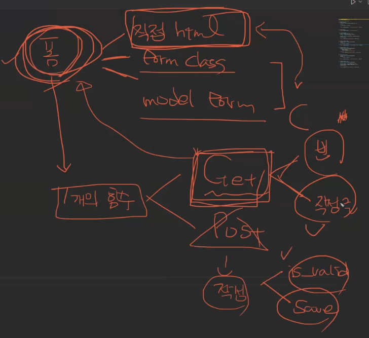

# Recap

<hr>

django 의 form 과 모델폼은 인풋값의 유효성, 필드 값들 세세한 커스텀 등 고리타분한 작업들을 대신 해주는 생산성을 올려주는 기능.

 





단단한 사이트 만들기

1. 데코레이터를 활용해, 특정한 method 로만 가능하게끔 만든다


모델폼 만들기 순서:

1. app 파일 밑에 forms.py 만들고 모델폼의 클래스 작성!

2. forms.py 에서 

   ```python
   from django import forms
   from .models import Article
   
   class ArticleForm(forms.ModelForm):
   	# form 으로 받은 데이터를 반드시 DB에 
       
   	class Meta:
           model = Article    # model 정보를 넘겨주고
           fields = '__all__'	 # 전체 필드도 받아올 수 있다
           exclude = ('title',) # 제외할 필드도 설정 가능
           
   ```

3. html 템플릿에서 보여주기 위해, views.py 로, 만든 articleform 을 불러와야 한다.

4. 해당 함수에서 인스턴스 생성하고, context에 할당하고

5. html template에 인자로 넘겨준다

6. html template안에서 `{{ form }}` 이렇게 보여준다

   (렌더링 옵션은 선택적으로! `as_p, as_table, as_ul, 등`)

7. 


## 부트스트랩 form 컨트롤

```python
title = forms.CharField(
        label='제목입니다:',
        widget=forms.TextInput(
            attrs={
                'class': 'my_title',
                'placeholder': '여기 내용 작성햇',
                'maxlength': 10,                # python 은 max_length, 하지만 html은 이렇게 작성
                'size': 20,
            }
        ),
        error_messages={
            'required': '제목좀 제발 넣어주세요'
        }
    )

    content = forms.CharField(
        label='내용입니다!',
        widget=forms.Textarea(
            attrs={
                'cols': 60,
                'rows': 30,
                'placeholder': '여기 내용 작성 플리즈.',
                'class': 'my_title',
            }
        ),
        error_messages={
            'required': '내용좀 제발 넣어주세요'
        }
    )
```

1. `pip install django-bootstrap-v5`
2. `pip freeze > requirements.txt`
3. settings.py 에 등록
4. base.html에 `` 입력
5. (django bootstrap 사이트 에 template tag and filters 에 form 참고)


## DECORATOR

특정한 메서드만 받아들이게 해주는 방화벽


## 디버깅 시 좋은 도구

디버깅 코드가 작성된 위치를 기준으로, 이전에 실행된 코드의 결과값을 모두 열람 가능

1. `pip install ipython`
2. `from IPython import embed`
3. 디버깅 하고픈 위치 코드의 아래에 `embed()` 입력
4. 서버 실행하고, 해당 코드 실행되는 위치의 페이지로 이동하면 디버깅 시작됨
5. VSC 터미널창에서 알고싶은 코드 입력
6. 끄고 싶을 때는, `embed()`에 주석처리


## 팁

1. 브라우저별로 스타일링이 다른 이유는 브라우저별로 다른 초기 셋팅값이 있기때문.  고로 bootstrap이런거에서는 자동으로 reset 혹은 normalize 기능으로 초기상태에서 bootstrap의 기능들을 적용시켜 동일화를 구현한다.

2. status code mdn 검색하면 에러 코드 이해에 도움

3. `get_object_or_404` 남탓용 모듈. 

   404 페이지를 모여주는 이유는? 보안을 위해? 왜? 디버깅이 가능해져서?

4. `<form action="" method="POST">` action을 빈공간을 두면 해당 파일 위치로 보냄. 고로 form 과 폼메서드 사용 시 이렇게도 활용 가능.\+ static(settings.MEDIA_URL, document_root=settings.MEDIA_ROOT)