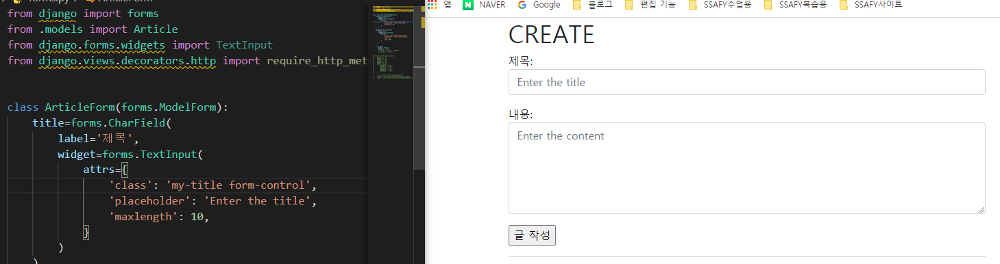

# 0906_youtube_live

[TOC]


## 1. Form class

### form field와 widget

#### form field


- form field는 사용자에게 받아올 정보를 일일히 작성해야한다.
- 원래 form필드를 사용하기 전에 content는 forms.Textfield()였는데, form필드에는 Textfield()가 존재하지 않기 때문에 대체로 widget을 쓰기 위해서는 CharField를 사용한다. 


- form field를 사용하는 이유: 모델 정보를 전달하고 이를 토대로 form 생성하고 데이터 유효성 검사, 필요시 입력된 데이터 검증 결과 재출력, DB 저장 등과 반복 코드를 줄여줌
- **Django Form 관리 시스템의 핵심**
- 사용법 : 


- forms.py에서 만든 class인 ArticleForm을 받아와서 사용할 것임


- 원래 많이 있던 new의 form 부분을 지우고 {{ form.as_p }}로 바꿔줌
  - form.as_p가 뭔데? : title과 content를 각각의 p태그로 감싸준다.
- 그리고 runserver 돌리면?


- 그럼 as_p말고는 또 있는가?
  - 물론 있다. as_p(), as_ul(), as_table()이 있지만 수업 시간에는 as_p만 사용할 예정이다.


- HTML input 요소의 표현 방식이 2가지 있다. 방금 본 것이 Form fields였고,

#### widget

- widgets 이라는 요소도 있다.


- 위젯은 반드시 form fields에 할당 된다.


- content 사이즈가 커졌다!

- **form field는 input의 유효성을 처리하는 것**이었고, **widget은 단순한 렌더링 처리**일 뿐이다!


#### form field와 widget 응용


- region_choices : [ ] 리스트 안에 () 튜플로 값 지정, (값, 사용자에게 보여질 모양)으로 지정해줌 -> 공식 문서에서 


## 2. ModelForm

> Modelform은 form의 업그레이드 버전이다??? NO!!!

- Modelform은 formclass와 다르게 재 정의를 하지 않는다.


- 튜플


- 만약 fields에 지금보다 훨씬 많은 수의 정보가 들어있을 때 하나하나 쓰기 힘드니까 아래처럼 적어주면 모두 다 불러와짐
- 무지성으로 all을 쓰기 보다는 각각 하나씩 받아오기를 추천함. (가독성 등의 이유로) -> 공식문서 왈

```python
$ fields = '__all__'
```

- 불러와도 created_at, updated_at은 안나옴 -> 사용자가 적은 정보가 아니기 때문임!

- 이렇게 다 불러왔는데 뭔가 하나 불러오기 싫다면 아래처럼 적어주자.


```python
$ exclude = ('어쩌고', )
```


### create할 때 유효성 검사


- 만약 form이 유효성 검사에 통과했다면 저장하고, 통과하지 못했다면 다시 글 작성하는 페이지(new)로 돌아가겠다.

```python
def create(request):
    form = ArticleForm(request.POST)
    # 위의 뜻은 ? ArticleForm에 있는 전체 내용을 받아오겠다.
    # request중에 POST인 정보만 불러오겠다.
    if form.is_vaild():
        article = form.save()
        return redirect('articles:detail', article.pk)
    return redirect('article:new')
```


#### new와 create 합치기


1. urls.py에서 new 지워주기


2. create.html 삭제 해주고
3. templates의 이름은 new.html -> create.html로 바꿔주기


- 하나로 다 합쳐버렸다!

4. get과 post 두가지를 합칠 때 -> post를 먼저 해준다 ! 
   1. 불필요한 반복을 줄인다. (가독성이 좋다.)
   2. **get 외의 메서드가 들어올 때 get부터 쓰면 else에서 post외의 다른 delete 등의 메서드가 들어올 수 있기 때문** -> post는 DB를 변경시키기 때문에 조심해서 사용해야한다.
   3. POST는 CUD를 담당하고, GET은 R만 담당하기 때문
      - new와 create 합치는 순서
        - else부터 작성하기 : ArticleForm()을 인스턴스화 시킨다 -> 사용자에게 데이터를 받기 위한 기본 준비!
        - new를 없애버리기 위해서 new라고 적힌 부분을 다 정리해준다. (각각의 html파일)
        - views.py에 create 함수에는 new가 없어야 한다.
        - urls.py에서 path(new)를 없애준다.
          - create.html 파일을 삭제하고 new.html 파일을 create.html로 이름을 바꿔준다.
          - index.html 파일에 new라고 적힌 부분을 create라고 고친다.
        - 코드를 작성한다.

- is_valid() : 유효성 검사를 실행하고, 데이터가 유효한지의 여부를 boolean으로 반환


### widget으로 웹페이지 꾸미기

> 지금까지는 input 태그를 이용해서 class나 style등을 정의하면 예쁘게 꾸밀 수 있었다.
>
> 하지만 이제 html에 한 줄로 바뀌어버렸기 때문에 꾸미는 방법을 모르겠다...!

- widget으로 스타일을 꾸밀 수 있다.


- attrs = attributes 속성 값
- class를 넣어주는 이유는 스타일을 클래스로 지정하고 변경시키기 위해서임 (아래 참조)


- 색깔을 넣고 싶을 때는?


- base.html에  넣어주고 create.html에 스타일을 클래스로 지정한 후 F5 누르면 ! 짜잔
- 흠 보노보노가 되었다.




- bootstrap 활용법 : class에 form-control 하나로 생각보다 예뻐졌다?

- bootstrap 설정법
  1. `pip install django-bootstrap-v5` 
  2. `pip freeze > requirements.txt`
  3. settings.py 에 등록 -> `'bootstrap5',`
  4. base.html에 `` 입력
  5. django bootstrap 사이트에 template tag and filters 에 form 참고


### edit과 update 합치기


- create와 update의 차이 : (3가지)
  - edit.html -> update.html로 바꿔 주기

```
form = ArticleForm() / form = ArticleForm(instance=article)

context 내에 'article': article 넣어 주는지 여부
```


## 3. Handling HTTP requests

#### django에서 HTTP 요청을 하는 방법

1. render
2. redirect
3. get_object_or_404
4. get_list_or_404


- shortcuts에서 get_object_or_404 불러오기


- 원래 있던 코드에서 get_object_or_404(Article, pk=pk)로 바꿔주면 에러 메세지가 500 -> 404로 바뀐다.


- 에러 코드를 일일히 알려주면 안된다 : 왜? -> 세부 내용까지 보여주지 않기 위해서 !

- 배포할 때는 DEBUG = False로 바꿔줘야한다.


#### 데코레이터

1. Allowed HTTP methods


- 이렇게 해주면 'GET'과 'POST' 제외 다른 건 못 들어온다!

```
@require_http_method(['GET', 'POST'])
```

- 요청이 조건을 충족시키지 못하면 405 오류 반환


- if else가 필요없어진다!

- 만약 GET만 받아오고 싶을 때는 @require_safe를 이용하기를 추천함. (공식문서 참고) -> 킹재석 피셜


- 참고


