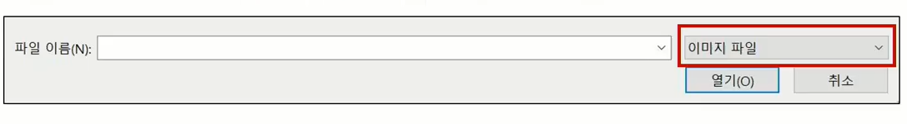

# static file

<hr>

- 정적 파일들 (그대로 보여준다): 

  사용자 요청이 서버에왔을떄, 서버가 별도의 처리 안하고 이미 준비된 파일을 미리 보여준다

  ex. img, javascript 파일, css 스타일, 등

- 개발자가 요청에 응답할 때 주기 위해 미리 준비한 정적 파일들

- 아메리카노주세요 >> 아메리카노 줌    /    카페라떼주세요 >> 아메리카노 줌


#### static file 구성

1. django.contrib.staticfiles

   장고 라이브러리에 있는 contrib 패키지에 staticfiles라는 앱이 sttings.py 에 INSTALLED_APP에 포함 되어 있는지 확인 (이미 default값으로 작성 되어있을거임)

2. settings.py 에서 STATIC_URL 을 정의 (default 값 = '/static/')

3. template에서 static 템플릿 태그를 사용하여 지정된 상대 경로에 대한 url 빌드

   (어딘가에 static file이 있을텐데, 그 경로는 static template 태그를 사용해서 사용한다)

   ```html
   
   
   ```

4. 위의 경로의 기준: 

   앱의 static 폴더에 정적 파일을 저장

   ​	ex. my_app/static/my_app/example.jpg

#### STATIC_ROOT

- collectstatic?

- settings.py 안에 STATIC_URL 바로 아래에 작성

- django project에서 사용하는 모든 정적 파일을 수집하는 디렉토리 의 절대경로

- 개발 과정에서 settings.py의 DEBUG값이 True면, 해당 경로 값은 적용 안됨!

  - 고로, 직접 작성 하지 않ㅇ르면, settings.py에 작성 안되있음

- 장고 프로젝트를 실 서비스로 배포할때, 그때는 장고 서버가 아닌 다른 서버에서 구동되기 때문에, 이 정적 파일들에 대한 경로를 해당 서버에 따로 제공 해야한다. 그때 쓰는 경로이다.

  

#### collectstatic

- STATIC_ROOT에 정적 파일을 수집

  ```python
  # STATIC_ROOT 경로를 작성하고,
  STATIC_ROOT = BASE_DIR / 'staticfiles'
  
  # python manage.py collectstatic 명령어를 사용 하면,
  static_root에 명시된 경로 안에 현재 장고가 사용하는 모든 static파일들을 참고해서 모아줌
  ```

#### STATIC_URL

- 물리적인 파일이나 디렉토리가 아니고, URL로만 존재

- STATIC_ROOT에 있는 정적 파일을 참조할때 사용

- 개발 단꼐에서는, 실제 정적 파일들이 저장되어 있는 app/static/ 경로 (기본경로) 및 

  STATICFILES_DIRS에 정의된 추가 경로들을 탐색한다

#### STATICFILES_DIRS

- 템플릿에서 사용됫던 DIRS 랑 같은 역활수행. 다만, 템플릿이 아닌 추가 static 경로를 작성하는곳.

- 기본 경로를 사용하는것 외에 (앱의 static directory 경로 외에), 추가적인 정적 파일 경로 목록을 정의하는 리스트

- 기본경로에서 벗어나 있기 때문에, 반드시 새로 정의를 해줘야한다.

- 추가 파일 디렉토리에 대한 전체 경로를 포함하는 문자열 목록으로 작성되어야 함

  ```python
  # settings.py
  STATICFILES_DIRS = [
  	BASE_DIR / 'static',
  ]
  
  # html 템플릿
  
  ```

  


## Media File

<hr>

- 사용자가 웹에서 업로드하는 static file
- 유저가 업로드 한 모든 파일 = media file / 서버가 준비한 정적 파일 = static file
- 이미지의 파일 자체가 업로드 되는게 아닌, 이미지의 경로가 문자열로 들어옴


#### 미디어 파일 받기 프로세스

- 우리가 img 파일 받겠다 = DB에 img column을 추가해야함

- ImageField를 활용할거다

  특징: FileField 의 sub 클래스이다 (모든 속성 및 매서드를 상속 받는다).

  특징2: 업로드 된 객체가 유효한 이미지인지 검사해줌!

- ImageField 사용하려면, !반드시! 

  Pillow 라이브러리 필요!

  `$ pip install Pillow` 기릿

  `$pip freeze > requirements.txt` 도 잊지말고


#### FileField

- 파일 업로드에 사용하는 모델 필드

- 2개의 선택인자(argument)를 가짐

  1. upload_to : 업로드 directory와 파일 이름 설정하는 2가지 방법 제공!

     ```python
     # 문자열 경로 지정 방식
     # models.py
     class MyMode(models.Model):
     	upload = models.FileField(upload_to='uploads/')
     	upload = models.FileField(upload_to='upload/%Y/%m/%d/')
         
     # 함수 호출 방식
     # 이건 나중에 알려준다네ㅎ
     ```

  2. [storage](함수 호출 방식으로 실제 이미지가 저장되는 경로 지정)


####  MEDIA_ROOT

- 폴더는 따로 생성하지 않는다. 유저가 업로드하면 자동 생성.

- 경로만 지정할 필요 있다.

  `MEDIA_ROOT = BASE_DIR / 'media'` (STATICFILES_DIRS 밑에 공간에 적자)

- 사용자가 업로드 한 미디어파일들을 보관할 디렉토리의 절대 경로

- django 는 성능을 위해 업로드 파일은 DB에 저장 안함. 오직 경로만 문자열로 DB에 저장됨

- !주의!

  MEDIA_ROOD 는 STATIC_ROOT와 반드시 다른 경로로 지정 해라


#### MEDIA_URL

- MEDIA_ROOT에서 제공되는 미디어를 처리하는 URL
- 업로드 된 파일의 주소를 만들어 주는 역할
  - 왜 만들어줌? 웹 서버에 요청을 보내는 사용자가 사용하는 public한 url이 될 것이기 때문!
- 얘도 STATIC_URL과 반드시 다른 경로로 지정해야함


#### 개발단계에서 사용자가 업로드 한 파일 제공하기

- 사용자가 업드로 한 파일이 우리 project에 업로드 되긴하는데, 실제로 다시 사용자에게 제공하기 위해서는, 업로드 된 파일의 URL이 필요

  ```python
  # crud/urls.py
  from django.conf import settings
  from django.conf.urls.static import static
  
  urlpatterns = [
  	path('admin/', admin.site.urls),
  	path('articles/', include('articles.urls')),
  ] + static(settings.MEDIA_URL, document_root=settings.MEDIA_ROOT)
  # 해석: 
  #static이라는 함수를 쓰는데, media url 주소값을 settings.MEDIA_URL에서 참조하겠다. 실제 보여주는 파일의 문서 위치는 settings.MEDIA_ROOT 참조하겠다.
  # 해석2: 
  #제공되는 url 은 MEDIA_URL 이고, 해당 url이 제공 될 때 사용하는 실제 파일의 경로는 MEDIA_ROOT 값을 사용하겠다.
  # 해석3: 
  #업로드 된 url을 통해 참조하는 파일의 실제 위치를 MEDIA_ROOT라고 결정
  ```

- 사용자가 업로드 한 파일이 실제로 우리 프로젝트에 업로드 된다. 결국 업로드 된걸 사용자에게 제공하기 위해선 업로드된 파일의 url 이필요하기 때문에, 그 url 을 만들어주는 urls.py에 위와같은 코드 작업이 필요하다.


## 이미지 업로드 CRUD

<hr>


#### ImageField 작성

- 실제 이미지가 저장되는 경로 지정 : upload_to='images/'

  `image = models.ImageField(blank=True, upload_to='images/'` 

  이렇게 경로 지정 되면, MEDIA_ROOT/images 에 저장 된다

- 사진 올리지 않았을때, 빈값으로도 저장 되어야 한다. (이미지를 선택적으로 업로드 하게끔)

  고로, 이미지 필드에 빈 값이 허용 되도록 설정 (기본값 False)

  `blank=True`

  이렇게 하면 DB에는 빈 문자열이 저장됨 ( ' ' )

  유효성 검사에서도 (is_valid) 막힘 없이 통과됨!


#### black & null 비교

- 비슷하게  데이터가 없음을 알리는 `null=True` 가 있다.

- 하지만, django는 기본적으로`blank=True` 를 컨벤션으로 삼고 있다. 

- 특히, 문자열 기반의 Field들은 (CharField, TextField, 등) 데이터가 없음 == 빈 문자열 이다.

- 여기에 또 다른 데이터가 없음을 알리는 null까지 가세해버리면, 의미가 중복되어 데이터가 없음을 정확히 표현 할 수 없게 될 수 있다.

- blank는 유효성과 밀접한 관련, null은 DB와 관련. 

  그래서 null은빈값을 넣으면 유효성 검사에서 걸린다, null 은 DB단에서 적용되기 때문.

- 문자열과 비문자열 기반 필드 모두에 대해 null 은 DB에 영향을 미친다.

  form 에서 빈값을 허용하려면, blank=True 를 해야한다.
  
- null 은 문자열 기반 필드에는 사용하는걸 피해야 한다 


#### 전송되는 데이터의 형식 지정

- `multipart/form-data`

  파일/이미지 업로드 시 필.수.

  `<form action="#" method="POST" enctype="multipart/form-data">`

- 그런데 이것만 하면, views.py 에 함수에서 처리 못해서 문자열 DB에 저장 안됨.

  고로!	↓


#### 이미지 문자열 DB에 반영하기

- 이미지 파일은 request.POST 로는 못 불러옴.

  request.FILES 로 불러 올 수 있다!

- 이렇게 해서 불러오면, 미디어 폴더가 하나 생길거임.


#### 다른 사용자가 같은 이미지 파일을 올려버리면??

- 이름이 겹쳐지면, django가 이미지를 덮어 씌우지 않고, 

  파일명 뒤에 임의에 난수 값을 붙여줌으로서, 중복을 방지해줌.

  고로, 같은 이미지 올려도 상관 없다.


#### 고유파일 유형 지정자 로 accept 속성 설정하기

- 입력 허용할 파일 유형을 정함

- 파일을 검증하는건 아님.

  이미지만 accept 해 놔도 비디오나 오디오 파일 제출 가능

  고로 UX 에 좀 더 연관있다.

  

- 위에 부분을 정하는 거임

  ```html
  <input type="file" accept="image/*">
  <input type="file" accept="video/*">
  ```

- views.py 함수에 적용하게 되면 아래처럼

  ```python
  def create(request):
      if request.method == 'POST':
          form = ArticleForm(data=request.POST, files=request.FILES)
          if form.is_valid():
              article = form.save()
              return redirect('articles:detail', article.pk)
      else:
          form = ArticleForm()
      context = {
          'form': form,
      }
      return render(request, 'articles/create.html/', context)
  ```


#### 업로드 된 이미지 조회

- 업로드 된 파일의 경로는 django가 제공하는 'url' 속성을 통해 얻는다.

  ``

- `article.image.url` == 업로드 파일의 경로

  `article.image` == 업로드 파일의 파일 이름


#### 업로드 된 이미지 수정

- 이미지는 텍스트처럼 일부만 수정 불가. 고로, 새로운 사진으로 덮어 씌움

- detail 페이지 출력 못하는 문제는, 

  아래에 2번째 코드처럼 article의 이미지 객체가 있는경우만 이미지를 출력하도록 하던지,

  default 이미지를 설정해놔서, 업로드 될 이미지가 없으면 기본 이미지로 데체한다.

-   ```python
    # update.html
    <form .... enctype="multipart/form-data">
    	{{ form.as_p }}
    	<button>수정</button>
    </form>
    
    # views.py
    def update(request, pk):
    	...
    	if request.method == 'POST':
    		form = ArticleForm(request.POST, instance=article, files=request.FILES)
    ```

- ```python
  # 이미지 수정 후 detail 페이지에서 보여주기
  # detail.html
  if article.image
  	
  else
  	
  endif
  ```


### 함수 호출 방식으로 실제 이미지가 저장되는 경로 지정

- 두개의 인자: 저장되는 객체(FileField 가 정의된 모델의 instance)와 이미지가 저장되는 파일 이름(filename), 

  를 통해서 경로를 만들고, 그 경로값을 `upload_to=함수` 이렇게 지정.

  ```python
  # models.py 
  def articles_image_path(instance, filename):
      # 이 예시는 유저의 회원번호를 기준으로 파일명을 정하는거(??)
      return f'user_{instance.user.pk}/{filename}'
  
  class Article(models.Model):
      image = models.ImageField(upload_to=articles_image_path)
  ```


#### 이미지 크기 변경하기 (resizing)

- 원본 이미지 그대로 업로드 == 매우 서버에 부담

- img 태그에서 직접 사이즈를 조정 가능 하지만(width, height),

  업로드 시, 임지 자체를 resizing 해볼거다

- django-imagekit 라이브러리 활용!

  1. django image kit 깃허브 접속
  2. pip install django-imagekit
  3. pip freeze > requirements.txt
  4. `settings.py` 에 imagekit  등록
  5. 코드 내용도 해당 깃허브 페이지의 read me 참고!

- 원본을 저장하지 않는 방식과, 원본을 저장하고 썸네일 을 나중에 사용하면 그때 생성하는 방식(?)

  이렇게 두가지 공식문서에서 예시로 보여준다.


#### 실제 이미지 파일 처리하는 방식

- 이미지들은 용량이 아닌 메모리 캐시를 가진다.

- 브라우저에 캐시 메모리 어딘가에 이미지들을 저장해두고, 필요할 때 마다 가져다 쓰니까.

  이미지는 서버로부터 받아오는게 아니라, 브라우저 캐시 메모리에서 가져온다.

- 크롬에서 개발자도구 킨 상태에서 새로고침 버튼을 우측클릭하면 다양한 기능 보인다.


#### 이미지 삭제 하기

1. `pip install django-cleanup`
2. `pip freeze > requirements.txt`
3. settings.py 에 `django_cleanup` 등록


# 교수님 꿀팁

<hr>

#### 개발 할 때에 편의를 위해 만 쓰자!

1. 구글에 vscode snipper generator 검색
2. 작성한 base.html 내용들 다 복사하고 snipper 웹페이지에 붙여넣기
3. description에 파일 명 (base.html) tab trigger 에 `bh` 작성
4. vscode 에서 snippet 검색하면 configure나오는데, 클릭하고 new global snippets file클릭
5. 타깃html파일명과동일명.json 치고
6. snippet 사이트에서 generate 된 코드 전체 copy 하고
7. 파일명과동일명.json
8. 그리고 tab trigger 에 적용한 값을 빈 파일에 적고 tab누르면 바로 생겨버림..!


#### 함수나 속성값이 가진 다양한 기능 (parameter 등) 확인하고플때, 공식 깃허브 참고하면 핵꿀!

- 특히 장고 꿀.


## Message 프레임워크

- alert 창들을 장고에서 매우 쉽게 구현하게 제공해준다..
- message framework django documentation 참고..
- 디폴트로 settings.py에 django.contrib.messages 있다
- 사용법
  1. settings.py 에 django documentation 에 있는 `MESSAGE_STORAGE =  ` 코드 그대로 복붙
  2. 코드의 CookieStorage 부분을 SessionStorage 로, cookie 부분을 session으로 변경
  3. 다양한 Message level 을 django documentation 에서 확인 가능
  4. view.py 가서, documentation 에 adding a message 섹션에 있는 from import 코드 복붙
  5. 바래 아래 코드도 복사해서 
  6. def create() 로 가서, if 문 리다이렉트 코드 바로 위에 복붙
  7. base.html 에 , documentation 에 displaying message 에 첫번째 코드 박스 전체 복사


#### 왜 CDN 을 안 쓰고 static 파일을 쓸까?

1. 사실 CDN이 매우 편하고 (간결성) & 가까운 서버(엣지서버)에서 데이터를 가져오기 때문에 로딩 속도를 늘릴 수 있는 장점들이 있습니다. 
2. 다만, 결국 서버에 의존해야 하기 때문에  서버에 문제가 생기면 원하는 서비스를 제공하지 못하는 문제가 생길 수 있습니다!
3. 이런 경우는 static 파일 자체를 로드하면 훨씬 큰 이점을 얻을 수 있죠. 
4. 그리고 static 파일을 사용하는 경우에 좋은건 내가 원하는 정보만 골라서 로드가 가능합니다. 
5. 예를 들면, bootstrap의 경우도 모든 걸 다 사용하는게 아니라 grid system만 사용하려고 한다면 해당 파일만 로드 하는 형태로 최적화가 가능해요!

# 일타싸피 꿀팁

<hr>

- 세기(power)와 각도(angle) 두 값을 인자로 전달하여 공을 친다.
- 두 점 사이에 거리를 계산 할때 피타고라스의 정리 사용해라
- 두 점 사이에 각도를 계산 할때 삼각함수, 라디안 개념을 활용해라
  - Math 라이브러리?모듈? 안에 있는 atan 라는 내장함수 (각도 계산할때 중요함) 활용하자.
- 선공 = 1, 3, 8 번 공 / 후 플레이는 2, 4, 8 번 공
- 외부 라이브러리 import 안.됨.
- x 와 y 좌표 를 2차원배열로 묶어서 전달해줄거임.

1. 타깃 정하고
2. 타깃에서 가장 가까운 홀 정하고
3. 각도 구하고
4. 타깃공을 치기위한 도착좌표 구하기