# 0908_youtube_live

[TOC]

## 1. Static file

> 정적 파일
>
> 응답할 때 별도 처리 없이 파일 내용을 그대로 보여주는 파일
>


### Static file 구성

1. django.contrib.staticfiles가 INSTALLED_APPS에 포함되어 있는지 확인 -> `이미 되어있음`
2. settings.py에서 STATIC_URL을 정의 -> `이미 되어있음`
3. 템플릿에서 static 템플릿 태그를 사용하여 지정된 상대경로에 대한 URL을 빌드
4. 앱의 static 폴더에 정적 파일을 저장 -> **apps/templates 와 비슷!**


- load : 사용자 정의 탬플릿 태그 세트를 로드, 패키지에 등록된 모든 태그와 필터를 로드
- static : STATIC_ROOT에 저장된 정적 파일에 연결
- STATIC_ROOT : collectstatic이 **배포를 위해** 정적 파일을 수집하는 디렉토리의 절대 경로
  - DEBUG : True일 때는 해당 값이 적용되지 않는다.
- 

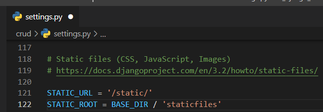


```
$ python manage.py collectstatic
```

- 장고 프로젝트에서 실서비스로 배포할 때 장고 서버가 아닌 다른 서버에서 구동되기 때문에 **정적파일들에 대한 경로를 한 곳에 모으는 명령어**

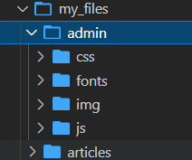

- 새로운 폴더가 생기고 129개의 파일이 생성됐다고 나옴

-> 당장 사용하지 않기 때문에 필요 없음 (나중에 배포할 때 필요함)


- STATIC_URL : STATIC_ROOT에 있는 정적 파일을 참조할 때 사용하는 URL
  -  같은 경로에 "/static/zzang-a.png"로 바꿔주는 효과
  - 실제 파일이나 디렉토리가 아니며, URL로만 존재한다. 끝낼 때 슬래쉬(/)로 끝나야 한다!
- STATICFILES_DIRS : app/static/ 디렉토리 경로를 사용하는 것 외에 추가적인 정적파일 경로 목록을 정의하는 리스트 (전역변수로 사용하는 경우가 많음!)
- 실습

### 사진 넣기

#### 첫번째 방법

> 앱 폴더 내에 static 폴더를 만들어서 사진 가져오기

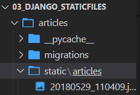

- app내에 static 폴더 만들기 - app 이름의 폴더를 하나 더 만듦

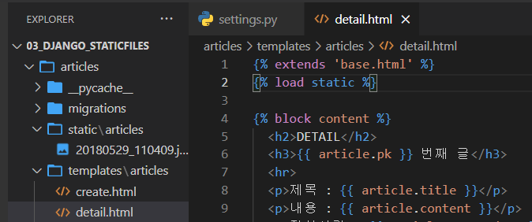

```html
 # 어떤 것이 와도 최상단에 위치해야 함
 # 이미지를 가져오기 위함
```

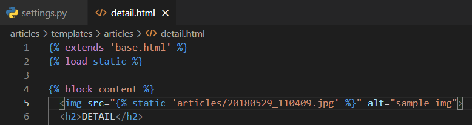

- 이미지 태그를 달아줬다!

``` python
python manage.py runserver
```

- 서버를 열어주면 사진이 나온다!


#### 두번째 방법

> 최상단 폴더에 있는 static 사진 불러오기

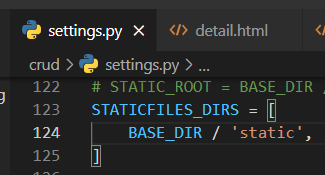

- settings.py부터 정의해주고

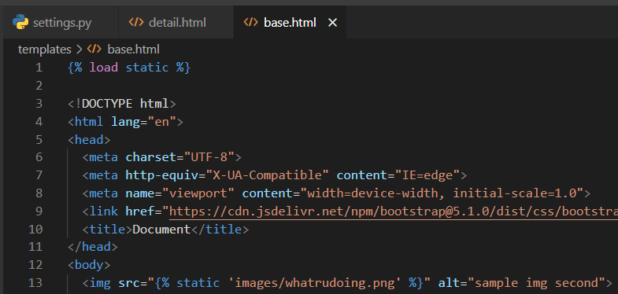

```


```

- 해주면 base.html을 상속하는 파일은 다 이 사진이 보인다!

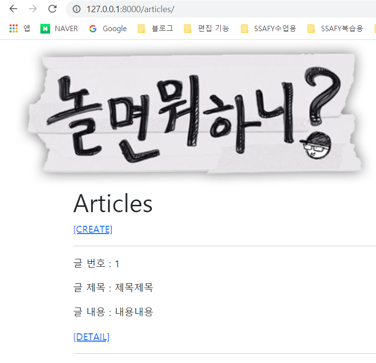

## 2. 이미지 업로드 (기본 설정)

### Media file

> 유저가 업로드 한 모든 정적 파일(user-uploaded)

#### ImageField

- ImageField : 이미지 업로드에 사용하는 **모델 필드**

  - FileField를 상속받는 서브 클래스
  - ImageField 인스턴스는 최대 길이가 100자인 문자열로 DB에 생성됨
    - max_length를 이용해 최대 길이 변경 가능
  - [주의] Pillow 라이브러리가 필요함

  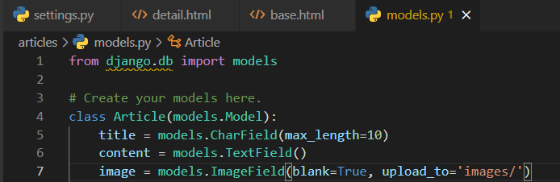

- blank=True : 사용자가 사진을 업로드 하지 않아도 유효성 검사에 걸리지 않도록!
  
- null : 데이터가 없음(빈 값을 넣는 것) -> `문자열 기반 필드(CharField, TextField)에서는 사용 하지 말자`
  
- FileField : 파일 업로드에 사용하는 모델 필드
  
  - 두 개의 선택 인자를 가지고 있음
    - **upload_to** : 문자열 값이나 경로 지정, 함수 호출
    - storage

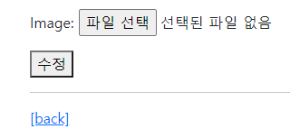

- 자동으로 생겨따아 🤩

#### Media

- MEDIA_ROOT : **사용자가 업로드 한 파일들을 보관**할 디렉토리의 절대 경로(**경로만!!!!**)

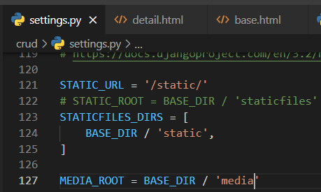

- MEDIA_URL : MEDIA_ROOT에서 제공되는 미디어를 처리하는 URL
  - 업로드된 파일의 주소를 만들어주는 역할
  - 반드시 슬래쉬(/)로 끝나야 함
  - MEDIA_URL과 STATIC_URL은 다른 경로로 끝나야 함

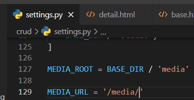

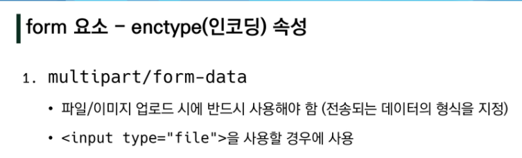

```html
enctype="multipart/form-data"
```


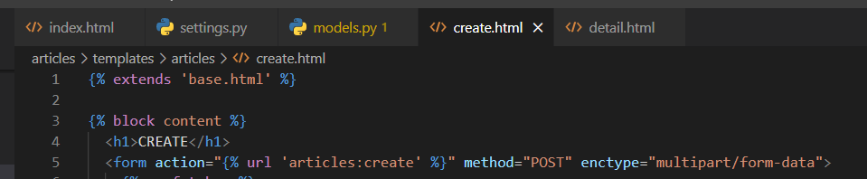

- 인코딩 타입 수정
- accpet 선택할 수 있음 (.jpg, .pdf 등 선택 가능)
- https://developer.mozilla.org/ko/docs/Web/HTML/Element/Input/file#htmlattrdefwebkitdirectory_non-standard_inline

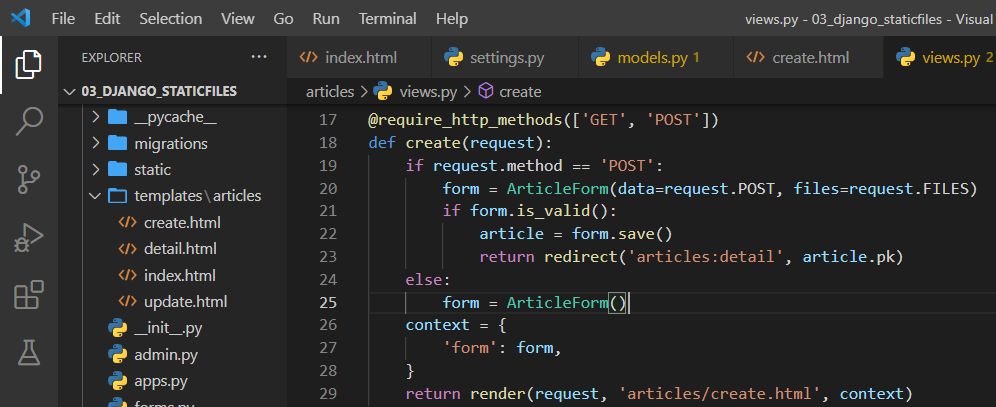

- 20번째 줄
- 키워드 인자 뒤에 위치 인자는 불가능 함!
- 키워드 쓸거면 다 쓰자 😎 
- https://docs.djangoproject.com/ko/3.2/howto/static-files/#serving-files-uploaded-by-a-user-during-development
- 목차 : 개발 중에 사용자가 업로드한 파일을 제공합니다.

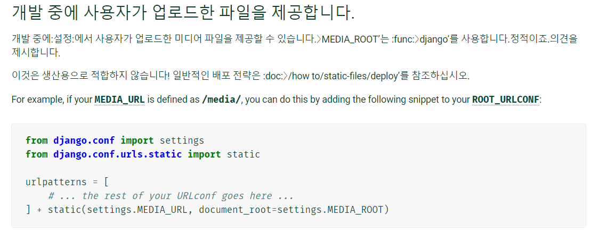

```
from django.conf import settings
from django.conf.urls.static import static

urlpatterns = [
    # ... the rest of your URLconf goes here ...
] + static(settings.MEDIA_URL, document_root=settings.MEDIA_ROOT)
```

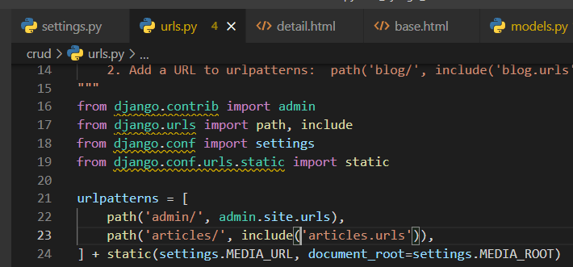

- project/urls.py 파일에 수정해주면 됨

-> MEDIA_ROOT, MEDIA_URL, settings.py 관리 해주면 끝


## 3. 이미지 업로드 (CREATE)


- ImageField 작성
  - upload_to = 'images/' : 실제 이미지가 저장되는 경로를 지정

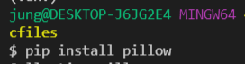

```
$ pip install pillow
```

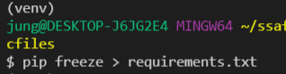

- requirements.txt에 저장해주기

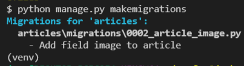

- makemigrations

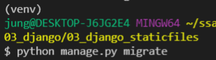

- migrate

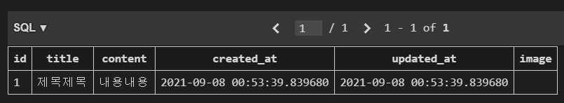

- image 필드 생겨따


#### blank & null 비교


- blank = True : 이미지 필드에 빈 값이 허용되도록 설정
  - blank의 기본 값 : False, 유효성 검사에서 사용 됨(is_valid)

- multipart/form-data : file 반드시 사용해야 함

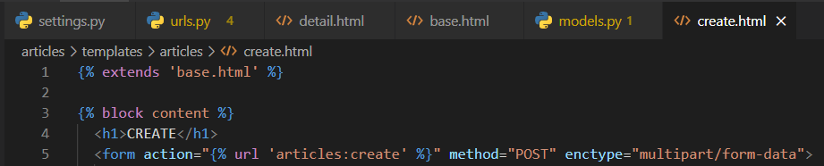

- 이렇게 해도 여전히 사진 안 올라가짐... 대체 왜?!?!!
- views.py 안 고쳐놓고 화내는 중... 

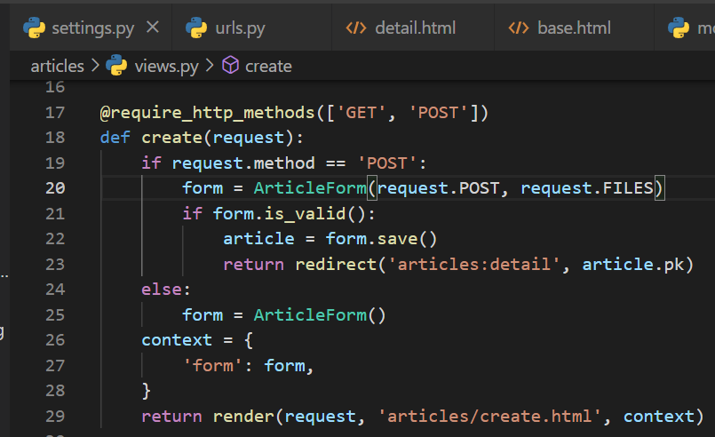

```
form = ArticleForm(request.POST, request.FILES) #20번째 줄
```


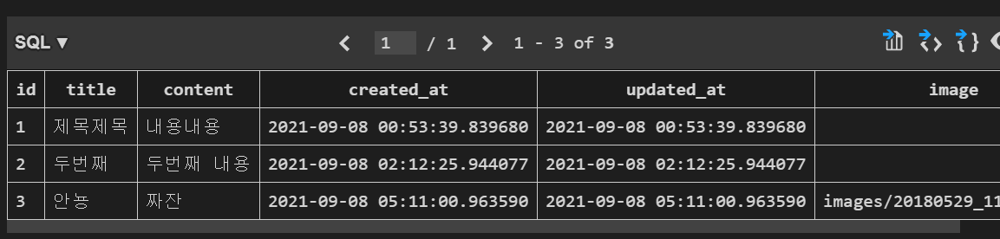

- 이미지 업로드가 됐다!
- 참고) 같은 이름의 파일이 업로드 되어도 신경쓰지 않아도 됨

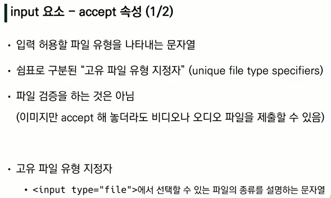


- detail.html에서 이미지가 보이도록 만들기

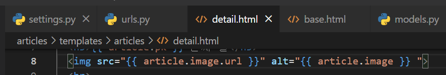

```

```


## 4. 이미지 업로드(UPDATE)

> create 뿐만 아니라 update도 가능해야하니까 수정해주자!

- update.html을 먼저 수정해주자

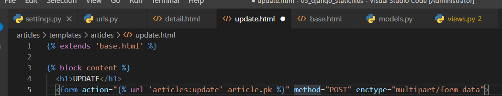

```
<form action="" method="POST" enctype="multipart/form-data">
```

- views.py를 수정하자

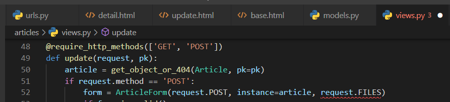

- 잉 빨간줄 ?_?

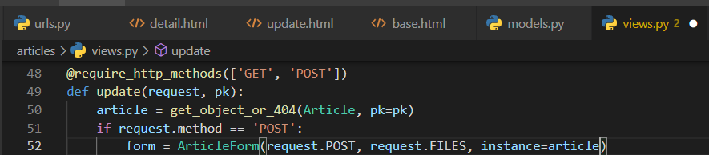

- 이렇게가 순서임! (아니면 명시적으로 뭔지 다 적어주거나...) -> 키워드 인자가 위치인자 앞에 갈 수 없다..


## 5. 사진이 없는 detail 창이 오류가 난다 ㅜㅜ

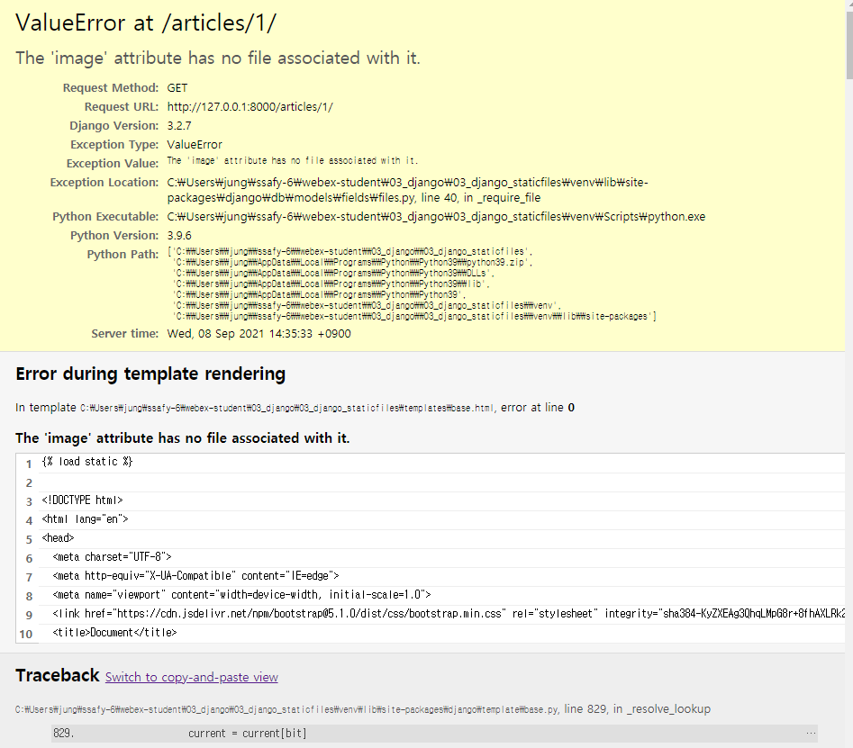

- 대체 어떡하라고오오오오ㅗㅇ오!!!!! 라고 소리치기 전에 다시 detail.html을 보자

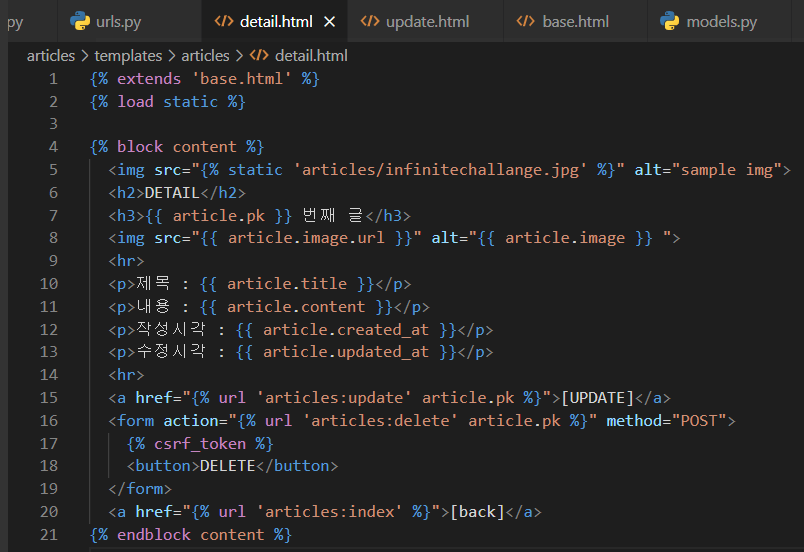

- 분명 img가 없는 상세페이지도 있을 텐데 쟤는 무조건 img를 불러오라고 한다 ??


- if문으로 수정해주자

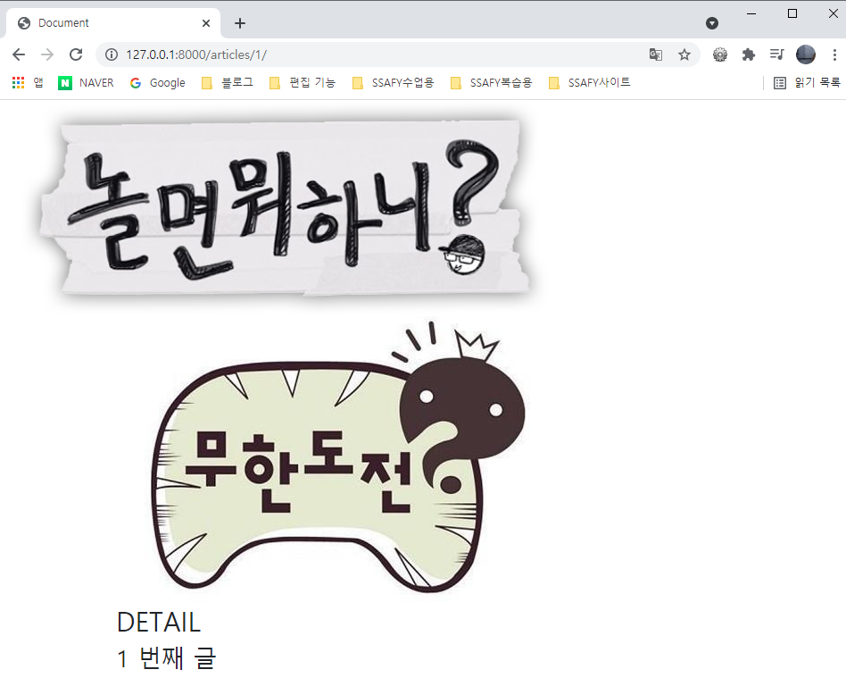

- 떴당! 히히


### 사진을 날짜대로 저장시키기

#### 첫번째 방법

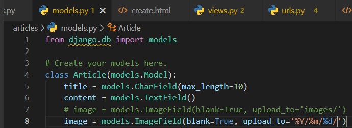

- models.py에서 upload_to를 %Y/%m/%d/ 형식으로 변경시키기

```python
# class내에 고쳐주기
	image = models.ImageField(blank=True, upload_to='%Y/%m/%d/')
```


#### 두번째 방법

> 모델에 함수를 정의하고 함수를 불러오기

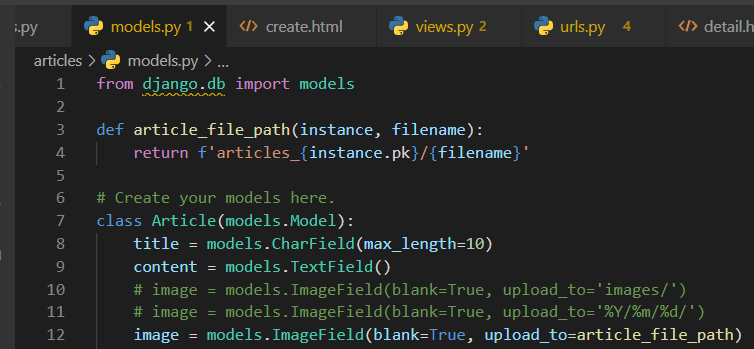

```python
def article_file_path(instance, filename):
    return f'articles_{instance.pk}/{filename}'
```

```python
# class내에 고쳐주기
    image = models.ImageField(blank=True, upload_to=article_file_path)
```


## 6. 이미지 리사이징

- 참고 URL : https://github.com/matthewwithanm/django-imagekit

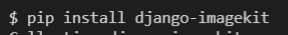

- 설치해주기

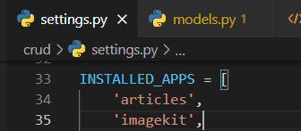

- INSTALLED_APPS에 `'imagekit',` 넣기

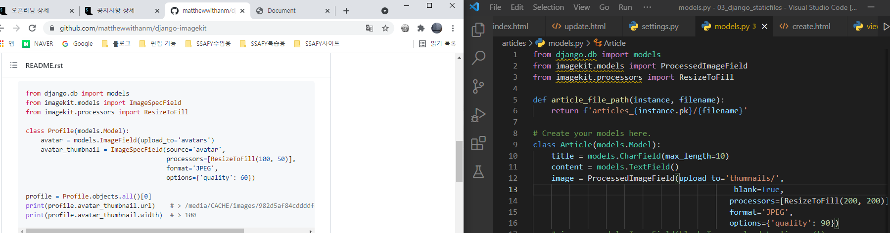

- 수정해주기

#### 썸네일 만들기

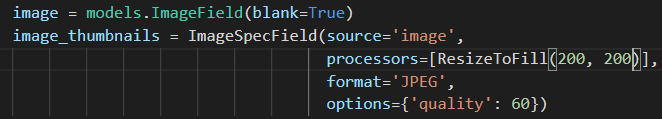


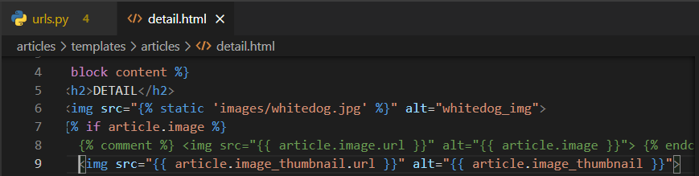

- 왜 썸네일이 안나올까... ㅜㅜ

#### 게시글이 삭제되면 사진도 삭제되게 만들기

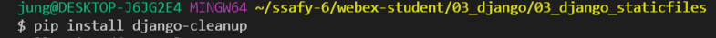

- `django-cleanup` 패키지 설치해주기

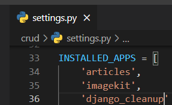

- 앱등록을 해준다. -> `INSTALLED_APPS = 'django_cleanup'`


## 7. 메세지 프레임워크

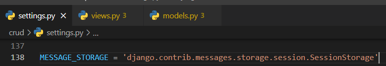

- settings.py에 코드를 붙여넣는다.

``` python
MESSAGE_STORAGE = 'django.contrib.messages.storage.session.SessionStorage'
```


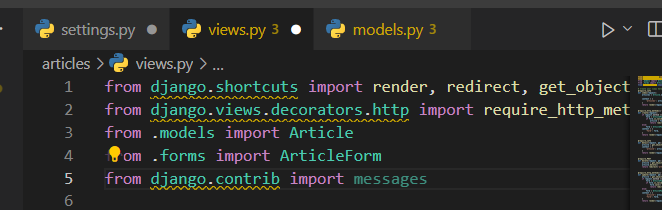


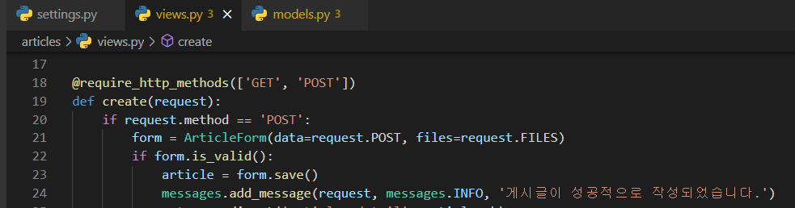


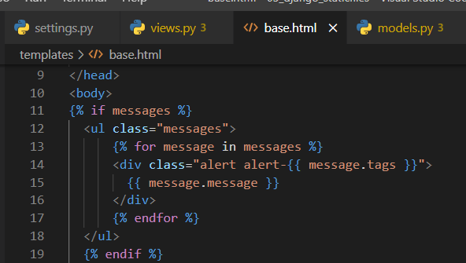


```html

  <ul class="messages">
      
      <div class="alert alert-{{ message.tags }}">
        {{ message.message }}
      </div>
      
  </ul>
  
```
