# recap


## form 이 뭐냐?

1. data validation 을 위해서
2. HTML (`<input>`) 태그에 대한 내용을 생성해준다.

<hr>


## Django 의 핵심!

아래와 같은 구조는 Django에 특화된 모델 구조! 

다른 프레임워크는 이게 아니라, 저번 주 내용과 비슷하다.

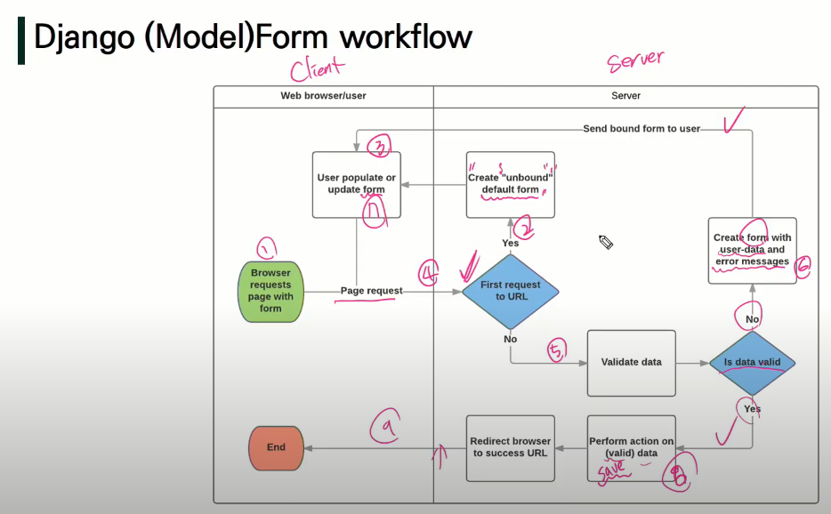

<hr>


#### base logic codes

```
board,

django_extensions,

from django.urls import path, include

path('board/', include('board.urls'))

touch urls.py forms.py

mkdir -p templates/board

cd templates/board

touch form.html index.html detail.html

cd ../../..

from django.urls import path
from . import views
app_name = 'board'
urlspatterns =[
	path('create/', views.create, name='create'),
	path('', views.index, name='index'),
	path('<int:question_pk>/', views.detail, name='detail'),
	path('<int:question_pk>/update/', views.delete, name='delete'),
]

class Question(models.Model):
	title = models.CharField(max_length=100)
	category = models.CharField(max_length=30)
	content = models.TextField()
	created_at = models.DateTimeField(auto_now_add=True)
	updated_at = models.DateTimeField(auto_now=True)
	
	def __str__(self):
		return f'{self.pk}: {self.title}'
	
from django import forms
from .models import Question
class QuestionForm(forms.ModelForm):
	class Meta:
		model = Question
		fields = '__all__'
		
python manage.py makemigrations
python manage.py migrate
		
from django.shortcuts import render, redirect
from .models import Question
from .forms import QuestionForm

def create(request):
	pass
def index(request):
	questions = Question.objects.order_by(''-pk')
	context = {
		'questions': questions,
	}
	return render(request, 'board/index.html', context)
def detail(request, question_pk):
	question = Question.objects.get(pk=question_pk)
	context = {
		'question': question,
	}
	return render(request, 'board/detail.html', context)
def update(request, question_pk):
	pass
def delete(request, question_pk):
	pass
	
from .models import Question
admin.site.resiger(Question)

python manage.py createsuperuser

mkdir templates
touch templates/base.html

'DIRS': [BASE_DIR / 'templates'],

# details.html
extends 'base.html'
block content
{{ question.title }}
<div>
	created_at: {{ question.created_at }}
	updated_at: {{ question.updated_at }}
</div>
{{ question.category }}
{{ question.content|linebreaksbr }}
<div>
	<a href="url 'board:index'">
		<button> back </button>
	</a>
</div
<div>
	<a href="url 'board:update' question.pk ">
		<button> edit </button>
	</a>
</div
<form action="" method="POST">
	csrf_token
	<button>delete</button>
</form>

from 

# index.html
extends 'base.html'
block content
<h1> index page</h1>
<ul>
	fop question in questions
	<li> <a href="url 'board:detail' question.pk">
	
def create(request):
	if request.method == 'POST':
		form = QuestionForm(request.POST)
		if form.is_valid():
			question = form.save()
			return redirect('board:detail', question.pk)
	else:
		form = QuestionForm()
	context = {'form': form,}
	return render(request, 'create.html', context)
	
# form.html
extends 'base.html'
block content
<form action="" method="POST">
	
	{{ form.as_p }}
	<button>제출</button>
</form>

def detail(request, question_pk):
	question = get_object_or_404(Question, pk=question_pk)
	...
	
def delete(request, question_pk):
	if request.method == 'POST':
		question = get_object_or_404(Question, pk=question+pk)
		question.delete()
	return redirect('board:index')
	
def update(request, question_pk):
	...
```

<hr>


## 추가 배운 내용

1. RESTful

   url 패턴을 사람들이 헷갈려 하지 않도록 제시한 가이드

   예로, detail 함수는 DB에 영향을 안 주기까, 의미론적으로 GET요청만 허용하는게 맞다.

   ```python
   from django.views.decorators.http
   import require_safe, require_post, require_http_methods
   ```

   require_safe 는 DB에 주는 영향이 없는 것들 (GET) 을 의미론적으로 나타낸다.

   ```python
   @require_http_methods(['GET', 'POST'])
   def create(request):
   	...
   	
   @require_safe
   def index(request):
   	...
   	
   @require_POST
   def delete(request, quesetion_pk)
   	...
   ```

   

2. Choice 선택지

   ```
   # 대문자의 이유 = constant value로 설정했으니 주의 하라는 강조
   CATEGORY_CHOICES = [
   	('django', '장고'),
   	('web', '웹'),
   	('python', '파이썬'),
   ]
   
   class Question(models.Model):
   	...
   	category = models.CharField(
   		max_length=30, 
   		choices=CATEGORY_CHOICES,
   		)
   ```

   

3. forms.py 는 models.py 보다 더 필드를 자세히 설정가능

   1. 필드 값 길이 required로 설정

      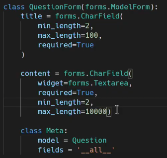

   2. 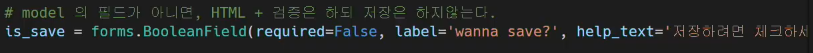

      위에건 체크박스 boolean 변수를 추가한 건데, 필드 값은 아니고, 이걸로 그냥 views 쪽에 함수에 if else 조건문 줘서 체크 안하면 DB에 전송 안되게 하게끔 하는 용도

   3. 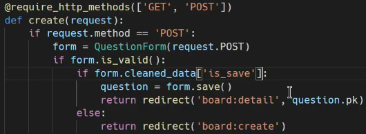

      위에건 if else 조건문 추가해준 예시

   4. 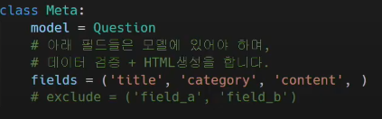

      위에건 그냥 exclude 와 DB에 보내고 싶은 필드값 손수 셋팅법

      

4. 부트스트랩 적용법 (비추)

   1. 인스톨드 앱에 `bootstrap5` 등록
   2. `base.html` 에 `load bootstrap5`, ``,  

   위에 두 스텝은 그냥 처음에 배운 cdn 가져와서 쓴 거랑 다르지 않다.

   하지만 더 않좋다. 왜냐면, 최신버전을 못 쓴다.

   패키지에 의존해버리면, 패키지가 품고있는 버전만을 사용 가능.

   

   하.지.만!

   만약 cdn 서버가 터졌다 가정하면, 우리가 직접 내부적으로 bootstrap 파일들을 가지고 있는게 제일 안전

   

5. 부트스트랩 적용법 (추천)

   1. bootstrap 에서 다운

   2. 프로젝트 생성시, `STATIC_URL = '/static/'` 디폴트로 정의 되 있음.

      기본적으로는 앱 폴더 안에서 위에 url을 찾지만, 그 찾는 위치를 하나의 부모 폴더로 바꾸고 싶다면

      `STATICFILES_DIRS = [BASE_DIR / 'static']` 설정

   3. 부모 static 폴더 안에 원하는 대로 하위 파일 생성하자

      예: `css, images, js`

      bootstrap 에서 원하는 css 와 js 들을 해당 파일에 넣자

   4. 그리고 `base.html`에 적용시키는 방법:

      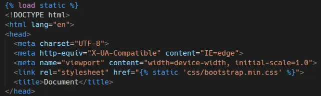

       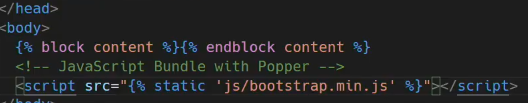

   5. 파일 이나 폴더 이름이 겹칠 때 제대로 라우팅 해주기 위해서,

      앱 폴더안에 스태틱 파일들은, 스태틱 폴더 안에 하나 더 앱폴더와 같은 이름의 폴더를 만들고, 그 안에 위치 시킨다.

      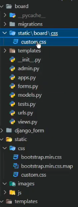

      그리고 html 에 적용시킨 때는 링크 제대로!

      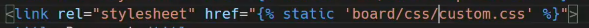

<hr>


## 부트스트랩 사용법!

1. `{}` 

   ( 언더바는 그냥 포스트잇임을 알리는 컨벤션)

   - 포트트 잇 처럼 html 파일안에 전체 코드를 다른 html 파일 코드 내부에 붙여넣는다!
   - base.html 관련만이 아니라, 모든 html 파일에 적용되는거임!
   - 다만, 적절하게 기능 단위로 쪼개서 사용하자

2. 보여주는 페이지 나누기! (pagenator)

   일단 django paginator 검색해서 들어가서 알아서 해봐라

   참고 코드:

   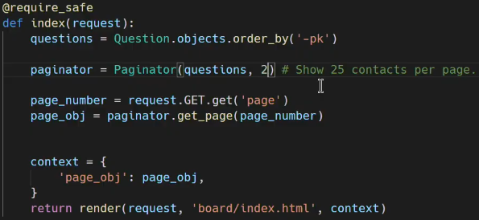

   pagenator는 paginator를 초기화 할건데, 인스턴스의 필드를 한페이지에 2개만큼 보여줄거고, 

   최종적으로,  사용자가 요청한 url 을 통해 넘어온 get 꾸러미 안에 있는 'page' 라는 키값을 인자로 넘겨서, page_obj 를 만들거다.

   (유동적으로 사용자가 클릭 할 때마다 그 숫자가 page_obj 가 됨)

   그리고 context로 page_obj 를 넘겨줄거다 

   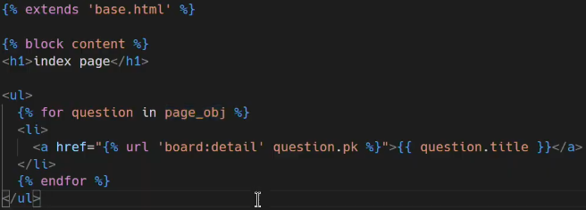

   

   그러면 페이지 분활시켜주는 버튼들은 어떻게 볼거임?

   부트스트렙 사이트에서 또 복붙 코드!

   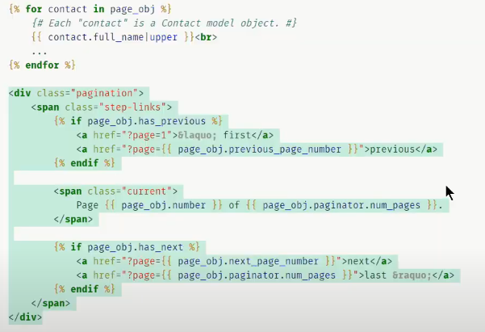

   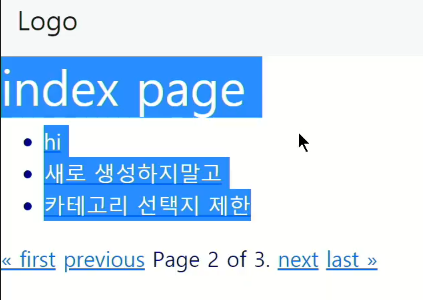

3. 이제 이걸 예쁘게 꾸미자

   bootstrap5 패키지 사용해서 html 에 부트스트랩 태그만 달아주자

   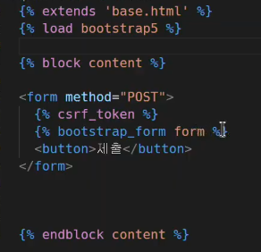

   원래는 일일히 클래스 줘야하는데, 알아서 부트스트랩이 만들어줌

   좀 더 정돈 하려면

   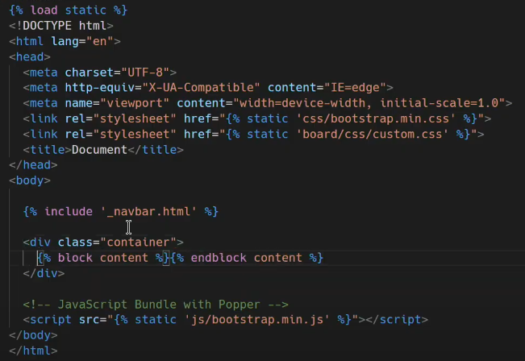

   이렇게 ㅇㅋ

   

4. form 말고도 paginator 도 예쁘게 꾸밀 수 있다.

   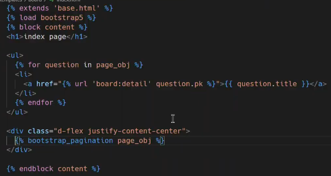

5. 위와 같이 자동 생성된거랑 내가 하나하나 만든걸아 동시에 사용 하려면

   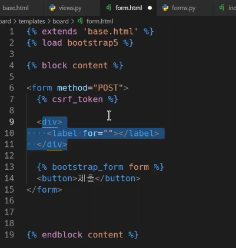

   여기에 직접 마크업 다 작성하고, 

   name 만!! 자동생성된것들이랑 중복 안되게 잘 맞춰줘라


git remote rm origin 기본주소

git remote add origin 본인주소