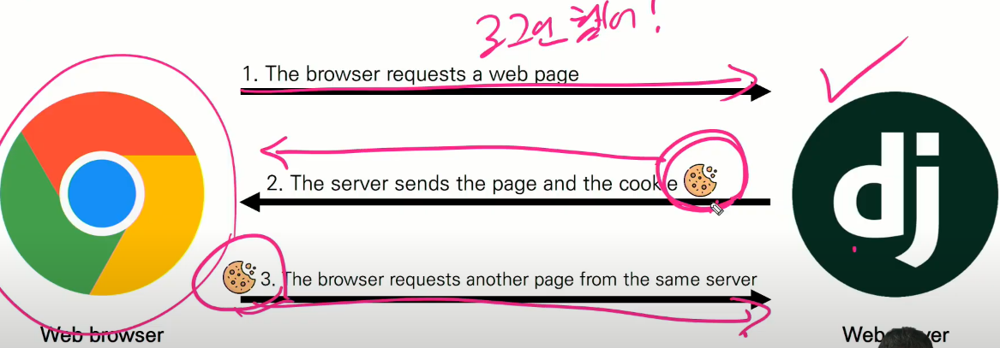
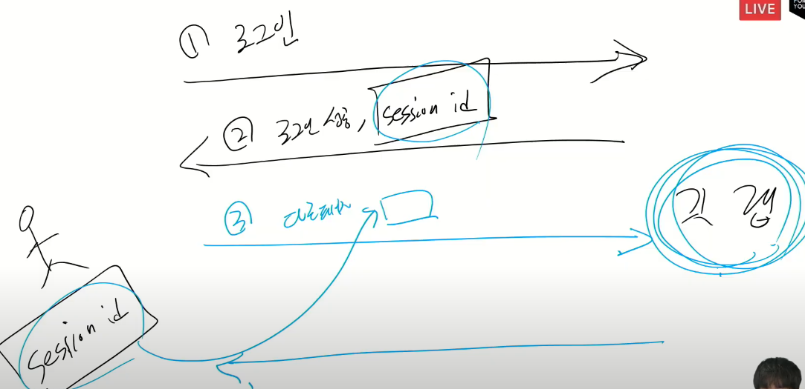

# 사용자 인증 및 권한

<hr>


## 쿠키와 세션

- HTTP (hyper text transfer protocol)

  - html 과 같은 자원 데이터들을 가져올 수 있게해주는 규칙

  - 웹 상에서 이루어지는 모든 데이터 교환의 기초!

  - #### 특징:

    1. connectionless => 서버는 요청에 대한 응답을 보내고 연결 끊음!
    2. stateless => 연결을 끊는 순간, client server 통신 끝.

    비 연결지향으로 인해, 무상태의 특징을 갖게 되는데, 무상태가 되면 상태 정보(대표적으로 로그인상태)가 유지되지 않는다.

    고로, 원래라면 로그인하고 다른페이지로 가버리면 로그인이 풀려야한다. 하지만, 이걸 방지해주는게 쿠키와 세션.

    client 와 server의 지속적 관계 유지를 위해 쿠키와 세션이 존재.


#### 쿠키

- 서버가 사용자의 웹 브라우저에 전송하는 작은 데이터 조각

- 쿠키는 로컬 key-value 데이터 형식으로 저장된다

- 쿠키를 훔쳐서 user's 행동 추적 => 계정 접근권한 획득도 가능

- HTTP 쿠키는 상태가 있는 세션을 만들어줌

- 쿠키는 두 요청이 동일한 브라우저에서 들어왔는지 판단 가능.

  고로, 상태가 없는 http 프로토콜에서 상태 정보를 기억 시켜주니까, 로그인 상태 유지 가능.

  1. 웹 페이지 접속 (웹 페이지 html 요청)
  2. 요청한 웹 페이지 와 쿠키 함께 받으며 쿠키 클라이언트쪽에 저장
  3. 클라이언트가 같은 서버에 재요청 시, 쿠키도 같이 보낸다
  4. 요청과 함께 쿠키가 클라이언트에게 다시 전송된다

  

#### 쿠키 사용목적

1. 세션 관리 (session management) ::star:

   로그인, 아이디 자동 완성, 팝업 체크, 장바구니, 공지 안보기, 등 정보 관리

2. 개인화 (personalization)

   사용자 선호, 테마 등의 설정

3. 트래킹 (tracking)

   사용자 행동을 기록 및 분석


#### 세션

- 쿠키의 하위 범주. 쿠키들 중에 상태를 유지시켜주는것들 을 세션이라 한다!

  쿠키에 담겨서 같이 보내지는게 세션!

  예: 로그인, 장바구니, etc

- 원래라면 웹 브라우저의 특성상 비 연결지향으로 인한 무상태이지만, 쿠키의 도움을 받아 사이트와 브라우저 사이의 상태 (state) 를 유지시키는것.

아래 사진 설명:

- client가 서버 접속 => 서버가 특정 session id 발급 => 

  client는 발급 받은 세션 id  쿠키에 저장.

  쿠키에는 세션을 구별하기 위한 id 값만 저장되고, value 값들은 서버에 저장되있다.

- example:

  

- 브라우저 상에서 쿠키의 보안을 유지시켜준다


#### 쿠키의 수명

1. 세션 쿠키 (session cookies)
   - 현재 세션 종료 전 까지 쿠키 지속
2. 지속적 쿠키 (permanent cookies)
   - expires 속성에 지정된 날짜 or Max-Age 속성에 지정된 기간이 지나면 삭제


#### 장고의 세션

- django 의 session 은 미들웨어를 통해 구현 됨

  미들웨어 : 요청과 응답 처리 중간에서 작용하는 시스템, 보안적인 측면을 담당

  1. SessionModdleware => 요청 전반에 걸쳐 세션을 관리
  2. AuthenticationMiddleware => 세션을 사용하여 사용자를 요청과 연결

- DB-backed sessions 저장방식을 기본 값으로 사용

  ​	cached, files-based, cookie-based, 방식으로 선택적 변경 가능

  ​	client에게는 session id 만 준다

- django 내부에서 세션 정보는 `diango_session`테이블에 저장된다

- 세션 정보가 다 서버에 저장되면, 브라우저에 저장되는것보다 더 안전한거 아닌가? 

  그러니까, 그냥 쿠키 방식에서 모든걸 다 세션방식으로 하면 보안이 더 좋은거 아님?

  ㄴㄴ 

  모든걸 다 세션으로 사용하면, 사용자가 많을 때 서버에 부하가 걸릴 가능성 있음.
  
  고로, 훔쳐도 상관없는 정보들은 굳이 세션 사용 필요 없지만, 로그인이나 이런 중요한 정보들만 세션처리 해주면 굳.

<hr>


## 로그인

로그인 != 회원가입

로그인 == 세션 생성

장고는 인증에 관한 built-in-form 을 제공.


#### AuthenticationForm

- 사용자 로그인 위한 form

- request를 첫번째 위치인자로 받는다

- django authentication system documentation 구선생에게 자세하게 질문 ;)

- 로그이늘 하기 위해 사용자로부터 입력을 받기 위한 form 이다!

- 실제로 로그인을 진행시켜주는 함수는 따로있다!

  => `login(request, user, backend=None)` views.py 에서 작성됨ㅇㅋ

  => `user` 가져오는 방법은 `form.get_user()` 라는 `AuthenticationForm`의 함수 사용!

#### Authentication data in templates

- 장고에는 기본적인 context 값들이 존재 == 따로 context 처리 없이 사용 가능

  => context processors

  ex. 

  ```html
   base.html 
  <h3>hello, {{ user }}</h3>
      <a href="">login!</a>
  ```

  로그인 했을 때 output : hello, admin

  로그인 no 일떄 output : hello, anonymous

<hr>


## 로그 아웃

현재 요청에 대한 session data 자체를 DB에서 삭제

클라이언트의 쿠키에서도 sessionid 삭제

- 왜냐하면, 다른 사람이 동일한 웹 브라우저를 사용해 로그인 후, 이전 사용자의 세션 데이터에 엑세스 하는것을 방지하기 위함

HttpRequest 객체를 인자로 받고, 반환 값이 없다

<hr>


## 로그인 사용자에 대한 접근 제한

두가지 방법이 있다

1. The raw way => `is_authenticated` 라는 속성값 사용 (attribute). is니까 boolean!
2. Decorator => `login_required` 라는 데코레이터 사용


#### `is_authenticated` 속성

- User model 의 속성 중 하나

- 모든 User 인스턴스에 대해 항상 True 인 읽기 전용 속성.

  고로, AnonymousUser 는 항상 False

- 사용자가 인증 되었는지 여부만 확인하는 기능!

  - 일반적으로 request.user 에서 이 속성을 사용
  - 권한과는 관련이 없으며, 사용자의 활성화 상태, 유효한 세션, 이런거 확인 x
  - 오로지 로그인 된 사용자냐 아니냐만 확인


#### `login_required` 데코레이터

- 데코레이터도 위에서 아래로 확인

  데코레이터를 쌓을 때의 순서는 로직에 따라 작성되는 순서가 결정. 

  한 데코레이터의 코드가 다른 데코레이터에 의해 설정되거나 보장된 내용에 의존하는 경우 반드시 순서를 지켜서 작성해야 정상적으로 작동.

<hr>


## 회원가입


#### `UserCreationForm`

- 회원가입 위한 built-in-form

- 유저 id, 패스워드, 패스워드 확인 필드 3개를 가진 

  권한 없는 새 유저 생성하는 `ModelForm`

만약 회원가입때 기입 내용 커스터마이징 하고프면..?

알아서 상속 usercreationform 필드값들을 상속받아서 사용하는

#### 나만의 `CustomUserCreationForm` 생성 및 활용!

<hr>


## 회원 탈퇴!

탈퇴 하면서 해당 유저의 세션 데이터도 함꼐 지울 경우, 아래처럼 ㄱ

반 드 시 탈퇴 후 로그아웃 순으로 처리해라!

이유: ..

```python
def delete(request):
	if request.user.is_authenticated:
		request.user.delete()
		auth_logout(request)
	return redirect('articles:index')
```

<hr>


## 회원 정보 수정!

#### `UserChangeForm`

- 회원 정보 수정 위한 admin 인터페이스에서 사용되는 `ModelForm`

하 지 만

​	빌트인 모델폼을 써 버리면 회원 정보 수정내용 권한이 admin 급이기 때문에,

​	위에 빌트인 모델폼을 상속 받아서 커스텀 회원 정보 수정 모델폼을 구축 함으로써, 적당한 수정 권한 부여

#### `CustomUserChangeForm` 작성

- 먼저 상속 받을 모델과 필드값들을 적어야 하는데,

  아니, user 모델 클래스를 받아야지 내용들이 상속되는거아님?

  why? 

  일단은 하라는대로 ㄱ. 후반기에 자세히 이유 알려줌

  거 기 서!
  
  #### user 모델 대신 `get_user_model()` 함수 활용
  
  이유: .. documentation 참고ㅎ

<hr>


## 비밀번호 변경

비밀번호 수정은 회원 수정 level에서 불가능하다.

따 로

사용자가 비밀번호를 변경할 수 있도록 하는 Form 활용!

## `PasswordChangeForm`  => `SetPasswordForm` 을 상속받는다

하지만, 이대로만 하면 패스워드 변경 시, 로그인이 풀린다.

why?

우리가 계속 로그인 유지 가능했던건 세션 아이디를 게속 보내줫기 때문, 로그아웃이 됬다는건, 세션값이 보내지지 않고있다 혹은 뭔가가 일치하지 않아서이다.

intuitively, 세션에 문제가 생긴 것이다.

그래서, 원인은:

비밀번호가 변경되면, 기존 세션이 바뀐다. 고로 기존 세션의 회원의 인증정보가 불일치 하여 로그인 상태 유지 불가능. (마치 비번 변경하면 새로운 가입자 처럼 처리하는듯..) 

고로, 암호를 변경할 때 새로운 password hash 로 session을 업데이트 해야한다.

그 럴 때

#### `update_session_auth_hash(request, user)` 활용!

비밀번호 변경하는것은, 새로운 세션 발급 과정인데 , 그 발급 과정에서 기존 정보와 일치 하지 않기 때문에, 함께 동일하게 업데이트 해주는게 위에 함수 역할!

<hr>
