# git

## branch

- branch 는 단순한 포인터(화살표) 이다.
- Head 는 단순한 포인터다. (포인터의 포인터인 경우가 많다)
- Head 는 현재 내가 작업중인 커밋을 의미한다.
- Head 는 내 머리라고 생각하면 된다.
- 하지만, Head 라는 포인터는, 다른 포인터를 통해서 날 가르킨다.
- 고로, Head가 master에 있다 == 현재 master 에서 작업중이다 라는 뜻.

#### 통합 브랜치 (integration branch)

#### 토픽 브랜치 (Topic branch)

- 버그 수정, 기능 추가, 같은 단위작업을 위한 브랜치.
- 여러 작업을 동시 진행 떄는, 그 수 만큼 토픽 브랜치 생서 가능!
- 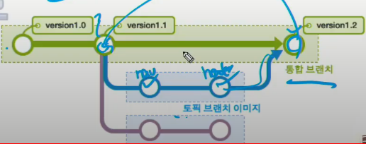

## branch usage

1. Head가 master에 있는 상태에서, 브랜치 `b1` 생성:

   `$ git branch b1` 

   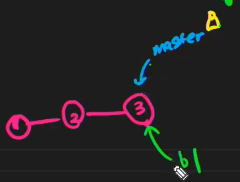

   

2. 생성 확인

   `$ git log --oneline`

   

3. Head를, 생성 된 `b1` 브랜치로 이동하기:

   `$ git switch b1`

   

   

4. `b1`에서 작업을 하고 `commit`을 하게되면, 아래처럼 된다

   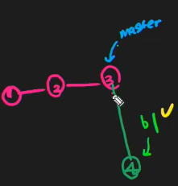

   

5. 커밋을 안한 내용은 깃이 절대 관리 안한다.

   고로, 파일을 어떠한 기능적 브랜치에서 관리하느냐가 중요

   

6. master에는 없는 파일이 `b1`에는 있는 상황에서 두 브랜치를 병합시키기:

   

   #### Fast forward 방식 병합

   => b1은 열일하고, master 는 꽃길만 걷는 병합 방식. 

   현재는 master 에 없는 파일이 b1 에 있다.

   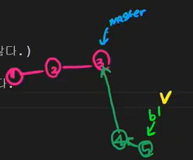

   `$ git swtich master`  => 헤더를 다시 master로 이동. 

   ​	현재 master에는 b1에 있는 파일이 없다

   `$ git merge b1`  =>  master에서 b1 내용을 다 흡수하겠다

   ​	이제 master에는 b1에 있는 파일이 있다

   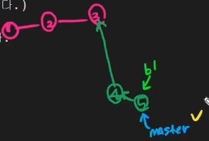

   

   #### Auto Merge 병합

   => 두개의 다른 정보를 가진 branch 를 하나로 병합!

   `$ git branch b2`

   `$ git switch b2`

   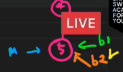

   `$ git commit -m '6'`

   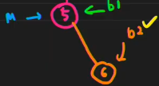

   `$ git commit -m '7'`

   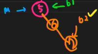

   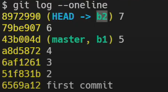

   `$ git switch master`

   여기서 변경사항 만들면 새로 커밋 `$ git commit -m '8'`

   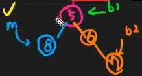

   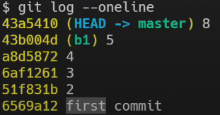

   `$ git commit -m '9'`

   `$ git merge b2`

   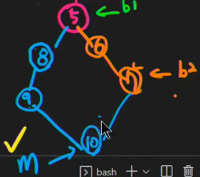

   10번 커밋은 안 했지만, merge 하는 과정에서 자동으로 커밋이 된것이다.

   이것만이 두 branch 를 merge 할 수있기 때문

   `$ git log --oneline --graph` => 깔끔하게 확인가능. `Q` 누르면 나올 수 있음

   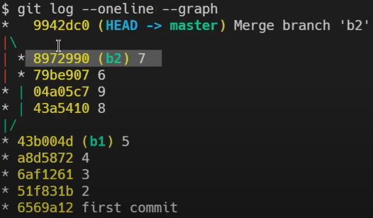

   

   #### Manual merge (conflict merge)

   => auto merge 하다가 충돌 생겼을 시 사용

   `$ git switch -c b3` : b3 브랜치를 생성함과 동시에 head를 b3로 이동

   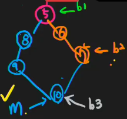

   `$ git commit -m '11'`

   `$ git commit -m '12'`

   `secret.txt` 라는 파일을 b3 브런치에 추가

   `$ git switch master`

   현재 b3 브런치의 수정사항들은 안보임

   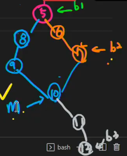

   `git commit -m '13'`

   `git commit -m '14'`

   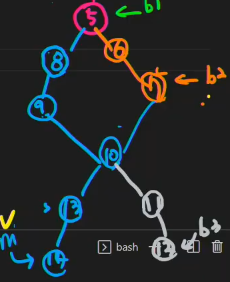

   `git merge b3`

   merge충돌 발생. 사유는 b3의`secret.txt` 과 master의 `master.txt` 때문.

   왜냐하면, 같은 파일에 다른 줄이 겹치니까, git 이 어떤 브랜치의 파일을 살려야 할지 결정장애 일으킨것.

   이때 master 걸 살린다 하면, head가 master에 위치한 상태에서

   `$ git commit -m '15 - conflict merge'`

   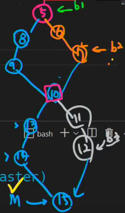

   `$ git log --oneline --graph`

   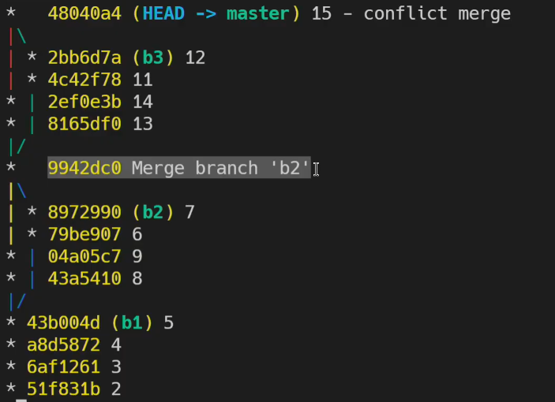

   

7. 병합이 다 되면, 

   문제해결 했다는 뜻, 고로 master 브런치를 기준으로 다시 작업을 해 나갈것.

   고로, 이전에 썻던 b1 과 b2 헤더는 없애자.

   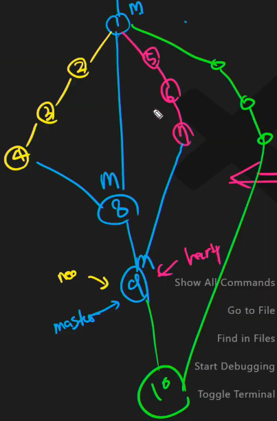

   `$ git branch -d b2`

   `$ git branch -d b1`

   변경 이력들은 사라진게 아니고, header (포인터) 만 삭제 시킨거임

   

